# Technical Knowledge Transfer: CATIE-TV Application

This document provides a comprehensive technical overview of the CATIE-TV application, detailing its architecture, core patterns, and the implementation of its various modules.

## Table of Contents

- [1. Architecture Overview](#1-architecture-overview)
- [2. Core System Components](#2-core-system-components)
  - [2.1 Networking and Parsing](#21-networking-and-parsing)
  - [2.2 Persistence Layer](#22-persistence-layer)
    - [2.2.1 Database Upgrade (Migration) Flow](#221-database-upgrade-migration-flow)
  - [2.3 Real-time Updates](#23-real-time-updates)
    - [2.3.1 App Lifecycle & Connection Flow](#231-app-lifecycle--connection-flow)
  - [2.4 UI Coordination (ViewUpdateHandler)](#24-ui-coordination-viewupdatehandler)
    - [2.4.1 Local Data Refresh (Offline) Flow](#241-local-data-refresh-offline-flow)
  - [2.5 Data Fetching Logic (DataFetchingUtility)](#25-data-fetching-logic-datafetchingutility)
  - [2.6 App Startup and Data Fetching Flow](#26-app-startup-and-data-fetching-flow)
  - [2.7 Data Clearing & Default States (Empty Response Strategy)](#27-data-clearing--default-states-empty-response-strategy)
  - [2.8 Dynamic Content Pacing](#28-dynamic-content-pacing)
  - [2.9 NotificationCenter Communication](#29-notificationcenter-communication)
- [3. Module Implementations](#3-module-implementations)
  - [3.1 Carousel](#31-carousel)
    - [3.1.1 Carousel Orchestration Flow](#311-carousel-orchestration-flow)
  - [3.2 Scroll Text](#32-scroll-text)
    - [3.2.1 Scroll Text Circular Lifecycle](#321-scroll-text-circular-lifecycle)
  - [3.3 Status Indicator](#33-status-indicator)
    - [3.3.1 Status Indicator Lifecycle](#331-status-indicator-lifecycle)
  - [3.4 SARA Alert](#34-sara-alert)
    - [3.4.1 SARA Alert Priority Flow](#341-sara-alert-priority-flow)
    - [3.4.2 Dynamic Line-based Layout Logic](#342-dynamic-line-based-layout-logic)
  - [3.5 Clock](#35-clock)
    - [3.5.1 Clock Message Flow](#351-clock-message-flow)
  - [3.6 Radio](#36-radio)
    - [3.6.1 Radio Playback Lifecycle](#361-radio-playback-lifecycle)
  - [3.7 Sitelogo](#37-sitelogo)
    - [3.7.1 Site Logo & Branding Flow](#371-site-logo--branding-flow)
  - [3.8 Weather](#38-weather)
    - [3.8.1 Weather Data & Icon Lifecycle](#381-weather-data--icon-lifecycle)
  - [3.9 Narration](#39-narration)
    - [3.9.1 Narration Playback Flow](#391-narration-playback-flow)
  - [3.10 Log Push](#310-log-push)
    - [3.10.1 Remote Diagnostic (LogPush) Flow](#3101-remote-diagnostic-logpush-flow)
  - [3.11 Websocket](#311-websocket)
    - [3.11.1 WebSocket Communication Flow](#3111-websocket-communication-flow)
  - [3.12 Thread Handling](#312-thread-handling)
    - [3.12.1 Reader-Writer Thread Safety Flow](#3121-reader-writer-thread-safety-flow)
  - [3.13 Portrait Mode](#313-portrait-mode)
    - [3.13.1 Portrait SwiftUI Bridge](#3131-portrait-swiftui-bridge)
  - [3.14 Registration](#314-registration)
    - [3.14.1 Registration & Handshake Flow](#3141-registration--handshake-flow)
  - [3.15 Custom Fonts](#315-custom-fonts)
  - [3.16 Events](#316-events)
    - [3.16.1 Events Processing & Timing Flow](#3161-events-processing--timing-flow)
  - [3.17 Custom Home Page](#317-custom-home-page)
    - [3.17.1 Custom Home Page Flow](#3171-custom-home-page-flow)
- [4. Initialization and Registration](#4-initialization-and-registration)
  - [4.1 App Initialization](#41-app-initialization)
  - [4.2 Hidden Registration Trigger](#42-hidden-registration-trigger)
    - [4.2.1 Hidden Registration Trigger Flow](#421-hidden-registration-trigger-flow)
- [5. Core Utilities and Infrastructure](#5-core-utilities-and-infrastructure)
  - [5.1 API Management](#51-api-management)
  - [5.2 File Downloader](#52-file-downloader)
    - [5.2.1 Completion Signal Chain](#521-completion-signal-chain)
  - [5.3 Exception Handling (Defensive Execution)](#53-exception-handling-defensive-execution)
  - [5.4 Device Details](#54-device-details)
- [6. Logging](#6-logging)
  - [6.1 Server Push Orchestration](#61-server-push-orchestration)
- [7. Development Environment and Tools](#7-development-environment-and-tools)
  - [7.1 SwiftFormat](#71-swiftformat)
  - [7.2 Periphery](#72-periphery)
  - [7.3 SwiftLint](#73-swiftlint)
- [8. UI Architecture (Landscape)](#8-ui-architecture-landscape)
- [9. Architectural Utilities](#9-architectural-utilities)
  - [9.1 ScrollDurationCalculator](#91-scrolldurationcalculator)
- [10. Development Tips](#10-development-tips)
- [11. Thread Safety and Concurrency](#11-thread-safety-and-concurrency)
  - [11.1 Reader-Writer Pattern](#111-reader-writer-pattern)
  - [11.2 UI Thread Safety](#112-ui-thread-safety)
  - [11.3 Deadlock Prevention](#113-deadlock-prevention)
- [12. CI/CD and Automation (Fastlane)](#12-cicd-and-automation-fastlane)
  - [12.1 Automation Lanes](#121-automation-lanes)
  - [12.2 MS Teams Integration](#122-ms-teams-integration)
  - [12.3 Configuration and Security](#123-configuration-and-security)
- [13. Orchestration and State Management](#13-orchestration-and-state-management)
  - [13.1 Carousel Ad-Ratio](#131-carousel-ad-ratio)
  - [13.2 UI Type Categorization](#132-ui-type-categorization)
  - [13.3 Portrait State Synchronization](#133-portrait-state-synchronization)
  - [13.4 Audio Priority and Conflict Management](#134-audio-priority-and-conflict-management)
- [14. Module Availability and Visibility](#14-module-availability-and-visibility)
  - [14.1 Module Availability by UI Type](#141-module-availability-by-ui-type)
  - [14.2 Timer Management Rules](#142-timer-management-rules)
  - [14.3 Weather View Visibility Rules](#143-weather-view-visibility-rules)
- [15. Knowledge Transfer Roadmap (20-Hour Plan)](#15-knowledge-transfer-roadmap-20-hour-plan)
  - [15.1 Curriculum Phases](#151-curriculum-phases)
  - [15.2 Consolidated KT Roadmap Matrix](#152-consolidated-kt-roadmap-matrix)

---

## 1. Architecture Overview

CATIE-TV is a hybrid application built using both **UIKit** and **SwiftUI**. It combines traditional **Model-Presenter-View** patterns (UIKit) for Landscape mode with a modern **SwiftUI-Combine** bridge for Portrait mode.

### Key Technologies

- **UIKit**: Powers the core Landscape interface and navigation.
- **SwiftUI**: Used for the modern, responsive Portrait mode layouts.
- **Combine**: Bridges data between UIKit components and SwiftUI views.

- **Persistence**: Reconnection states are managed in `ThreadSafeGlobals`.
- **Reactivity**: The UI updates connection indicators (Status Indicator 2) based on these socket states.

- **Thread-Safe Globals**: Centralized management of app state using `ThreadSafeGlobals.swift` with concurrent queue/barrier pattern.

---

## 2. Core System Components

### 2.1 Networking and Parsing

Most modules follow a consistent networking pattern:

1. **Request**: Initiated via `URLSession`. Endpoints are managed in `API.networkAPI()`.
2. **Safety**: Wrapped in `SwiftTryCatch.try` to handle exceptions during networking or JSON decoding.
3. **State Management**: Uses singleton dictionaries in `ThreadSafeDictionary.swift` to track API state:
    - `StatusCodeDict`: Tracks HTTP status codes for each module.
    - `OngoingAPICallDict`: Prevents redundant concurrent requests for the same module.
    - `PendingAPICallRequestDict`: Tracks requests that were deferred while a previous call was in-progress.
4. **Status Tracking**: `StatusCodeDict` tracks HTTP responses to coordinate data syncing.

### 2.2 Persistence Layer

- **`DataHandler.swift`**: Utility class for performing CRUD operations on Core Data.
- **Entities**: Uses the `CATIE_TV` persistence container.
- **Pattern**: Modules usually delete old records (`DataHandler().deleteRecords`) before saving newly fetched data to ensure the local cache remains fresh.
- **Upgrades**: Lightweight migrations are enabled automatically to handle schema changes (e.g., adding properties to entities).

#### 2.2.1 Database Upgrade (Migration) Flow

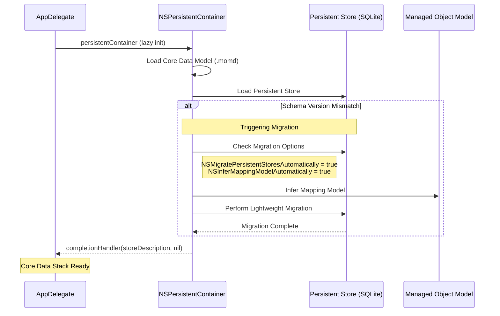
```mermaid
sequenceDiagram
    participant AD as AppDelegate
    participant PC as NSPersistentContainer
    participant PS as Persistent Store (SQLite)
    participant M as Managed Object Model

    AD->>PC: persistentContainer (lazy init)
    PC->>PC: Load Core Data Model (.momd)
    PC->>PS: Load Persistent Store
    
    alt Schema Version Mismatch
        Note over PC,PS: Triggering Migration
        PC->>PS: Check Migration Options
        Note right of PC: NSMigratePersistentStoresAutomatically = true<br/>NSInferMappingModelAutomatically = true
        PC->>M: Infer Mapping Model
        PC->>PS: Perform Lightweight Migration
        PS-->>PC: Migration Complete
    end
    
    PC-->>AD: completionHandler(storeDescription, nil)
    Note over AD: Core Data Stack Ready
```

### 2.3 Real-time Updates

- **Resilience**: Implements a watchdog timer and exponential-style fixed backoff reconnection logic (30 seconds).

#### 2.3.1 App Lifecycle & Connection Flow

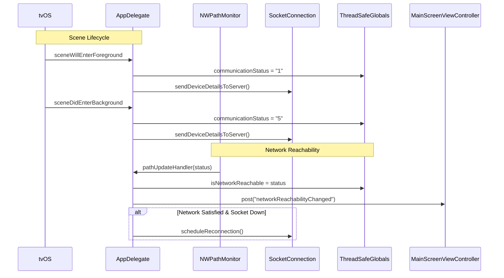
```mermaid
sequenceDiagram
    participant OS as tvOS
    participant AD as AppDelegate
    participant NM as NWPathMonitor
    participant SC as SocketConnection
    participant GL as ThreadSafeGlobals
    participant MS as MainScreenViewController

    Note over OS,AD: Scene Lifecycle
    OS->>AD: sceneWillEnterForeground
    AD->>GL: communicationStatus = "1"
    AD->>SC: sendDeviceDetailsToServer()
    
    OS->>AD: sceneDidEnterBackground
    AD->>GL: communicationStatus = "5"
    AD->>SC: sendDeviceDetailsToServer()

    Note over NM,GL: Network Reachability
    NM->>AD: pathUpdateHandler(status)
    AD->>GL: isNetworkReachable = status
    AD->>MS: post("networkReachabilityChanged")
    
    alt Network Satisfied & Socket Down
        AD->>SC: scheduleReconnection()
    end
```

### 2.4 UI Coordination (ViewUpdateHandler)

- **Trigger**: Called manually or via `updateUI()` after non-API state changes.
- **Mechanism**: Fetches cached data from Core Data and executes `SuccessResponse` delegates to refresh the UI layers.

#### 2.4.1 Local Data Refresh (Offline) Flow

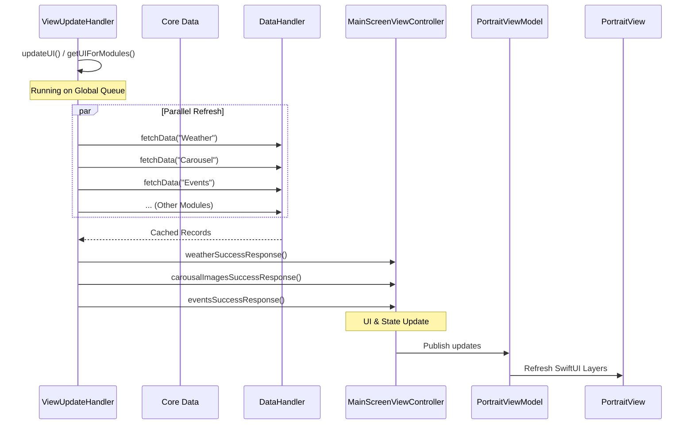
```mermaid
sequenceDiagram
    participant VH as ViewUpdateHandler
    participant CD as Core Data
    participant DH as DataHandler
    participant MS as MainScreenViewController
    participant VM as PortraitViewModel
    participant PV as PortraitView

    VH->>VH: updateUI() / getUIForModules()
    Note over VH: Running on Global Queue
    
    par Parallel Refresh
        VH->>DH: fetchData("Weather")
        VH->>DH: fetchData("Carousel")
        VH->>DH: fetchData("Events")
        VH->>DH: ... (Other Modules)
    end
    
    DH-->>VH: Cached Records
    VH->>MS: weatherSuccessResponse()
    VH->>MS: carousalImagesSuccessResponse()
    VH->>MS: eventsSuccessResponse()
    
    Note over MS: UI & State Update
    MS->>VM: Publish updates
    VM->>PV: Refresh SwiftUI Layers
```

### 2.8 Dynamic Content Pacing

- **File**: `ScrollDurationCalculator.swift`
- **Logic**: Automatically adjusts scroll durations and rotation intervals based on content density (e.g., number of events or weather items).
- **Constraints**: Enforces minimum readability durations (e.g., 10s for events, 8s for weather) while scaling linearly with item count.

- **File**: `ViewUpdateHandler.swift`
- **Purpose**: Orchestrates the refreshing of UI data across all modules.
- **Logic**: Provides centralized methods like `updateUI()` and `getUIForModules()` that trigger delegate callbacks for success responses (e.g., `weatherSuccessResponse`, `carousalImagesSuccessResponse`) defined in `MainScreenDelegate`.
- **Bridge**: Acts as the primary bridge between background data updates and the `MainScreenViewController`.

### 2.5 Data Fetching Logic (DataFetchingUtility)

- **Purpose**: Optimized performance by preventing unnecessary data fetching based on the current UI type.
- **Logic**: Defines rules for which modules (Weather, Events, Status Indicators, Radio) are active for each of the 6 UI types.
- **Integration**: Heavily used by `SocketConnection` and `ViewUpdateHandler` to decide whether to proceed with a data request.

### 2.6 App Startup and Data Fetching Flow

The following diagram illustrates the sequence from cold boot to the initial UI rendering and background data fetching:

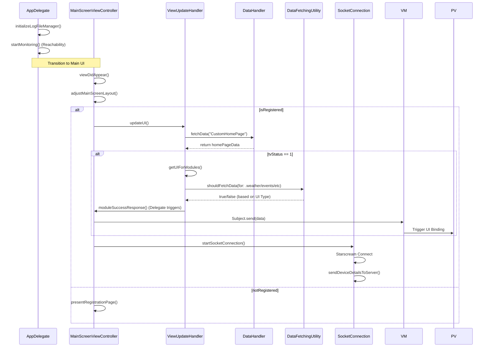
```mermaid
sequenceDiagram
    participant AD as AppDelegate
    participant MS as MainScreenViewController
    participant VH as ViewUpdateHandler
    participant DH as DataHandler
    participant DF as DataFetchingUtility
    participant SC as SocketConnection

    AD->>AD: initializeLogFileManager()
    AD->>AD: startMonitoring() (Reachability)
    
    Note over AD,MS: Transition to Main UI
    
    MS->>MS: viewDidAppear()
    MS->>MS: adjustMainScreenLayout()
    
    alt isRegistered
        MS->>VH: updateUI()
        VH->>DH: fetchData("CustomHomePage")
        DH-->>VH: return homePageData
        
        alt tvStatus == 1
            VH->>VH: getUIForModules()
            VH->>DF: shouldFetchData(for: .weather/events/etc)
            DF-->>VH: true/false (based on UI Type)
            
            VH->>MS: moduleSuccessResponse() (Delegate triggers)
            MS->>VM: Subject.send(data)
            VM->>PV: Trigger UI Binding
        end
        
        MS->>SC: startSocketConnection()
        SC->>SC: Starscream Connect
        SC->>SC: sendDeviceDetailsToServer()
    else notRegistered
        MS->>MS: presentRegistrationPage()
    end
```

### 2.7 Data Clearing & Default States (Empty Response Strategy)

A core architectural pattern in CATIE-TV is the use of **empty server responses** as a signal to clear or reset a module. This serves as a passive acknowledgement or "All Clear" signal.

- **Trigger**: A WebSocket message (e.g., `"carousal"`, `"weather"`) prompts the app to fetch new data.
- **Logic**: If the subsequent API request returns an empty JSON/data set, the app invokes the module's `FailureResponse` delegate.
- **Action**: The `FailureResponse` handler proactively invalidates timers, clears local data arrays, and resets the UI to a default state (e.g., hiding the view or showing generic placeholders).
- **Portrait Propagation**: Because `PortraitViewModel` subscribes to the UIKit state, these "Clear" actions automatically trigger SwiftUI view updates (e.g., setting `@Published` arrays to empty or visibility flags to `false`).
- **Benefit**: This allows the server to remotely "de-trigger" or hide any feature simply by purging its active data set.

---

### 2.9 NotificationCenter Communication

The application uses `NotificationCenter` as a decoupled messaging bus for system-wide events that require UI-layer reactions.

#### 2.9.1 Notification Communication Map

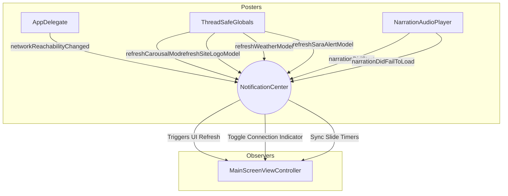
```mermaid
graph TD
    subgraph Posters
        AD[AppDelegate] -- "networkReachabilityChanged" --> NC
        TG[ThreadSafeGlobals] -- "refreshCarousalModel" --> NC
        TG -- "refreshSiteLogoModel" --> NC
        TG -- "refreshWeatherModel" --> NC
        TG -- "refreshSaraAlertModel" --> NC
        NP[NarrationAudioPlayer] -- "narrationDidStart" --> NC
        NP -- "narrationDidFailToLoad" --> NC
    end

    NC((NotificationCenter))

    subgraph Observers
        NC -- "Triggers UI Refresh" --> MS[MainScreenViewController]
        NC -- "Toggle Connection Indicator" --> MS
        NC -- "Sync Slide Timers" --> MS
    end
```

| Notification Name | Trigger Source | Handling Method in `MainScreen` |
| :--- | :--- | :--- |
| `networkReachabilityChanged` | `NWPathMonitor` in `AppDelegate` | `networkStatusChanged(notification:)` |
| `refreshCarousalModel` | Asset Finish in `ThreadSafeGlobals` | `refreshCarousalImages()` |
| `refreshSiteLogoModel` | Asset Finish in `ThreadSafeGlobals` | `refreshSiteLogoModel()` |
| `refreshWeatherModel` | Asset Finish in `ThreadSafeGlobals` | `refreshWeatherModel()` |
| `refreshSaraAlertModel` | Asset Finish in `ThreadSafeGlobals` | `refreshSaraAlertModel()` |
| `narrationDidStart` | Audio Start in `NarrationAudioPlayer` | `handleNarrationDidStart()` |
| `narrationDidFailToLoad` | Audio Error in `NarrationAudioPlayer` | `handleNarrationDidFailToLoad()` |

---

## 3. Module Implementations

### 3.1 Carousel

- **File**: `CarousalModel.swift`
- **Purpose**: Manages the rotating banner/slideshow on the main screen.
- **Logic**: Fetches data from the server, parses JSON, and stores slide info in `Carousal` and `CarousalImages` Core Data entities.
- **Media**: Downloads images locally using `fileDownloader` to ensure high performance and offline fallback.
- **Acknowledgement/Clear**: An empty response triggers `CarousalImagesFailureResponse`, which stops the timer and calls `presentDefaultSlide()` to show the `DummyCarousal` placeholder.

#### 3.1.1 Carousel Orchestration Flow

The following diagram explains the multi-stage lifecycle of the Carousel module, from fetching metadata to local media caching:

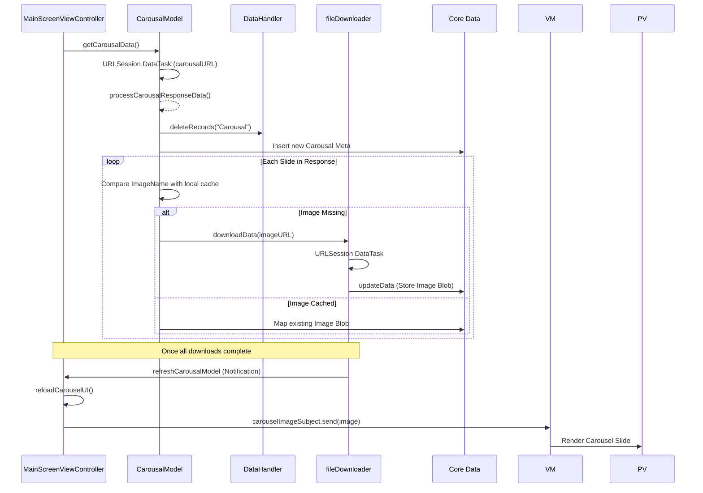
```mermaid
sequenceDiagram
    participant MS as MainScreenViewController
    participant CM as CarousalModel
    participant DH as DataHandler
    participant FD as fileDownloader
    participant CD as Core Data

    MS->>CM: getCarousalData()
    CM->>CM: URLSession DataTask (carousalURL)
    CM-->>CM: processCarousalResponseData()
    
    CM->>DH: deleteRecords("Carousal")
    CM->>CD: Insert new Carousal Meta
    
    loop Each Slide in Response
        CM->>CM: Compare ImageName with local cache
        alt Image Missing
            CM->>FD: downloadData(imageURL)
            FD->>FD: URLSession DataTask
            FD->>CD: updateData (Store Image Blob)
        else Image Cached
            CM->>CD: Map existing Image Blob
        end
    end
    
    Note over FD,MS: Once all downloads complete
    FD->>MS: refreshCarousalModel (Notification)
    MS->>MS: reloadCarouselUI()
    MS->>VM: carouselImageSubject.send(image)
    VM->>PV: Render Carousel Slide
```

### 3.2 Scroll Text

- **File**: `ScrollMessageModel.swift`
- **Purpose**: Displays scrolling informational or news messages.
- **Logic**: Fetches data from `API.networkAPI().scrollMessageURL`.
- **Circular Scrolling**: Implemented in `MainScreenViewControllerExtension.swift` by doubling the text content and using a `Timer` to animate `contentOffset.x` in a continuous loop.
- **Storage**: Sanitizes and saves messages into the `ScrollMessage` Core Data entity.
- **Acknowledgement/Clear**: An empty response triggers `scrollingMsgFailureResponse`, which clears the `scrollableText` and hides the `scrollableTextView`.

#### 3.2.1 Scroll Text Circular Lifecycle

The scroll text follows a continuous animation loop combined with periodic remote refreshes:

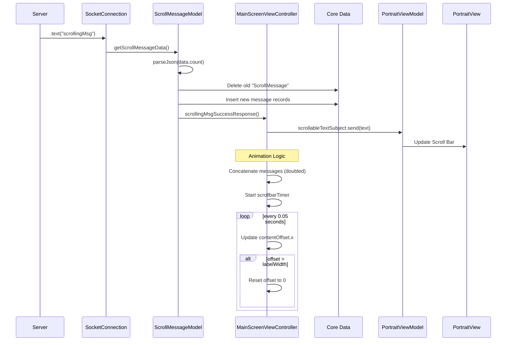
```mermaid
sequenceDiagram
    participant S as Server
    participant SC as SocketConnection
    participant SM as ScrollMessageModel
    participant MS as MainScreenViewController
    participant CD as Core Data
    participant VM as PortraitViewModel
    participant PV as PortraitView

    S->>SC: .text("scrollingMsg")
    SC->>SM: getScrollMessageData()
    SM->>SM: parseJson(data.count)
    
    SM->>CD: Delete old "ScrollMessage"
    SM->>CD: Insert new message records
    
    SM->>MS: scrollingMsgSuccessResponse()
    MS->>VM: scrollableTextSubject.send(text)
    VM->>PV: Update Scroll Bar
    
    Note over MS: Animation Logic
    MS->>MS: Concatenate messages (doubled)
    MS->>MS: Start scrollbarTimer
    loop every 0.05 seconds
        MS->>MS: Update contentOffset.x
        alt offset > labelWidth
            MS->>MS: Reset offset to 0
        end
    end
```

### 3.3 Status Indicator

- **File**: `StatusIndicatorModel.swift`
- **Purpose**: Visual cues for various system or facility statuses.
- **Implementation**: Standard fetching and parsing logic. Stored in `StatusIndicator` entity.
- **Acknowledgement/Clear**: An empty response triggers `statusIndicatorFailureResponse`, which clears the indicator array and hides the `statusIndicatorSuperView`.

#### 3.3.1 Status Indicator Lifecycle

Status indicators are managed as a collection that refreshes on notification:

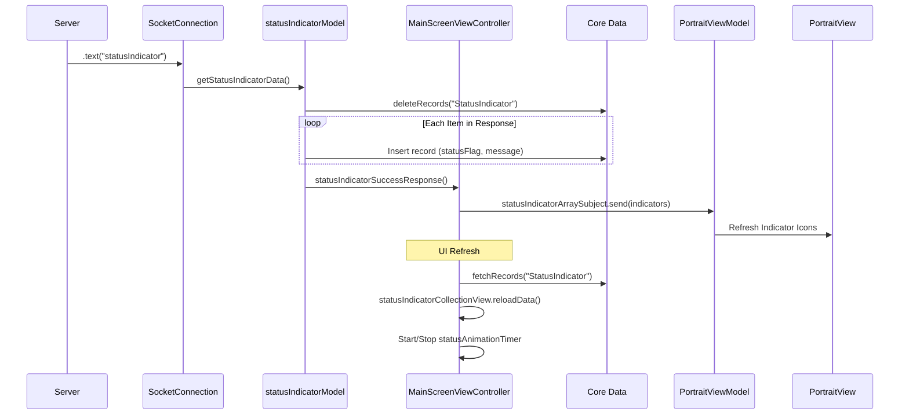
```mermaid
sequenceDiagram
    participant S as Server
    participant SC as SocketConnection
    participant SI as statusIndicatorModel
    participant MS as MainScreenViewController
    participant CD as Core Data
    participant VM as PortraitViewModel
    participant PV as PortraitView

    S->>SC: .text("statusIndicator")
    SC->>SI: getStatusIndicatorData()
    
    SI->>CD: deleteRecords("StatusIndicator")
    loop Each Item in Response
        SI->>CD: Insert record (statusFlag, message)
    end
    
    SI->>MS: statusIndicatorSuccessResponse()
    MS->>VM: statusIndicatorArraySubject.send(indicators)
    VM->>PV: Refresh Indicator Icons
    
    Note over MS: UI Refresh
    MS->>CD: fetchRecords("StatusIndicator")
    MS->>MS: statusIndicatorCollectionView.reloadData()
    MS->>MS: Start/Stop statusAnimationTimer
```

### 3.4 SARA Alert

- **File**: `SaraAlertModel.swift`
- **Purpose**: Handles high-priority emergency alerts with dynamic styling.
- **Entities**: `SaraAlert`, `SaraHeader`, `SaraBody`, `SaraBodyText`, `SaraBodyIndividual`, `SaraFooter`.
- **Complexity**: Parses nested structures to build a complete alert UI.
- **Styles**: Supports rich text formatting via `SaraBodyIndividual` components (colors, font sizes, alignments).
- **Flashing**: Implements a `saraAlertFlashTimer` that alternates between `borderColor` and `flashColor` when the `flash` flag is active.
- **Audio**: Triggers automatic download and playback of alert-specific audio files via `handledSaraAlertAudioOptions`.
- **Acknowledgement/- **Clear Logic**: An empty response triggers `saraAlertFailureResponse`, stoping audio and dismissing the UI.

#### 3.4.1 SARA Alert Priority Flow

The following diagram shows how SARA alerts interrupt the normal app state and take control of the UI and Audio:

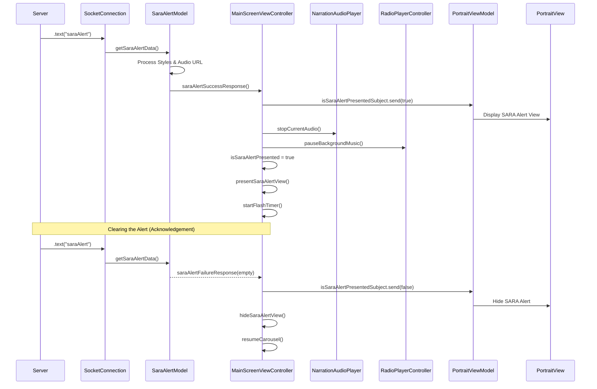
```mermaid
sequenceDiagram
    participant S as Server
    participant SC as SocketConnection
    participant SM as SaraAlertModel
    participant MS as MainScreenViewController
    participant AP as NarrationAudioPlayer
    participant RP as RadioPlayerController
    participant VM as PortraitViewModel
    participant PV as PortraitView

    S->>SC: .text("saraAlert")
    SC->>SM: getSaraAlertData()
    SM->>SM: Process Styles & Audio URL
    SM->>MS: saraAlertSuccessResponse()
    
    MS->>VM: isSaraAlertPresentedSubject.send(true)
    VM->>PV: Display SARA Alert View

    MS->>AP: stopCurrentAudio()
    MS->>RP: pauseBackgroundMusic()
    MS->>MS: isSaraAlertPresented = true
    MS->>MS: presentSaraAlertView()
    MS->>MS: startFlashTimer()

    Note over S,MS: Clearing the Alert (Acknowledgement)
    S->>SC: .text("saraAlert")
    SC->>SM: getSaraAlertData()
    SM-->>MS: saraAlertFailureResponse(empty)
    MS->>VM: isSaraAlertPresentedSubject.send(false)
    VM->>PV: Hide SARA Alert
    MS->>MS: hideSaraAlertView()
    MS->>MS: resumeCarousel()
```

#### 3.2.2 Dynamic Line-based Layout Logic

SARA body content is laid out using a complex iterative positioning engine:

1. **Vertical Iteration**: Processes `SaraBodyText` line-by-line.
2. **Horizontal Composition**: Groups `SaraBodyIndividual` items tagged with `+lineX` into the current vertical slot.
3. **Pointer Injection**: Dynamically injects bullet points (`\u{2022}`) or auto-incrementing numbers based on the `pointers` attribute.
4. **Coordinate Accumulation**: `yAxVal` is updated after each line based on the calculated height of the tallest item in the previous bundle.

### 3.5 Clock

- **File**: `ClockModel.swift`
- **Entities**: `Clock`.
- **Implementation**: Fetches clock display settings (e.g., message, visibility) from the server.
- **UI**: Displayed using `ClockView.swift`. Can be toggled by server commands (`showClock`/`hideClock`).
- **Empty Response**: If the server returns no clock data, it clears the current message and hidden the clock overlay.

#### 3.5.1 Clock Message Flow

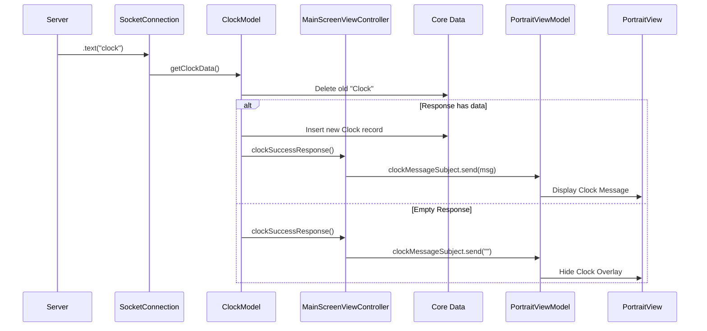
```mermaid
sequenceDiagram
    participant S as Server
    participant SC as SocketConnection
    participant CL as ClockModel
    participant MS as MainScreenViewController
    participant CD as Core Data
    participant VM as PortraitViewModel
    participant PV as PortraitView

    S->>SC: .text("clock")
    SC->>CL: getClockData()
    CL->>CD: Delete old "Clock"
    alt Response has data
        CL->>CD: Insert new Clock record
        CL->>MS: clockSuccessResponse()
        MS->>VM: clockMessageSubject.send(msg)
        VM->>PV: Display Clock Message
    else Empty Response
        CL->>MS: clockSuccessResponse()
        MS->>VM: clockMessageSubject.send("")
        VM->>PV: Hide Clock Overlay
    end
```

### 3.6 Radio

- **Files**: `RadioModel.swift` & `RadioPlayerController.swift`
- **Entity**: `Radio`.
- **Mechanism**: Uses `AVPlayer` for streaming audio.
- **Data**: Fetches radio feed URLs and metadata from `RadioModel`.
- **Interruption**: Logic in `RadioPlayerController` handles pausing radio when SARA alerts or Narrations take priority.
- **Persistence**: Metadata (URL, status) is stored in the `Radio` entity.
- **Priority**: Background playback is paused by high-priority modules like SARA or Narration.

#### 3.6.1 Radio Playback Lifecycle

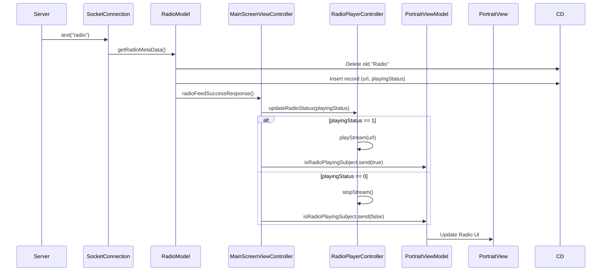
```mermaid
sequenceDiagram
    participant S as Server
    participant SC as SocketConnection
    participant RM as RadioModel
    participant MS as MainScreenViewController
    participant RC as RadioPlayerController
    participant VM as PortraitViewModel
    participant PV as PortraitView

    S->>SC: .text("radio")
    SC->>RM: getRadioMetaData()
    RM->>CD: Delete old "Radio"
    RM->>CD: Insert record (url, playingStatus)
    RM->>MS: radioFeedSuccessResponse()
    
    MS->>RC: updateRadioStatus(playingStatus)
    alt playingStatus == 1
        RC->>RC: playStream(url)
        MS->>VM: isRadioPlayingSubject.send(true)
    else playingStatus == 0
        RC->>RC: stopStream()
        MS->>VM: isRadioPlayingSubject.send(false)
    end
    VM->>PV: Update Radio UI
```

### 3.7 Sitelogo

- **File**: `SiteLogoModel.swift`
- **Entity**: `SiteLogo`.
- **Implementation**: Downloads the facility/site logo.
- **Flow**: Fetches logo URL -> Uses `fileDownloader.downloadData` -> Saves to `SiteLogo` entity.
- **Caching**: Uses `fileDownloader` to save the logo as a binary blob in the `SiteLogo` entity.
- **Reactivity**: Both Landscape and Portrait headers automatically update when a new branding asset is cached.

#### 3.7.1 Site Logo & Branding Flow

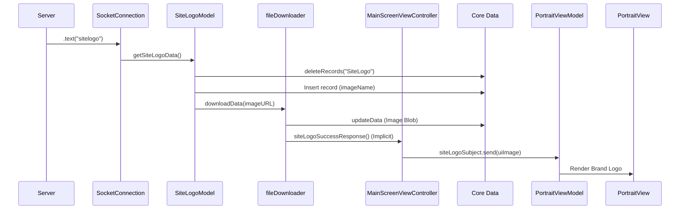
```mermaid
sequenceDiagram
    participant S as Server
    participant SC as SocketConnection
    participant SL as SiteLogoModel
    participant FD as fileDownloader
    participant MS as MainScreenViewController
    participant CD as Core Data
    participant VM as PortraitViewModel
    participant PV as PortraitView

    S->>SC: .text("sitelogo")
    SC->>SL: getSiteLogoData()
    SL->>CD: deleteRecords("SiteLogo")
    SL->>CD: Insert record (imageName)
    SL->>FD: downloadData(imageURL)
    FD->>CD: updateData (Image Blob)
    FD->>MS: siteLogoSuccessResponse() (Implicit)
    MS->>VM: siteLogoSubject.send(uiImage)
    VM->>PV: Render Brand Logo
```

### 3.8 Weather

- **File**: `WeatherModel.swift`
- **Entities**: `Weather`, `DetailedWeather`, `ForeCastWeather`.
- **Features**: Provides current conditions and 5-day forecasts.
- **Icon Handling**: Automatically downloads weather icons and stores them for offline use.
- **Acknowledgement/Clear**: An empty response triggers `weatherFailureResponse`, which stops the display timer and potentially reverts to static icons or hides the weather view.

#### 3.8.1 Weather Data & Icon Lifecycle

Weather management involves heavy data parsing and parallel icon caching:

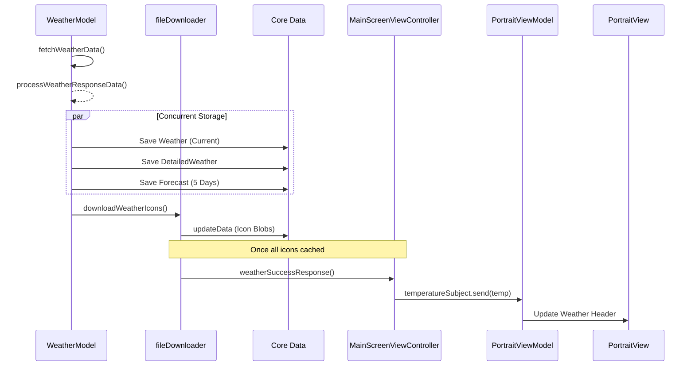
```mermaid
sequenceDiagram
    participant WM as WeatherModel
    participant FD as fileDownloader
    participant CD as Core Data
    participant MS as MainScreenViewController
    participant VM as PortraitViewModel
    participant PV as PortraitView

    WM->>WM: fetchWeatherData()
    WM-->>WM: processWeatherResponseData()
    
    par Concurrent Storage
        WM->>CD: Save Weather (Current)
        WM->>CD: Save DetailedWeather
        WM->>CD: Save Forecast (5 Days)
    end
    
    WM->>FD: downloadWeatherIcons()
    FD->>CD: updateData (Icon Blobs)
    
    Note over FD,MS: Once all icons cached
    FD->>MS: weatherSuccessResponse()
    MS->>VM: temperatureSubject.send(temp)
    VM->>PV: Update Weather Header
```

### 3.9 Narration

- **Implementation**: Managed by `NarrationAudioPlayer.swift`.
- **Logic**: Downloads audio files for specific carousel slides and plays them using `AVAudioPlayer`.
- **Portrait Sync**: The `isNarrationPlaying` state is bridged to Portrait mode to show/hide audio indicators.

#### 3.9.1 Narration Playback Flow

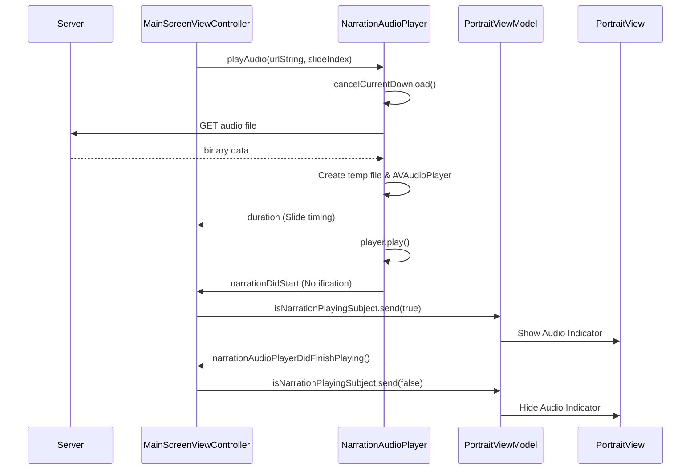
```mermaid
sequenceDiagram
    participant S as Server
    participant MS as MainScreenViewController
    participant NA as NarrationAudioPlayer
    participant VM as PortraitViewModel
    participant PV as PortraitView

    MS->>NA: playAudio(urlString, slideIndex)
    NA->>NA: cancelCurrentDownload()
    NA->>S: GET audio file
    S-->>NA: binary data
    NA->>NA: Create temp file & AVAudioPlayer
    NA->>MS: duration (Slide timing)
    
    NA->>NA: player.play()
    NA->>MS: narrationDidStart (Notification)
    MS->>VM: isNarrationPlayingSubject.send(true)
    VM->>PV: Show Audio Indicator
    
    NA->>MS: narrationAudioPlayerDidFinishPlaying()
    MS->>VM: isNarrationPlayingSubject.send(false)
    VM->>PV: Hide Audio Indicator
```

### 3.10 Log Push

- **Implementation**: Log files are gathered and pushed to the server using `LogHandlingModel.swift`.
- **Storage**: Logs are stored in the `/Caches/DebugLogs` directory.
- **Trigger**: Can be triggered remotely by the server via WebSocket command.

#### 3.10.1 Remote Diagnostic (LogPush) Flow

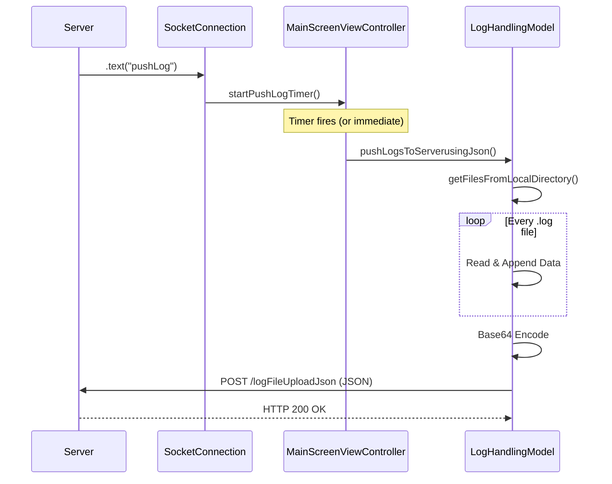
```mermaid
sequenceDiagram
    participant S as Server
    participant SC as SocketConnection
    participant MS as MainScreenViewController
    participant LH as LogHandlingModel

    S->>SC: .text("pushLog")
    SC->>MS: startPushLogTimer()
    Note over MS: Timer fires (or immediate)
    MS->>LH: pushLogsToServerusingJson()
    
    LH->>LH: getFilesFromLocalDirectory()
    loop Every .log file
        LH->>LH: Read & Append Data
    end
    LH->>LH: Base64 Encode
    LH->>S: POST /logFileUploadJson (JSON)
    S-->>LH: HTTP 200 OK
```

### 3.11 Websocket

- **File**: `SocketConnection.swift`
- **Purpose**: Provides real-time communication between the server and the app using the **Starscream** library.
- **Logic**: Listens for text-based triggers (e.g., `"carousal"`, `"weather"`) to perform on-demand data refreshes.
- **Resiliency**: Implements an automated reconnection strategy with a 30-second fixed backoff and a 20-second connection watchdog.

#### 3.11.1 WebSocket Communication Flow

The following diagram illustrates the real-time update lifecycle, including connection, messaging, and automated recovery:

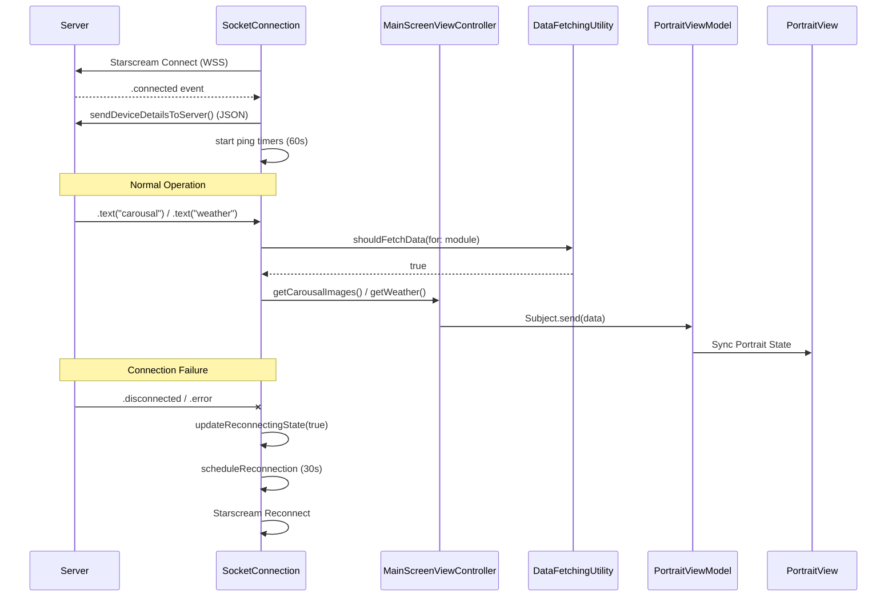
```mermaid
sequenceDiagram
    participant S as Server
    participant SC as SocketConnection
    participant MS as MainScreenViewController
    participant DF as DataFetchingUtility
    participant VM as PortraitViewModel
    participant PV as PortraitView

    SC->>S: Starscream Connect (WSS)
    S-->>SC: .connected event
    SC->>S: sendDeviceDetailsToServer() (JSON)
    SC->>SC: start ping timers (60s)
    
    Note over S,SC: Normal Operation
    
    S->>SC: .text("carousal") / .text("weather")
    SC->>DF: shouldFetchData(for: module)
    DF-->>SC: true
    SC->>MS: getCarousalImages() / getWeather()
    MS->>VM: Subject.send(data)
    VM->>PV: Sync Portrait State
    
    Note over S,SC: Connection Failure
    
    S-xSC: .disconnected / .error
    SC->>SC: updateReconnectingState(true)
    SC->>SC: scheduleReconnection (30s)
    SC->>SC: Starscream Reconnect
```

### 3.12 Thread Handling

- **Implementation**: Uses a concurrent `DispatchQueue` with barriers for writes to ensure global variables like `tvStatus` and `isNetworkReachable` are accessed safely across threads.
- **Deadlock Prevention**: When a property setter triggers a notification or UI update, it dispatches to the main queue to release the writer lock immediately.

#### 3.12.1 Reader-Writer Thread Safety Flow

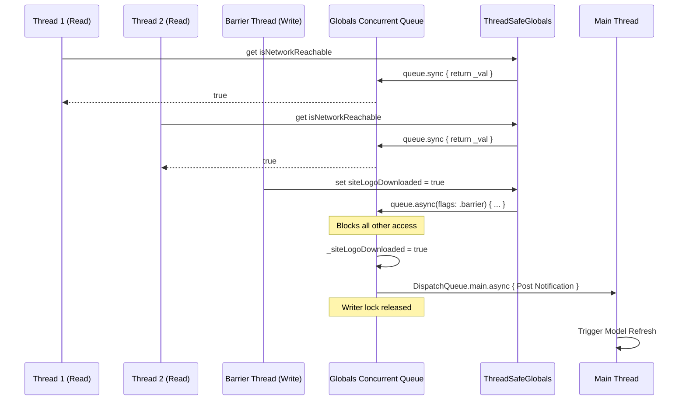
```mermaid
sequenceDiagram
    participant T1 as Thread 1 (Read)
    participant T2 as Thread 2 (Read)
    participant B as Barrier Thread (Write)
    participant Q as Globals Concurrent Queue
    participant G as ThreadSafeGlobals
    participant M as Main Thread

    T1->>G: get isNetworkReachable
    G->>Q: queue.sync { return _val }
    Q-->>T1: true
    
    T2->>G: get isNetworkReachable
    G->>Q: queue.sync { return _val }
    Q-->>T2: true

    B->>G: set siteLogoDownloaded = true
    G->>Q: queue.async(flags: .barrier) { ... }
    Note over Q: Blocks all other access
    Q->>Q: _siteLogoDownloaded = true
    Q->>M: DispatchQueue.main.async { Post Notification }
    Note over Q: Writer lock released
    M->>M: Trigger Model Refresh
```

### 3.13 Portrait Mode

- **Source**: `CATIE-TV-Portrait` directory.
- **Framework**: Built with **SwiftUI**.
- **Integration**: Communicates with the UIKit layer via the **Combine** framework.
- **Reactivity**: Covers **all modules**. When UIKit clears a module (via the Empty Response Strategy), the `@Published` properties in `PortraitViewModel` are updated, causing the SwiftUI `PortraitView` to hide or reset that component instantly.

#### 3.13.1 Portrait SwiftUI Bridge

The application uses a reactive bridge to synchronize data between the legacy UIKit manager and the modern SwiftUI interface:

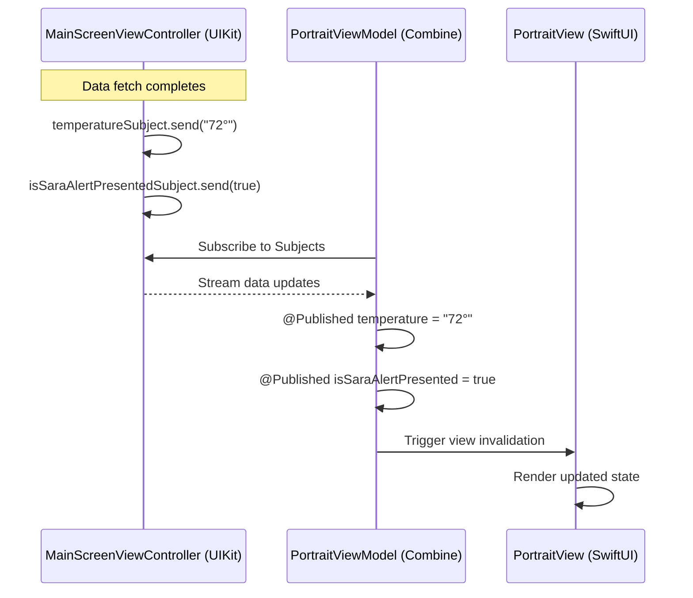
```mermaid
sequenceDiagram
    participant MS as MainScreenViewController (UIKit)
    participant VM as PortraitViewModel (Combine)
    participant PV as PortraitView (SwiftUI)

    Note over MS: Data fetch completes
    MS->>MS: temperatureSubject.send("72°")
    MS->>MS: isSaraAlertPresentedSubject.send(true)
    
    VM->>MS: Subscribe to Subjects
    MS-->>VM: Stream data updates
    
    VM->>VM: @Published temperature = "72°"
    VM->>VM: @Published isSaraAlertPresented = true
    
    VM->>PV: Trigger view invalidation
    PV->>PV: Render updated state
```

- **Bridge**: `PortraitViewController` hosts the SwiftUI view via `UIHostingController`.
- **Reactive**: `PortraitViewModel` uses `@Published` properties updated via `Combine` subscriptions to the `MainScreenViewController`.

### 3.14 Registration

- **File**: `RegistrationModel.swift`
- **Flow**: User enters Domain and Room Number.
- **Validation**: Performed via API. On success, `userId` is saved to `UserDefaults`, and the app state transitions to `tvStatus = 1` (Registered).

#### 3.14.1 Registration & Handshake Flow

The registration process transitions the app from an idle state to an active management state:

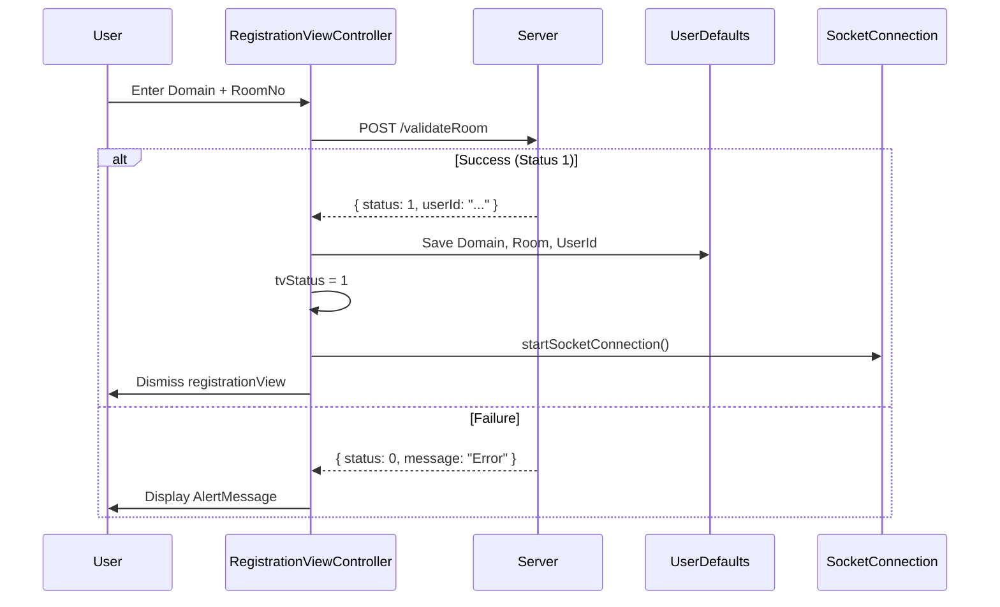
```mermaid
sequenceDiagram
    participant U as User
    participant RV as RegistrationViewController
    participant S as Server
    participant UD as UserDefaults
    participant SC as SocketConnection

    U->>RV: Enter Domain + RoomNo
    RV->>S: POST /validateRoom
    
    alt Success (Status 1)
        S-->>RV: { status: 1, userId: "..." }
        RV->>UD: Save Domain, Room, UserId
        RV->>RV: tvStatus = 1
        RV->>SC: startSocketConnection()
        RV->>U: Dismiss registrationView
    else Failure
        S-->>RV: { status: 0, message: "Error" }
        RV->>U: Display AlertMessage
    end
```

### 3.15 Custom Fonts

- **Assets**: Fonts like `Poppins` and `Roboto` are bundled in `Assets/Fonts`.
- **Helpers**: `DesignHelpers.swift` contains extensions to `UIFont` for applying traits like bold/italic programmatically.

### 3.16 Events

- **File**: `EventsModel.swift`
- **Entities**: `Event`, `EventList`.
- **Complexity**: Supports multi-calendar views.
- **Data**: Fetches `EventsData` containing lists of events with start/end times and descriptions.
- **Acknowledgement/Clear**: An empty response triggers `eventFailureResponse`, which clears scheduled events, hides the view, and triggers a fallback to `weatherSuccessResponse`.

#### 3.16.1 Events Processing & Timing Flow

Events use a specialized duration calculator to ensure content is readable based on the amount of data:

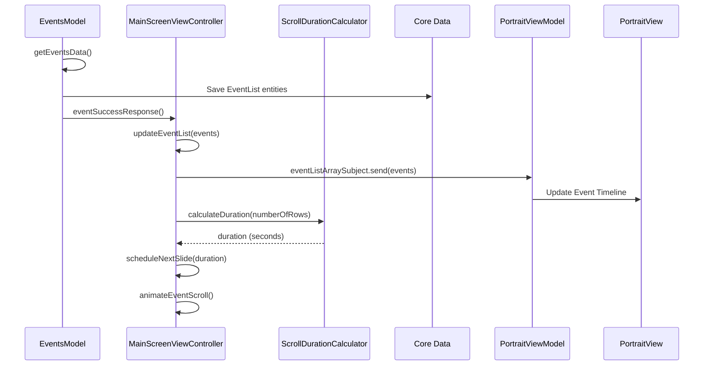
```mermaid
sequenceDiagram
    participant EM as EventsModel
    participant MS as MainScreenViewController
    participant SC as ScrollDurationCalculator
    participant CD as Core Data
    participant VM as PortraitViewModel
    participant PV as PortraitView

    EM->>EM: getEventsData()
    EM->>CD: Save EventList entities
    EM->>MS: eventSuccessResponse()
    MS->>MS: updateEventList(events)
    MS->>VM: eventListArraySubject.send(events)
    VM->>PV: Update Event Timeline
    
    MS->>SC: calculateDuration(numberOfRows)
    SC-->>MS: duration (seconds)
    
    MS->>MS: scheduleNextSlide(duration)
    MS->>MS: animateEventScroll()
```

### 3.17 Custom Home Page

- **File**: `CustomHomePageModel.swift`
- **Entity**: `CustomHomePage`.
- **Purpose**: Remote configuration of the dashboard's look and feel.
- **Settings**: Fetched via server, allowing real-time changes to font sizes, background colors, and UI types (Landscape/Portrait).

#### 3.17.1 Custom Home Page Flow

```mermaid
sequenceDiagram
    participant S as Server
    participant SC as SocketConnection
    participant CH as CustomHomePageModel
    participant CD as Core Data
    participant VH as ViewUpdateHandler
    participant MS as MainScreenViewController

    S->>SC: .text("customPage") (or daily sync)
    SC->>CH: getCustomHomePageData()
    CH->>S: GET /customHomePage
    S-->>CH: JSON Config (font size, colors, UI type)
    
    CH->>CD: Delete old "CustomHomePage"
    CH->>CD: Insert new config
    
    CH->>VH: dataForCustomHomePage(callFromAPI: true)
    VH->>MS: Refresh UI & Reload Views
    CH->>SC: syncDataForAllModules() (If UI type changed)
```

---

## 4. Initialization and Registration

### 4.1 App Initialization

- **App Start**: Initialized in `AppDelegate`. If credentials exist, it starts the `SocketConnection` and begins the initial sync of all modules.

### 4.2 Hidden Registration Trigger

- **Files**: `RegistrationTapHandler.swift`
- **Mechanism**: Uses `GameController` framework to observe `microGamepad` button presses.
- **Logic**: Detects a sequence of **5 presses** of the Select button (or Button A) within a 7-second window to trigger the registration callback.

#### 4.2.1 Hidden Registration Trigger Flow

```mermaid
sequenceDiagram
    participant R as Remote (Apple TV)
    participant GC as GameController Framework
    participant TH as RegistrationTapHandler
    participant MS as MainScreenViewController
    participant RV as RegistrationViewController

    R->>GC: Button A / Select Press
    GC->>TH: handleButtonPress(pressed: true)
    
    alt within 7 seconds
        TH->>TH: increment count
    else timeout
        TH->>TH: reset count
    end
    
    Note over TH: Count reaches 5
    TH->>MS: triggerRegistrationPage()
    MS->>MS: stopHomeViewUpdates()
    MS->>RV: present(RegistrationViewController)
    RV->>R: Show Registration UI
```

---

## 5. Core Utilities and Infrastructure

### 5.1 API Management

- **Files**: `DataHelpers.swift` (Classes: `API`, `networkAPI`)
- **Purpose**: Central repository for all server endpoints.
- **Authentication**: Handles `URLAuthenticationChallenge` globally for all `URLSession` tasks.

### 5.2 File Downloader

- **File**: `DataHelpers.swift`
- **Purpose**: A background asset management utility that downloads media (Images/Audio) and updates Core Data.

#### 5.2.1 Completion Signal Chain

The app uses a "Signal-to-Post" pattern to inform UI components when background assets are ready:

```mermaid
sequenceDiagram
    participant FD as fileDownloader
    participant URL as URLSession
    participant CD as Core Data
    participant GL as ThreadSafeGlobals (Setters)
    participant NC as NotificationCenter
    participant MS as MainScreenViewController

    FD->>URL: dataTask(with: url)
    URL-->>FD: Data (Image/Audio Byte Stream)
    FD->>CD: updateData(entity, identifier, data)
    CD-->>FD: Context Saved
    
    FD->>GL: siteLogoDownloaded = true / downloadedCarousalCount++
    Note over GL: Writer Lock (Barrier)
    GL->>NC: Post "refreshSiteLogoModel" / "refreshCarousalModel"
    Note over NC: Dispatch to Main Thread
    NC->>MS: Trigger Success Delegate
    MS->>MS: Reload UI Components
```

### 5.3 Exception Handling (Defensive Execution)

- **Files**: `SwiftTryCatch.h/m`
- **Rational**: Objective-C `@try/@catch` blocks are used to wrap Swift execution at critical boundaries (Registration, Layout, Networking).
- **Benefit**: Prevents app-wide crashes caused by unexpected API data types or Core Animation illegal states by catching exceptions that Swift's `do-catch` (Errors) cannot trap.

### 5.4 Device Details

- **File**: `DataHelpers.swift` (Class: `DeviceDetails`)
- **Purpose**: Provides metadata about the hardware state:
  - **Networking**: Retrieves IP addresses across WiFi, Cellular, and Ethernet.
  - **Hardware**: Identifies Apple TV generation (4, 4K, 2nd Gen, etc.).
  - **App Info**: Provides OS version and bundled App version.

---

## 6. Logging

- **Framework**: `CocoaLumberjackSwift`.
- **Storage Path**: `Library/Caches/DebugLogs`.
- **Rotation Configuration**:
  - `rollingFrequency`: 2 days (48 hours).
  - `maximumFileSize`: 2MB per file.
  - `maximumNumberOfLogFiles`: 2 files (keeps current and previous).
- **Log Formatting**: Standardized prefix with `yyyy/MM/dd HH:mm:ss:SSS`.

### 6.1 Server Push Orchestration

Logs are automatically transmitted to the server to allow remote diagnosis:

1. **Trigger**: A 12-hour timer (`pushLogFilesTimer`) initialized in `viewDidAppear`.
2. **Combination**: `LogHandlingModel` reads all `.log` files in the debug directory and appends them into a single `Data` blob.
3. **Encoding**: The raw log data is encoded to **Base64** to ensure safe network transmission.
4. **Transmission**: Sent via a POST request to the `logFileUploadJson` endpoint, including the `roomNumber` and the encoded `logFile` string.
5. **Security**: Uses `URLSession` with custom authentication handling to validate server trust.

---

## 7. Development Environment and Tools

The project uses several tools to maintain code quality, consistency, and cleanliness.

### 7.1 SwiftFormat

**SwiftFormat** is used to enforce a consistent coding style across the project.

- **Configuration**: [`.swiftformat`](file:///Users/harish/Developer/iOS/CATIE-TV/.swiftformat)
- **Installation**: `brew install swiftformat`
- **Usage**: Automatically formats code according to the rules defined in the configuration file.

### 7.2 Periphery

**Periphery** is a tool used to identify and remove unused code (dead code) from the project.

- **Configuration**: [`.periphery.yml`](file:///Users/harish/Developer/iOS/CATIE-TV/.periphery.yml)
- **Installation**: `brew install periphery`
- **Usage**: Run `periphery scan` to identify unused declarations, protocols, and properties.

### 7.3 SwiftLint

**SwiftLint** is configured for the project but currently **disabled** to avoid overwhelming the build with legacy warnings.

- **Configuration**: [`.swiftlint.yml`](file:///Users/harish/Developer/iOS/CATIE-TV/.swiftlint.yml)
- **Status**: Currently not active in build phases, but the config includes exclusion paths for generated code and Core Data properties.

---

## 8. UI Architecture (Landscape)

The Landscape interface is highly customized via `DesignHelpers.swift` extensions and specialized collection/table view cells.

### 8.1 Custom Components

- **`ClockView`**: A custom `UIView` that handles real-time time/date formatting and display.
- **`StatusIndicatorCollectionViewCell`**: Manages the visual state (active/inactive) of facility indicators, including custom `UIPageControl` dot styling.
- **`FourDayWeatherTableCell` & `DetailedWeatherTableViewCell`**: Render complex weather data with localized styling.
- **`SingleCalendarEventCell` & `MultipleCalendarEventCell`**: Handle event layouts for different calendar configurations.

### 8.2 Design Helpers

- **`UIView` Extensions**: Provides `@IBInspectable` properties for `cornerRadius`, `borderWidth`, `shadowColor`, and `addGradientColor` for easy Interface Builder styling.
- **`UIColor` Extensions**: Convenience initializers for RGB and Hex strings.
- **`UIFont` Extensions**: Adds trait support (bold/italic) to custom-loaded fonts like Poppins.

---

## 9. Architectural Utilities

### 9.1 ScrollDurationCalculator

- **File**: `ScrollDurationCalculator.swift`
- **Purpose**: Centralized logic for calculating "reading time" and scroll speeds.
- **Logic**:
  - **Events**: Calculates duration based on `numberOfRows` (2 events per row) with a `minimumEventsDuration` of 10s.
  - **Weather**: Calculates duration based on items count with a `minimumWeatherDuration` of 8s.
- **Benefit**: Ensures that content remains on screen long enough for the user to read, regardless of the amount of data.

---

## 10. Development Tips

> [!TIP]
> When adding a new module:
>
> 1. Define the Core Data entity.
> 2. Create a Model class following the `URLSession` + `DataHandler` pattern.
> 3. Add a delegate method to `MainScreenDelegate`.
> 4. Add a socket trigger in `SocketConnection.swift`.

---

## 11. Thread Safety and Concurrency

The application operates in a highly concurrent environment with background networking, WebSocket updates, and UI rendering. Thread safety is enforced through centralized utilities.

### 11.1 Reader-Writer Pattern

The project implements a **Reader-Writer pattern** using Grand Central Dispatch (GCD) to allow concurrent reads while ensuring exclusive writes.

- **Implementation**: Found in `ThreadSafeGlobals.swift` and `ThreadSafeDictionary.swift`.
- **Mechanism**:
  - **Reads**: Performed using `queue.sync` for immediate retrieval.
  - **Writes**: Performed using `queue.async(flags: .barrier)` to ensure no other thread is accessing the resource during the update.
- **Queue Type**: A custom concurrent `DispatchQueue` (e.g., `com.statusSolutions.CATIE-TV.globals`).

### 11.2 UI Thread Safety

All UI updates and notification triggers must occur on the **Main Thread**.

- **Pattern**: Most setters in `ThreadSafeGlobals` or callback handlers in `MainScreenViewController` use `DispatchQueue.main.async` to bridge from background processing to the UI layer.
- **Example**: Post-download refreshes or SARA alert presentations are always dispatched to the main queue.

### 11.3 Deadlock Prevention

To prevent deadlocks when a thread-safe setter triggers a UI update (which might try to read a global value):

- **Logic**: Logic within `didSet` or set-blocks that interacts with `NotificationCenter` or the Main Queue is wrapped in `DispatchQueue.main.async`.
- **Reasoning**: This ensures the writer lock on the concurrent queue is released before the main thread attempts any subsequent reads, preventing a circular wait.

---

## 12. CI/CD and Automation (Fastlane)

The project uses **Fastlane** to automate the build, testing, and deployment processes to TestFlight and the App Store.

### 12.1 Automation Lanes

Found in [`fastlane/Fastfile`](file:///Users/harish/Developer/iOS/CATIE-TV/fastlane/Fastfile):

- **`lane :beta`**:
  - Builds the app with the `CATIE-TV` scheme.
  - Exports for `app-store`.
  - Uploads the build to **TestFlight** for the Beta group.
  - Triggers a Teams notification upon completion.
- **`lane :release-candidate`**:
  - Promotes an existing TestFlight build to the **Release Candidate** testing group.
  - Notifies "Status QA" and "E2 External" testers.
- **`lane :production`**:
  - Submits an existing TestFlight build for **App Store Review**.
  - Skips binary upload (uses existing build) and metadata updates.

### 12.2 MS Teams Integration

- **Method**: The `notify_teams` helper method sends a Rich Adaptive Card to MS Teams via a Power Automate webhook.
- **Payload**: Includes build date, version, release type, app name, package name, branch name, and the last commit message.
- **Aesthetics**: Uses dynamic badge styles (Attention, Warning, Good) based on the release type.

### 12.3 Configuration and Security

- **App Store Connect API**: Authenticates using an API Key (`.p8` file) specified in `before_all`.
- **Appfile**: Manages the `app_identifier` (Bundle ID) and Apple ID credentials.

---

## 13. Orchestration and State Management

The `MainScreenViewController` centralizes the app's orchestration, managing transitions between layout types and ensuring state consistency.

### 13.1 Carousel Ad-Ratio

The application implements a strict advertisement rotation logic in `advanceToNextSlideWithAdvertisements()`:

- **Rule**: For every 4 normal slides shown, 1 advertisement slide is inserted.
- **Arrays**: Managed via `normalSlidesArray` and `advertisementSlidesArray`.
- **Persistence**: Both types are stored in Core Data but differentiated by `carouselType` (0 for Normal, 2 for Advertisement).

### 13.2 UI Type Categorization

The app supports multiple UI layouts driven by the `catieTvType` (or `actualUIType`):

- **Landscape Layouts (1, 2, 5)**: Optimized for TV screens with horizontal sections for Event/Weather.
- **Portrait Layouts (3, 4, 6)**: Optimized for vertically mounted screens, leveraging the SwiftUI `PortraitView`.
- **UI Type 5 (Carousel-Only)**: A special landscape mode that expands the Carousel to full width and reduces other modules.

### 13.3 Portrait State Synchronization

The Portrait mode relies on a 1:1 mapping between UIKit `Subjects` and SwiftUI `@Published` properties:

| Module | UIKit Subject | SwiftUI @Published Property | Clear Behavior |
| :--- | :--- | :--- | :--- |
| **SARA Alert** | `isSaraAlertPresentedSubject` | `isSaraAlertPresented` | View hides instantly |
| **Carousel** | `carouselImageSubject` | `currentCarouselImage` | Reverts to nil/placeholder |
| **Weather** | `temperatureSubject` | `temperature` | Resets to "--°" |
| **Events** | `eventListArraySubject` | `eventListArray` | List clears/hides |
| **Status** | `statusIndicatorArraySubject` | `statusIndicatorArray` | Icons removed |
| **Scroll Text** | `scrollableTextSubject` | `scrollableText` | Bar hides |
| **Clock** | `isClockPresentedSubject` | `isClockVisible` | Clock hides |

This synchronization is handled in `PortraitViewModel.setupSubscriptions(from:)`, ensuring that any remote orchestration (including "All Clear" signals) is reflected cross-platform.

### 13.4 Audio Priority and Conflict Management

The application manages multiple potentially overlapping audio sources with a strict priority hierarchy:

```mermaid
graph TD
    SARA[SARA Alert] -->|Interrupts| NARR[Narration]
    SARA -->|Interrupts| RAD[Radio / Background]
    NARR -->|Mutes| RAD
    CLO[Clock Logic] -->|Pauses| NARR
    CLO -->|Pauses| RAD

    subgraph Priorities
    P1[Priority 1: SARA Alert]
    P2[Priority 2: Narration/Audio Slides]
    P3[Priority 3: Background Radio]
    end
```

The method `updateCarouselAudioStatus()` manages the `AVAudioSession` priority:

1. **SARA Alert**: Highest priority - pauses carousel music and narration.
2. **Narration**: Medium priority - ducks or pauses carousel music.
3. **Carousel Music/Radio**: Lowest priority - background playback.

- **Cleanup**: `stopHomeViewUpdates()` ensures all timers (10+ active timers) and audio players are safely invalidated when transitioning to Registration or during "Room Detailed" events.

---

## 14. Module Availability and Visibility

The application optimizes data fetching and UI rendering based on the active `UI Type`. This ensures that hidden components do not consume network or CPU resources.

### 14.1 Module Availability by UI Type

| UI Type | Layout | Weather | Events | Status Indicators | Radio Data | Description |
| :--- | :--- | :--- | :--- | :--- | :--- | :--- |
| **1** | Landscape | ✅ Always | ✅ Always | ✅ Always | ✅ Always | Full content layout |
| **2** | Landscape | ✅ Always | ❌ Skip | ✅ Always | ✅ Always | No events, date/time focus |
| **3** | Portrait | ✅ Always | ✅ Always | ✅ Always | ✅ Always | Full content portrait |
| **4** | Portrait | ✅ Always | ❌ Skip | ❌ Skip | ✅ Always | Full screen portrait image |
| **5** | Landscape | ✅ Always | ❌ Skip | ❌ Skip | ⚠️ `tvRadioFlag` | Carousel-only wide |
| **6** | Portrait | ✅ Always | ❌ Skip | ❌ Skip | ⚠️ `tvRadioFlag` | Carousel-only padded |

> [!NOTE]
> For UI Types 5 and 6, the Radio module is only enabled if the server returns `tvRadioFlag = 1`.

### 14.2 Timer Management Rules

Timers are strictly controlled to prevent background processing for inactive modules:

- **Weather Display Timer (10s)**: Only active for **UI Type 1** (and only if no events are present).
- **Event Animation Timer (15s)**: Only active for **UI Type 1**.
- **Ongoing Event Schedule Timer**: Active only for **UI Types 1 and 3**.
- **Status Animation Timer (10s)**: Active for Landscape **UI Types 1, 2, 5** (Portrait uses separate logic).
- **Scrollbar Timer (4s)**: Active for all Landscape layouts (**UI Types 1, 2, 5**).
- **Always Active**: Carousel Timer, Time/Date Timer, and SARA Alert Flash Timer.

### 14.3 Weather View Visibility Rules

The Landscape UI manages two specific weather views: `detailedWeatherView` (current stats) and `fourDayWeatherView` (forecast).

- **UI Type 1**: Alternates between these views every 10 seconds **only when no events are present**.
- **All Other Types (2-6)**: Both views are **Always Hidden**. They only display basic weather (Temp/Icon) in the header.
- **Portrait Views (3, 4, 6)**: Use SwiftUI-based weather components instead of these UIKit views.

---

## 15. Knowledge Transfer Roadmap (20-Hour Plan)

This roadmap outlines an accelerated 20-hour curriculum to bring a developer from zero to a contributor level.

### 15.1 Curriculum Phases

#### Phase 1: Core Foundation (4 Hours)

- **Topics**: Architecture Overview, Core Data Persistence, Empty Response Strategy, Thread Safety (`ThreadSafeGlobals`), and Data Fetching Logic.
- **Goal**: Understand how the app starts, handles persistent storage, and manages thread-safe global state and clearing logic.

#### Phase 2: High-Impact UI Modules (4 Hours)

- **Topics**: Carousel (Ad-ratio), Weather (Visibility Rules), Events, **Scroll Text**, **Status Indicator**, **Clock**, and **Sitelogo**.
- **Goal**: Master the logic and UI implementations of all primary and secondary visual modules.

#### Phase 3: Service Layer and Resiliency (4 Hours)

- **Topics**: WebSocket triggers, SARA Alert (Layout Logic), NotificationCenter Communication, Audio Priority, and **Narration** (TTS).
- **Goal**: Understand real-time orchestration, system-wide overrides, and decoupled event handling.

#### Phase 4: UI Orchestration and State (4 Hours)

- **Topics**: `MainScreenViewController` lifecycle, Portrait SwiftUI Bridge (Combine), **Custom Home Page**, and **Registration** flow.
- **Goal**: Master the transitions between layouts and the synchronization of UIKit and SwiftUI states.

#### Phase 5: DevOps, Automation and Maintenance (4 Hours)

- **Topics**: Fastlane Lanes, Logging Rotation, **Log Push** Orchestration, and **Device Details** metadata.
- **Goal**: Prepare for automated deployment, remote diagnosis, and metadata management.

### 15.2 Consolidated KT Roadmap Matrix

| Phase | Category | Modules / Components | Key Focus | Estimation (Hrs) |
| :--- | :--- | :--- | :--- | :--- |
| **1** | **Foundation** | Architecture, Core Data, Thread Safety, Data Fetching, Empty Response | IPC, persistence, global state, clear logic | 4.0 |
| **2** | **UI Modules** | Carousel, Weather, Events, Scroll, Status, Clock, Logo | Visual logic, animation, layout rules | 4.0 |
| **3** | **Services** | Websockets, SARA, NotificationCenter, Audio Priority, Narration | Real-time triggers, decoupled events, TTS | 4.0 |
| **4** | **Orchestration** | MainScreen, Portrait Bridge, Custom Home, Registration | State sync, SwiftUI bridge, remote config | 4.0 |
| **5** | **Ops / Maintenance** | Fastlane, Logging, Log Push, Server Push, Device Details | Deployment, rotation, diagnostics, metadata | 4.0 |
| **Total** | | **All 20 Modules & Infrastructure** | | **20.0** |
