# CATIE TV - Product Documentation

| Document Information | Details |
|---------------------|---------|
| **Version** | 1.0 |
| **Last Updated** | March 2, 2026 |
| **Document Type** | Internal Use Only |
| **Application** | CATIE TV (tvOS Digital Signage) |
| **Created by** | Harish Anbalagan |

> **Note for Developers:** This document focuses on admin configuration and product features. For technical implementation details, architecture, code patterns, and development guidelines, please refer to the **[Technical KT Document](Technical%20KT.md)**.

---

## Table of Contents

1. [Overview](#overview)
2. [Initial Setup & Registration](#initial-setup--registration)
3. [UI Types & Layouts](#ui-types--layouts)
   - [UI Type 1: Full Content Layout](#ui-type-1-full-content-layout)
   - [UI Type 2: Clock-Focused Display](#ui-type-2-clock-focused-display)
   - [UI Type 3: Portrait Mode Display](#ui-type-3-portrait-mode-display)
   - [UI Type 4: Full-Screen Carousel](#ui-type-4-full-screen-carousel)
   - [UI Type 5: Full Carousel Layout](#ui-type-5-full-carousel-layout)
   - [UI Type 6: Portrait Center Layout](#ui-type-6-portrait-center-layout)
4. [Feature Configuration](#feature-configuration)
   - [Carousel Management](#carousel-management)
     - [Advertisement / Placeholder Slides](#advertisement--placeholder-slides)
   - [Event Calendar](#event-calendar)
   - [Status Indicators](#status-indicators)
   - [Radio Configuration](#radio-configuration)
   - [Clock Configuration](#clock-configuration)
   - [Scroll Text](#scroll-text)
   - [Weather Configuration](#weather-configuration)
   - [Logo Configuration](#logo-configuration)
   - [SARA Emergency Alerts](#sara-emergency-alerts)
5. [Monitoring & Troubleshooting](#monitoring--troubleshooting)
   - [TV Status Monitoring](#tv-status-monitoring)
   - [Log Collection](#log-collection)
     - [Log Retrieval](#log-retrieval)
     - [Log Files Location](#log-files-location)
6. [MDM Configuration](#mdm-configuration)

---

## Overview

CATIE TV is a tvOS application that displays digital signage content including:

- Real-time weather information
- Event calendars
- Status indicators
- Image carousels
- Radio streaming
- SARA emergency alerts
- Scrolling messages

The application connects to a CATIE server via WebSocket for real-time updates and supports both landscape and portrait orientations with 6 different UI layout types.

---

## Initial Setup & Registration

### Registration Steps

#### 1. Configure Room in CATIE Admin

1. Open **CATIE Admin** web interface
2. Navigate to **Room Administration**
3. Select a room that is detached or create a new room
4. In the **Solutions** section, select **CATIE TV**
5. Choose the desired **UI Type** (1-6) from the dropdown

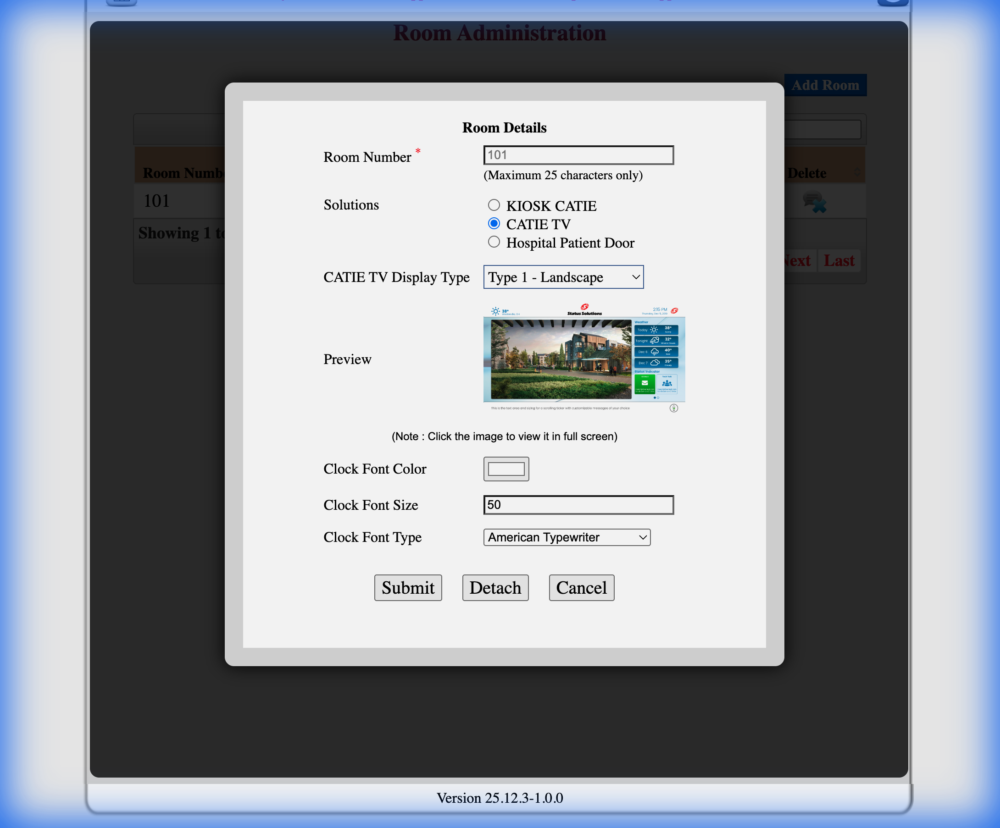

#### 2. Register TV Device

1. Launch the CATIE TV app on Apple TV
2. The registration screen will appear with the CATIE TV logo

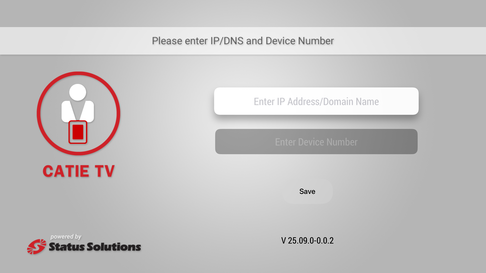

**First-Time Registration:**

On the initial registration screen, enter:

- **IP/DNS (Server URL)**: Enter the IP address or domain name of CATIE server (e.g., `e2dev1.mycatie.com`, `catie.example.com`, or `192.168.1.100`)
- **Device Number**: Enter the device/room identifier configured in admin (e.g., `tv1_e2dev1`, `1001`)

Select **Save** to confirm and complete the registration.

**Modifying Existing Registration:**

After initial registration, if you return to the registration page (by pressing the remote button 5 times), you'll see:

- Pre-filled **IP/DNS** and **Device Number** fields with your current registration
- **Modify** button: Click to save changes to registration details
- **Cancel** button: Click to discard changes and return to the home screen

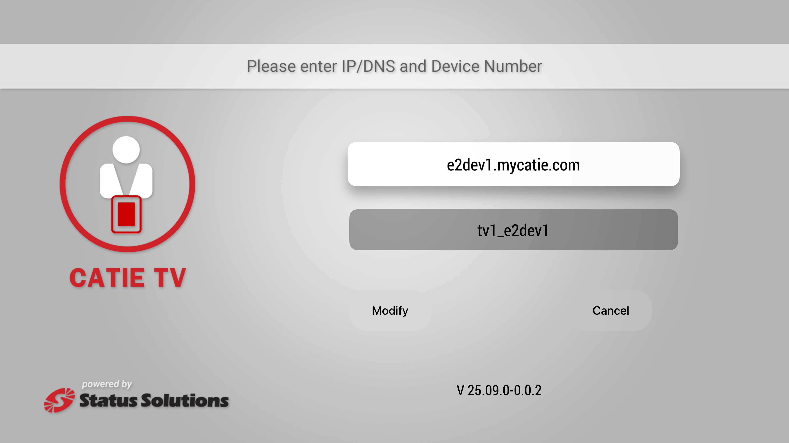

**Registration Screen Features:**

- Shows CATIE TV branding with logo
- Displays current app version at the bottom (e.g., "V 25.09.0-0.0.2")
- Powered by Status Solutions branding

#### 3. Verify Registration

Once registration is completed, the app will redirect to the home page and display content based on the configured UI type.

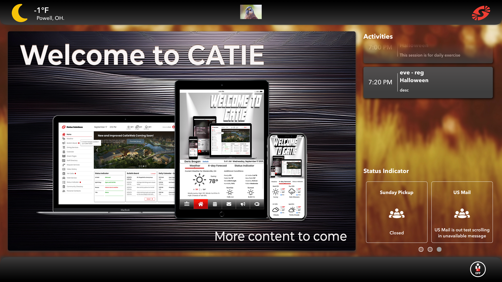

**After Successful Registration, You Should See:**

- **Weather Information**: Temperature and location in the top-left corner (e.g., "-1°F Powell, OH")
- **Site Logo**: Custom facility logo in the top-right corner
- **Welcome Message**: Large "Welcome to CATIE" banner (if configured)
- **Carousel**: Rotating images/content in the center area showing "More content to come"
- **Activities/Events**: Upcoming events listed on the right side (e.g., "TRIVIA", "Halloween"). *Note: If no events are allocated to the TV, detailed weather information will be displayed here by default.*
- **Status Indicators**: Facility status indicators showing services and their availability (e.g., "Sunday Pickup - Closed", "US Mail")
- **Scroll Text**: Scrolling message bar at the bottom (if configured)
- **Time Display**: Current time shown in the interface

#### 4. Re-accessing Registration

To open the registration page after initial setup:

- Press the **Apple TV remote primary button 5 times** quickly

---

## UI Types & Layouts

CATIE TV supports 6 different UI layout types optimized for various content display scenarios:

| UI Type | Orientation | Aspect Ratio | Primary Use Case | Components Displayed |
|---------|-------------|--------------|------------------|----------------------|
| **Type 1** | Landscape | 16:9 | Full content layout | Weather/Events\*, Status, Carousel, Radio |
| **Type 2** | Landscape | 16:9 | Clock-focused display | Weather, Time/Date, Status, Carousel, Radio |
| **Type 3** | Portrait | 9:16 | Full content portrait | Weather, Events, Status, Carousel, Radio |
| **Type 4** | Portrait | 1:1 | Full-screen image | Basic weather, Carousel only |
| **Type 5** | Landscape | 21:9 | Carousel-focused wide | Basic weather, Carousel, Optional Radio |
| **Type 6** | Portrait | 9:16 | Carousel-focused padded | Basic weather, Carousel, Optional Radio |

*\*For UI Type 1, the detailed weather forecast is displayed if no events are allocated to the TV.*

### Changing UI Type

To change the UI type for a registered TV:

> [!WARNING]
> Changing the UI Type to a different orientation (e.g., from Landscape to Portrait) will automatically remove all previously assigned carousel slides. You will need to reallocate slides with the correct orientation after making this change.

1. Open **CATIE Admin** > **Room Administration**
2. Locate the room assigned to the TV
3. Change the **UI Type** dropdown to desired type
4. Click **Submit**
5. The TV will automatically update to the new layout within seconds

### UI Type Feature Matrix

| Feature | Type 1 | Type 2 | Type 3 | Type 4 | Type 5 | Type 6 |
|---------|--------|--------|--------|--------|--------|--------|
| Full Weather Display | ✅ | ❌ | ✅ | ❌ | ❌ | ❌ |
| Events List | ✅ | ❌ | ✅ | ❌ | ❌ | ❌ |
| Status Indicators | ✅ | ✅ | ✅ | ❌ | ❌ | ❌ |
| Clock Display | Standard | Prominent | Standard | Standard | Standard | Standard |
| Radio Player | Always | Always | Always | Always | Optional* | Optional* |
| Carousel | Standard | Standard | Portrait | Full-Screen | Wide | Portrait-Padded |
| Ingage | ✅ | ✅ | ❌ | ❌ | ❌ | ❌ |

*\*Radio is shown in Types 5-6 only if `tvRadioFlag` is set to 1 in admin configuration*

### UI Type 1: Full Content Layout

The following screenshot shows UI Type 1, featuring the full content landscape layout:

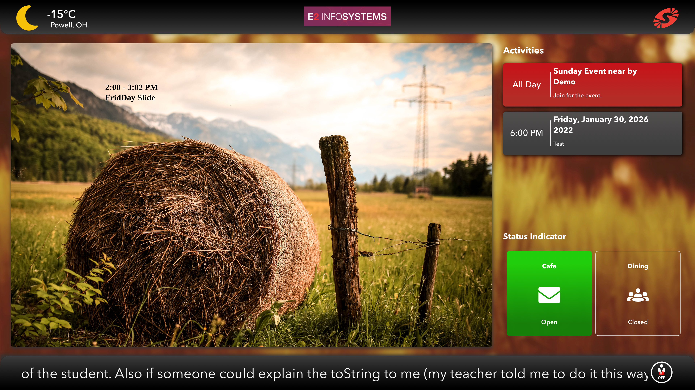

This landscape layout (Type 1, 16:9 aspect ratio) provides the most comprehensive view of all CATIE TV features, making it ideal for full-featured digital signage displays that need to show all information simultaneously.

### UI Type 2: Clock-Focused Display

The following screenshot shows UI Type 2, which emphasizes time display with a prominent clock:

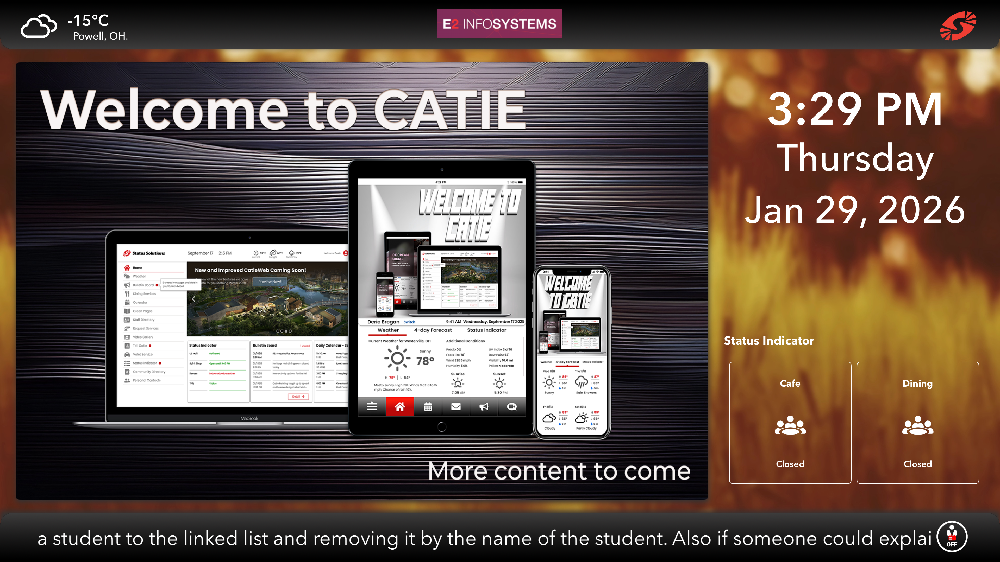

This landscape layout (Type 2) is optimized for scenarios where time display is the primary focus, making it ideal for waiting areas or lobbies where users need to quickly check the time.

### UI Type 3: Portrait Mode Display

The following screenshot shows an example of CATIE TV in portrait mode (UI Type 3):

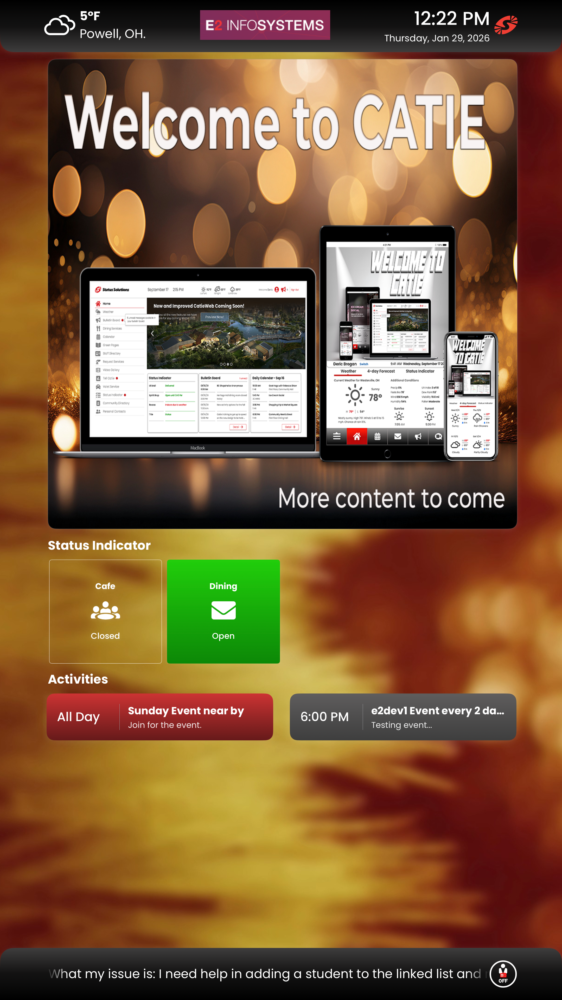

This portrait layout (Type 3, 9:16 aspect ratio) is optimized for vertically-oriented displays and provides a comprehensive view of all CATIE TV features.

### UI Type 4: Full-Screen Carousel

The following screenshot shows UI Type 4, featuring full-screen image display in portrait orientation:

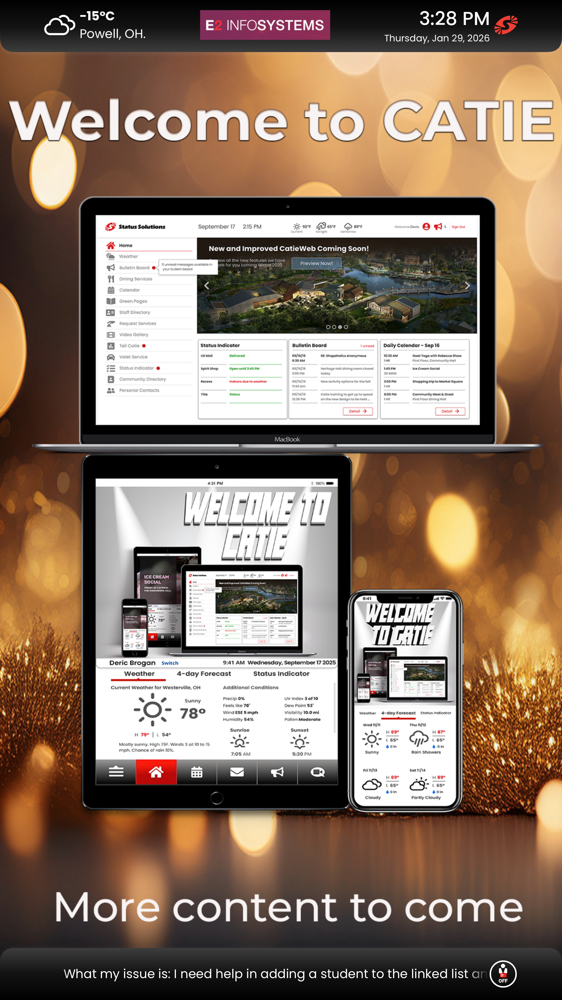

This portrait layout (Type 4, 1:1 aspect ratio) maximizes the carousel display area, making it perfect for showcasing high-impact visual content, announcements, or promotional materials.

### UI Type 5: Full Carousel Layout

UI Type 5 provides a full carousel-focused layout optimized for ultra-wide landscape displays (21:9 aspect ratio). This layout is designed to maximize carousel content visibility while providing minimal but essential information.

#### Configuring UI Type 5

To configure a TV for UI Type 5:

1. Open **CATIE Admin** > **Room Administration**
2. Select the room assigned to the TV
3. In the **CATIE TV Display Type** dropdown, select **Type 5 - Landscape - W**
4. The preview section will show how the carousel content will appear

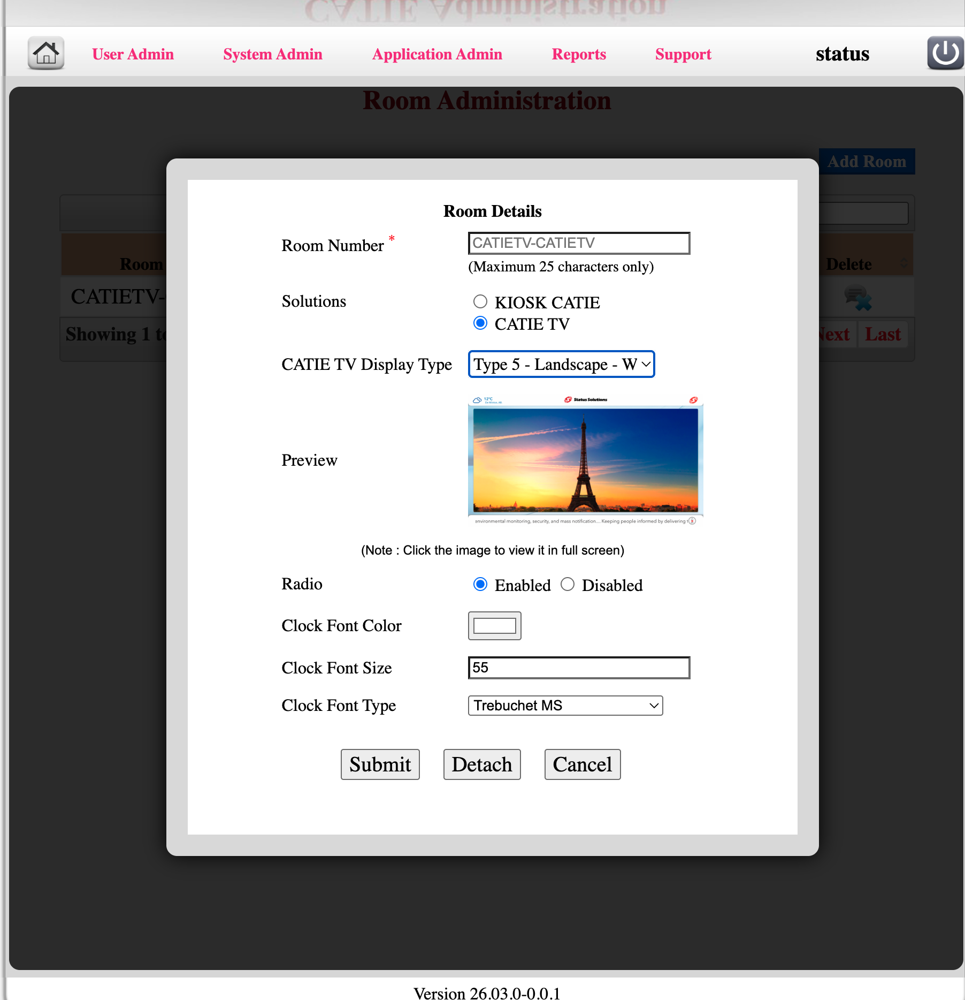

#### Configuration Dialog

When configuring UI Type 5 in Room Details, you'll see:

- **CATIE TV Display Type**: Select "Type 5 - Landscape - W" from dropdown
- **Preview**: Shows a sample carousel image with layout elements:
  - Weather information in top-left corner (e.g., "12°C De Winton, AB")
  - Status Solutions branding in top corners
  - Large carousel image display in the center
  - Scrolling text banner at the bottom with notification icon

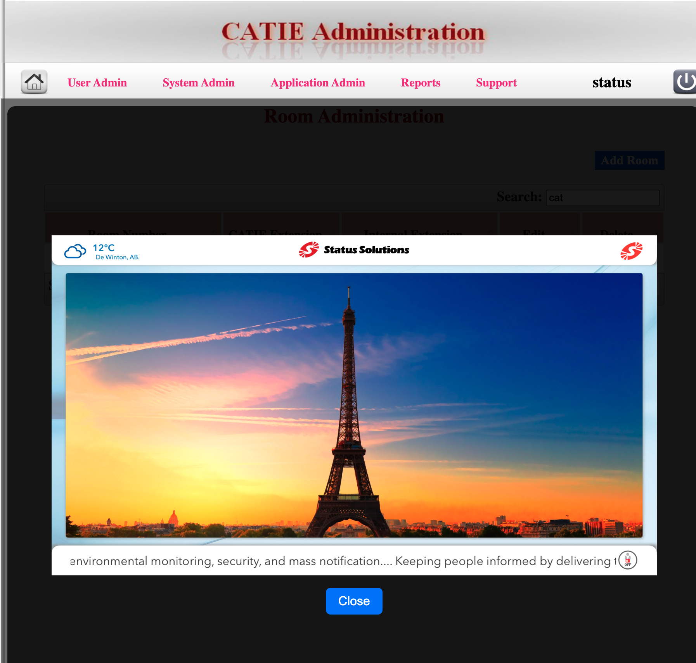

---

### UI Type 6: Portrait Center Layout

UI Type 6 provides a portrait-oriented layout (9:16 aspect ratio) that centers the content, often referred to as "Carousel-focused padded". This layout is designed for vertical displays where the focus is on a central visual element.

#### Configuring UI Type 6

To configure a TV for UI Type 6:

1. Open **CATIE Admin** > **Room Administration**
2. Select the room assigned to the TV
3. In the **CATIE TV Display Type** dropdown, select **Type 6 - Portrait - Center**
4. The preview section will show how the carousel content will appear

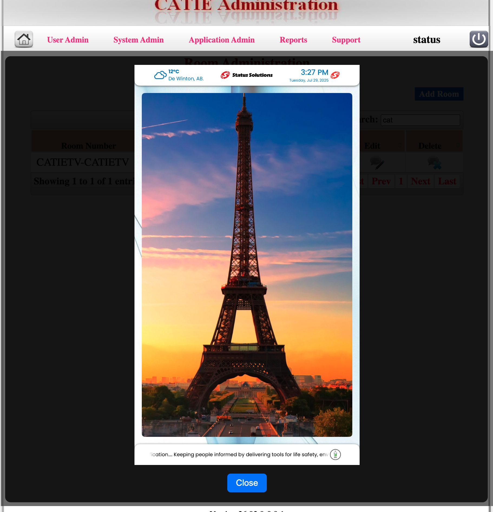

#### Configuration Dialog

When configuring UI Type 6 in Room Details, you'll see:

- **CATIE TV Display Type**: Select "Type 6 - Portrait - Center" from dropdown
- **Preview**: Shows a sample vertically oriented carousel image with layout elements:
  - Weather information in top-left corner
  - Status Solutions branding
  - Carousel image centered in the display
  - This layout is distinct from Type 3 (Full Content) and Type 4 (Full Screen) as it balances content with negative space or padding as needed.

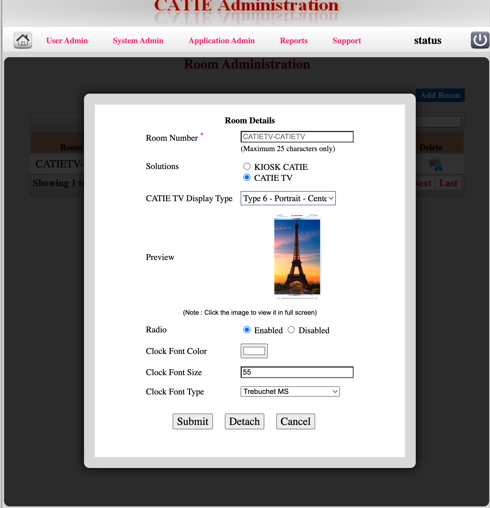

---

## Feature Configuration

### Carousel Management

The image carousel is managed via **Application Admin** > **Content Management** > **Slides**.

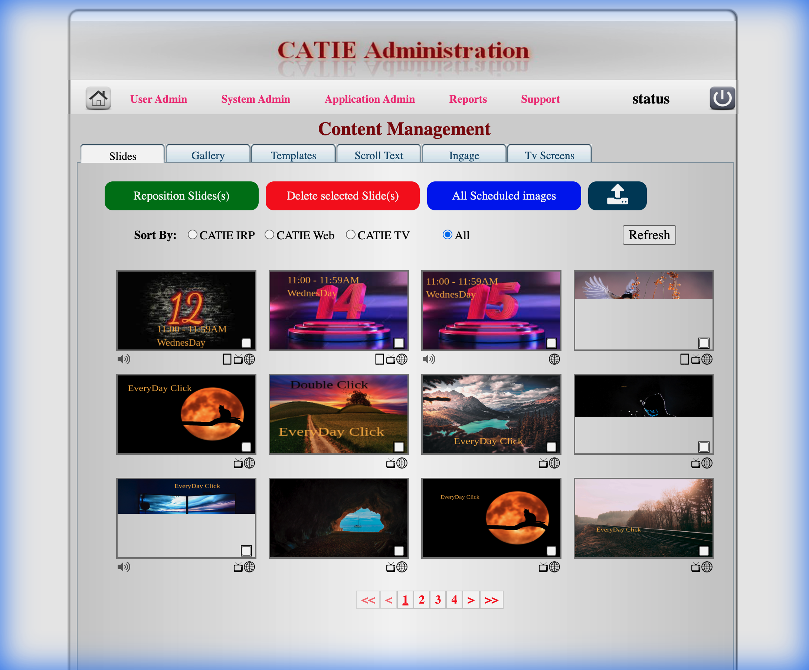

#### Carousel Configuration

**Adding Carousel Images:**

1. Navigate to **Content Management** > **Slides**
2. Click the upload button to open the **Upload Image** dialog

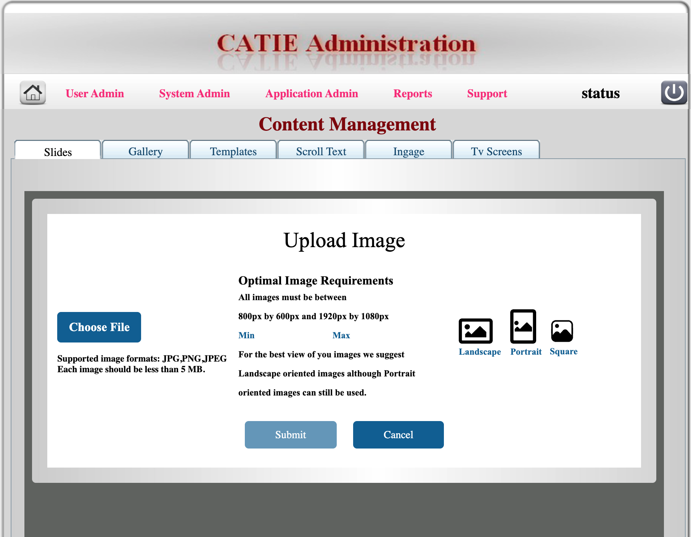

**Upload Image Dialog:**

The upload dialog displays basic image requirements. See [Image Requirements by UI Type](#image-requirements-by-ui-type) below for detailed specifications on optimal resolutions and aspect ratios for each UI type.

1. Click **Choose File** to select your image
2. Preview the uploaded image and select the appropriate orientation

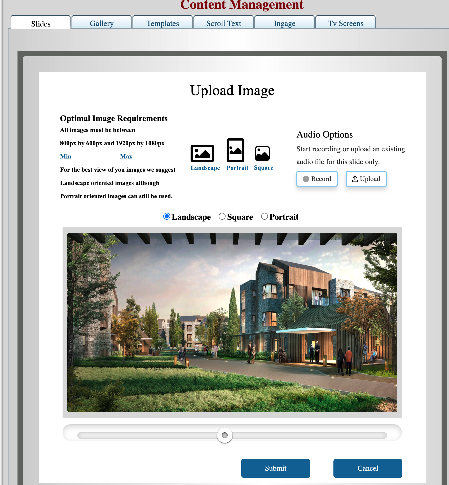

**Image Preview Features:**

- **Orientation Selection**: Choose Landscape, Square, or Portrait based on your TV configuration
- **Audio Options**:
  - **Record**: Record audio narration for this slide
  - **Upload**: Upload an existing audio file for this slide
- **Image Preview**: View your uploaded image before submitting
- Click **Submit** to upload or **Cancel** to discard

**Recording Audio Narration:**

When you click the **Record** button, the narration recording interface appears:

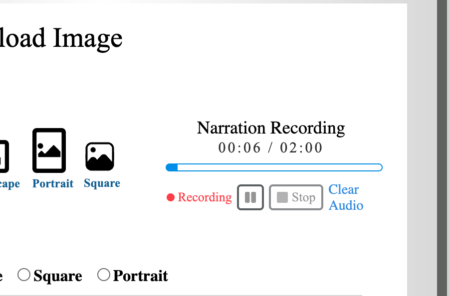

- **Timer**: Shows current recording time / maximum time (e.g., "00:06 / 02:00")
- **Progress Bar**: Visual indicator of recording progress
- **Recording Indicator**: Red dot with "Recording" text shows active recording
- **Pause Button**: Pause the current recording
- **Stop Button**: Stop and save the recording
- **Clear Audio**: Remove the recorded audio and start over

1. After uploading, schedule the slide using the **Schedule Selected Slides** dialog

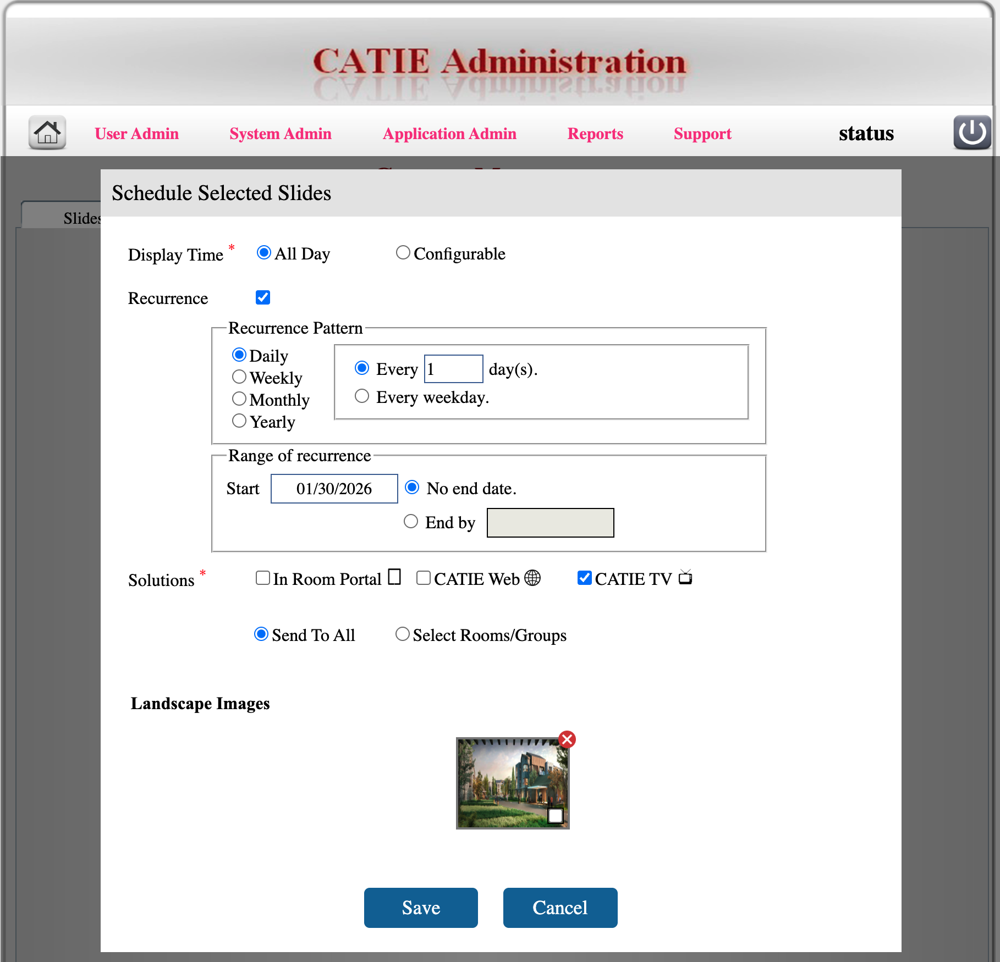

**Scheduling Options:**

- **Display Time**:
  - **All Day**: Display the slide throughout the entire day
  - **Configurable**: Set specific time ranges for display
- **Recurrence**: Enable to set up recurring display patterns
  - **Recurrence Pattern**: Daily, Weekly, Monthly, Yearly, Every X day(s), Every weekday
  - **Range of Recurrence**: Set start date and optionally an end date
- **Solutions**: Select which platforms should display this slide
  - **In Room Portal**: Display on in-room portal devices
  - **CATIE Web**: Display on web-based interfaces
  - **CATIE TV**: Display on CATIE TV devices (check this for TV display)
- **Distribution**:
  - **Send To All**: Send to all registered devices
  - **Select Rooms/Groups**: Choose specific rooms or groups
- **Landscape Images**: Preview section showing the uploaded image

1. Click **Save** to apply the scheduling configuration
2. Organize slide order using drag-and-drop in the main slides view
3. Click **Save Changes** to finalize

#### Advanced Carousel Settings

Carousel behavior can be customized via **System Admin** > **Application Configurations** > **Carousel**.

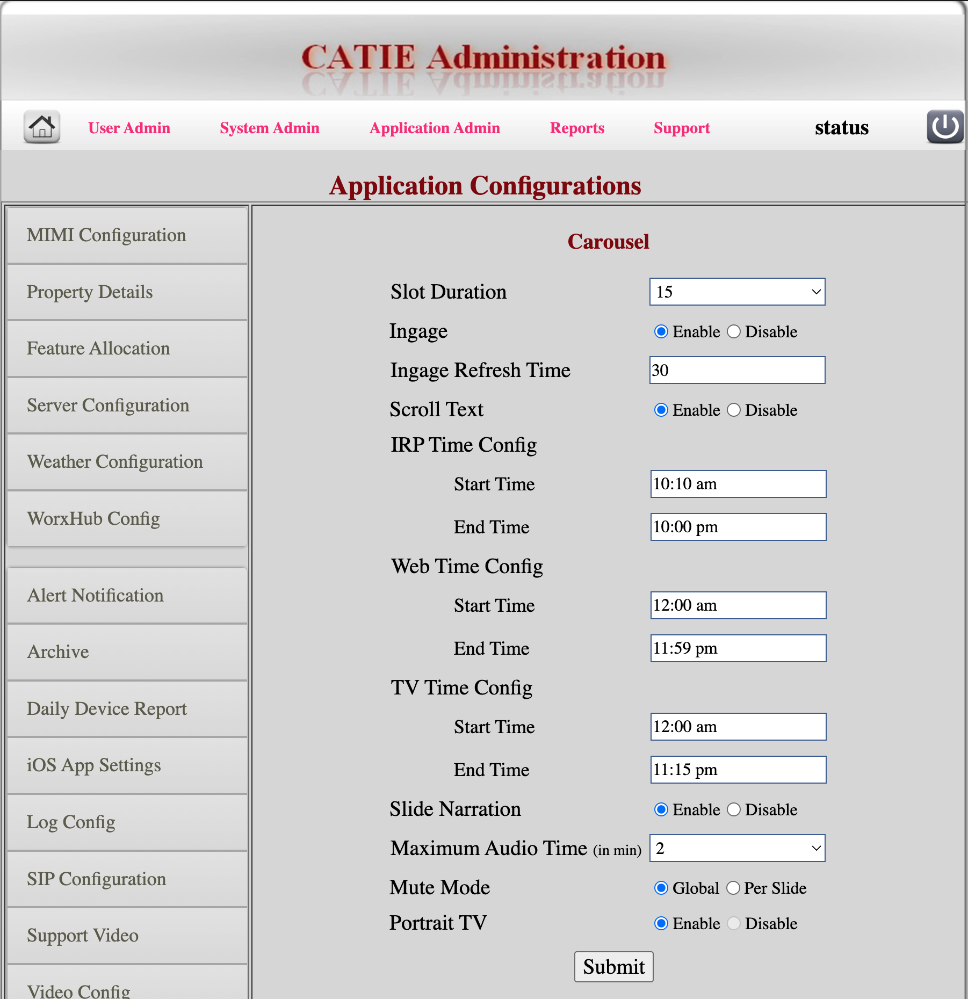

**To configure Carousel settings:**

1. Navigate to **System Admin** > **Application Configurations**
2. Select **Carousel** from the configuration menu
3. Configure the following settings:

**General Settings:**

- **Slot Duration**: Time duration for each slide display (dropdown in seconds, e.g., 15 seconds)
- **Ingage**: Enable/Disable Ingage integration
  - **Enable**: Activates Ingage integration
  - **Disable**: Turns off Ingage integration
  - **Note**: Since Apple TV doesn't support webview, the CATIE server converts Ingage webview URLs into images and sends them to the TV for display
- **Ingage Refresh Time**: Refresh interval in seconds for updating Ingage content (e.g., 30 seconds) - *Server-side configuration, typically managed automatically*
- **Scroll Text**: Enable/Disable scroll text display
  - **Enable**: Shows scroll text banner
  - **Disable**: Hides scroll text banner

**TV Time Config (CATIE TV Specific):**

Controls when the carousel is active on CATIE TV devices:

- **Start Time**: When carousel starts displaying (e.g., "12:00 am")
- **End Time**: When carousel stops displaying (e.g., "11:15 pm")

**Slide Narration Settings:**

- **Slide Narration**: Enable/Disable audio narration for slides
  - **Enable**: Activates audio narration functionality
  - **Disable**: Turns off audio narration
- **Maximum Audio Time (in min)**: Maximum duration for audio narration per slide (dropdown in minutes, e.g., 2 minutes)
- ~~**Mute Mode**: Controls audio muting behavior - *Not applicable for CATIE TV*~~
  - ~~**Global**: Applies mute setting globally to all slides~~
  - ~~**Per Slide**: Allows individual mute settings per slide~~

**Portrait TV:**

- **Enable**: Activates carousel for portrait-oriented TVs (UI Types 3, 4, 6)
- **Disable**: Turns off carousel for portrait TVs

**Note:** The carousel cannot be disabled when portrait TVs are allocated. This setting is only available when no portrait-oriented TVs (UI Types 3, 4, 6) are currently assigned.

**Other Time Configurations:**

The page also shows IRP Time Config and Web Time Config, which control carousel display times for other CATIE platforms (not applicable to CATIE TV).

1. Click **Submit** to save the configuration changes

#### Advertisement / Placeholder Slides

**Understanding the Placeholder/Advertisement System:**

The placeholder/advertisement system adds an extra slide at regular intervals in the carousel rotation:

- **Placeholder slides** are default slides (numbered 1, 2, 3, 4, 5) that appear automatically at every 5th position in the carousel (after every 4 normal carousel slides)
- **Advertisement slides** are custom slides you create and allocate to specific TVs
- When you allocate an advertisement slide to a TV, it **replaces** the default placeholder slide at that position
- The **4:1 ratio** is maintained: 4 normal carousel slides, then 1 placeholder/advertisement slide
- **With Advertisements Allocated**: Custom advertisement slides replace placeholders only for selected TVs
- **No Advertisements Allocated**: All TVs show default numbered placeholder slides at every 5th position

**Configuring Advertisement Slides:**

1. Navigate to **System Admin** > **Application Configurations** > **Carousel**
2. Click the **Placeholders** tab


**Placeholder-Specific Configuration:**

- **Placeholder slides**: Enable/Disable placeholder slide functionality
  - **Enable**: Activates placeholder slides (default slides will appear at every 5th position at 4:1 ratio)
  - **Disable**: Turns off placeholder slides (only normal carousel slides will display continuously)

**Advertisement Allocation:**

Control which TVs display custom advertisement slides (replacing default placeholders):

- **All**: Send advertisement slides to all registered CATIE TV devices
- **Select TV**: Choose specific TVs to receive custom advertisement slides
  - **Room List**: Shows available TV devices (e.g., CATIETV-CATIETV, CATIETV)
  - **Selected Rooms**: Shows currently selected TVs where advertisements will replace placeholders
  - Use the arrow buttons (→ ←) to move TVs between available and selected lists
  - **Select All**: Checkbox to quickly select all available TVs

**Managing Placeholder and Advertisement Slides:**


Both default placeholder slides and custom advertisement slides are managed through **System Admin** > **Application Configurations** > **Carousel** > **Placeholders** tab. The interface displays default placeholder slides (numbered 1-5) and any custom advertisement slides you've created, organized by orientation.

**Slide Organization by Orientation:**

Placeholder slides are grouped into four orientation categories to match different UI types:

- **Landscape**: For UI Types 1, 2, 5 (16:9 aspect ratio)
  - Select individual slides or use **Select All** checkbox
  - Shows thumbnail previews of landscape-oriented placeholder slides
  
- **Square**: For UI Type 4 (1:1 aspect ratio)
  - Select individual slides or use **Select All** checkbox
  - Shows thumbnail previews of square-oriented placeholder slides

- **Portrait**: For UI Types 3, 6 (9:16 aspect ratio)
  - Select individual slides or use **Select All** checkbox
  - Shows thumbnail previews of portrait-oriented placeholder slides

- **Landscape Wide**: For UI Type 5 (21:9 ultra-wide aspect ratio)
  - Select individual slides or use **Select All** checkbox
  - Shows thumbnail previews of ultra-wide placeholder slides

**Management Actions:**

- **Upload Button** (top right): Click to upload new placeholder slides
  - Follow the same upload process as normal carousel slides
  - Select the appropriate orientation category during upload
  
- **Reposition Slides(s)**: Reorder the selected placeholder slides
  - Select one or more slides using checkboxes
  - Click the green **Reposition Slides(s)** button
  - Drag and drop to change the display order
  
- **Delete selected Slide(s)**: Remove placeholder slides
  - Select one or more slides using checkboxes
  - Click the red **Delete selected Slide(s)** button
  - Confirm deletion when prompted

**Select All Feature:**

Each orientation category has a **Select All** checkbox that allows you to:

- Quickly select all slides in that specific orientation
- Perform bulk operations (reposition or delete) on multiple slides at once
- Useful for managing large numbers of placeholder slides

**Viewing and Managing Default Placeholder Slides:**

The Placeholders tab displays the default placeholder slides (numbered 1, 2, 3, 4, 5) organized by orientation. These are the slides that appear automatically when no custom advertisements are allocated.

**Creating Custom Advertisement Slides:**

To create advertisement slides that replace default placeholders:

1. Navigate to **Application Admin** > **Content Management** > **Slides**
2. Click the upload button to add a new slide (follow standard carousel image upload process)
3. After uploading, click **Schedule Selected Slides**
4. In the scheduling dialog, locate the **Advertisement** field:

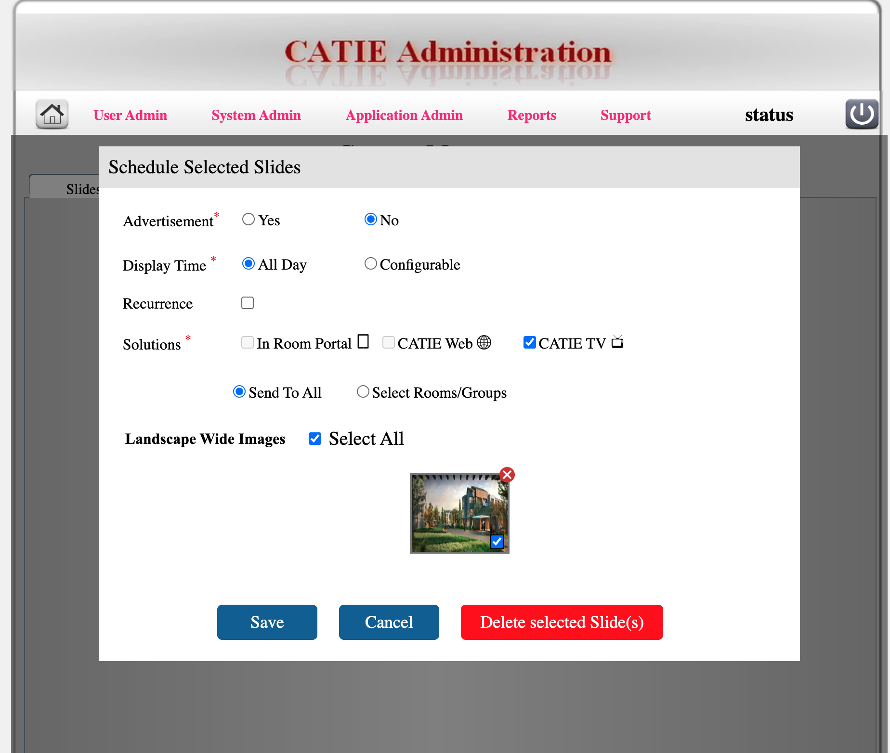

1. Configure the advertisement slide:
   - **Advertisement**: Select **Yes** to mark this slide as an advertisement (will replace placeholder slides)
     - **Yes**: This slide will appear at the 5th position (every 4 normal slides), replacing placeholder slides
     - **No**: This slide will be a regular carousel slide in the normal rotation
   - **Display Time**: Choose "All Day" or "Configurable" for specific time ranges
   - **Recurrence**: Enable if the slide should repeat on a schedule
   - **Solutions**: Check **CATIE TV** to make this available for CATIE TV devices
   - **Distribution**: Select "Send To All" or choose specific rooms/groups
   - **Landscape Wide Images**: Preview of the uploaded slide

2. Click **Save** to schedule the advertisement slide
3. The advertisement slide will now appear in the **Placeholders** tab under the corresponding orientation category
4. Configure which TVs receive this advertisement via the **Placeholder Allocation** settings in **Application Configurations** > **Carousel** > **Placeholders** tab

**Display Behavior:**

The display pattern varies based on configuration:

**Example Rotation Patterns:**

*TVs with No Advertisement Allocated (showing default placeholders):*

```
Normal Slide 1 → Normal Slide 2 → Normal Slide 3 → Normal Slide 4 → Placeholder 1 → 
Normal Slide 5 → Normal Slide 6 → Normal Slide 7 → Normal Slide 8 → Placeholder 2 →
(Pattern continues with default numbered placeholders...)
```

*TVs with Custom Advertisements Allocated:*

```
Normal Slide 1 → Normal Slide 2 → Normal Slide 3 → Normal Slide 4 → Custom Ad 1 → 
Normal Slide 5 → Normal Slide 6 → Normal Slide 7 → Normal Slide 8 → Custom Ad 2 →
(Pattern continues with custom advertisements replacing placeholders...)
```

**Important Notes:**

- Default placeholder slides appear automatically when the feature is enabled
- Custom advertisement slides **replace** placeholders only for TVs where they are allocated
- Different TVs can show different content at the 5th position (placeholders vs advertisements)
- Advertisement slides must meet the same image requirements as normal carousel slides
- The 4:1 ratio is fixed and cannot be customized
- You can mix and match: some TVs show placeholders, others show custom advertisements

#### Image Requirements by UI Type

| UI Type | Aspect Ratio | Recommended Resolution |
|---------|--------------|------------------------|
| Type 1, 2 | 16:9 (Landscape) | 1920x1080 |
| Type 3, 6 | 9:16 (Portrait) | 1080x1920 |
| Type 4 | 1:1 (Square) | 1080x1080 |
| Type 5 | 21:9 (Ultra-wide) | 2560x1080 |

#### Filtering Carousel Images by TV

You can filter and view carousel images allocated to specific TVs using the filtering options.

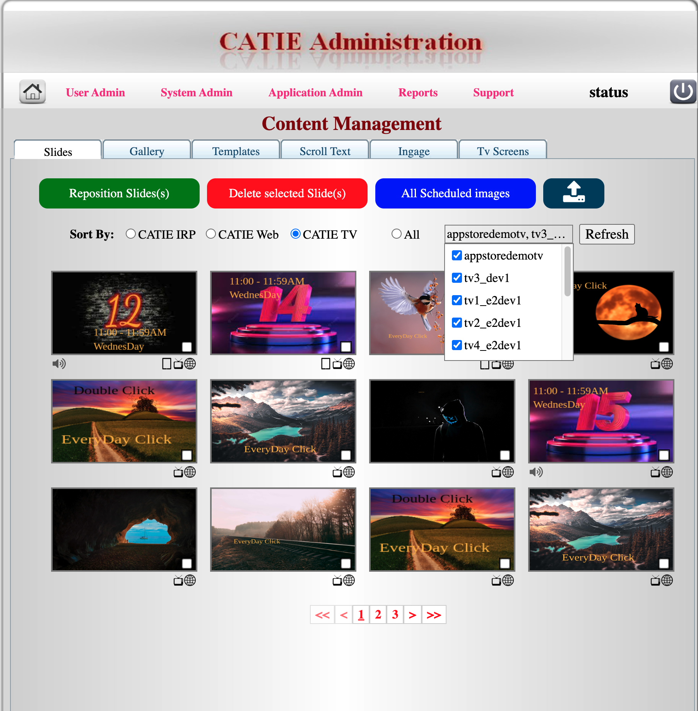

**To filter carousel images by TV:**

1. Navigate to **Content Management** > **Slides**
2. Use the **Sort By** radio buttons to filter by display type:
   - ~~**CATIE IRP**: Images for CATIE IRP displays~~
   - ~~**CATIE Web**: Images for web-based displays~~
   - **CATIE TV**: Images for CATIE TV devices (select this for TV filtering)
   - **All**: Show all carousel images
3. Click the **dropdown menu** on the right (shows TV name like "appstoredemotv, tv3...")
4. Select specific TVs using the checkboxes:
   - Check/uncheck individual TV devices (e.g., `appstoredemotv`, `tv3_dev1`, `tv1_e2dev1`, `tv2_e2dev1`, `tv4_e2dev1`)
   - Select multiple TVs to view their combined carousel allocations
5. Click **Refresh** button to apply the filter
6. The carousel grid will update to show only images allocated to the selected TV(s)

**Additional Actions:**

- **Reposition Slides(s)**: Change the order of carousel images
- **Delete selected Slide(s)**: Remove selected carousel images
- **All Scheduled images**: View all scheduled carousel content

#### Gallery Management

Alternative image management via **Content Management** > **Gallery**:

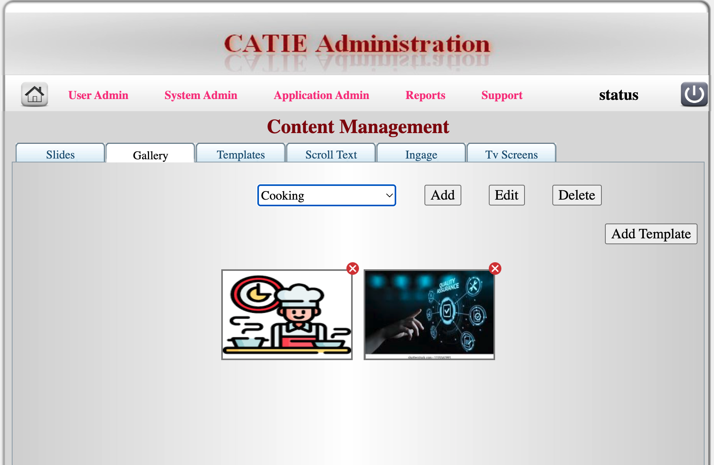

The Gallery provides category-based organization for carousel images:

**Category Management:**

- **Category Dropdown**: Select a category to view images (e.g., "Cooking", "Events", "Announcements")
- Images are organized by category for easier management

**Image Management Actions:**

- **Add**: Upload new images to the selected category
- **Edit**: Modify existing image properties or category assignment
- **Delete**: Remove selected images from the gallery
- **Add Template**: Create or add predefined image templates

**Gallery View:**

- Images are displayed in a grid layout with thumbnails
- Each image has an **X** button in the top-right corner for quick deletion
- Category-based filtering makes it easy to find and manage specific types of content

#### Ingage Content Management

Ingage provides interactive digital content that can be integrated into the carousel. Ingage content is managed via **Content Management** > **Ingage**.

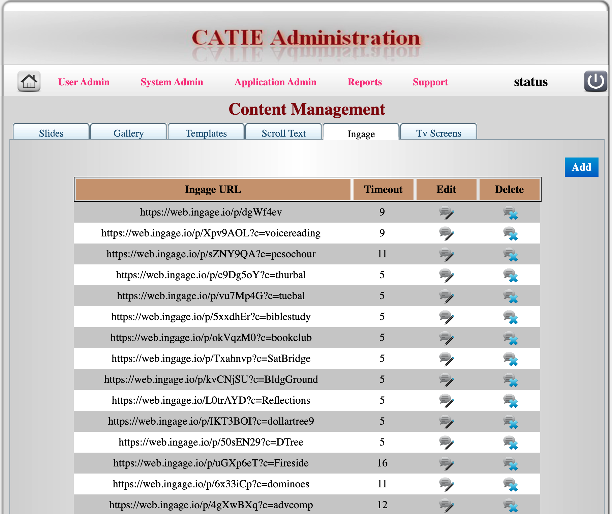

**Ingage List View:**

The Ingage management page displays all configured Ingage content in a table format:

- **Ingage URL**: The web.ingage.io URL for the interactive content (e.g., `https://web.ingage.io/p/dgWf4ev`)
- **Timeout**: Display duration in seconds for each Ingage item (e.g., 5, 9, 11, 16 seconds)
- **Edit**: Pencil icon to modify existing Ingage entries
- **Delete**: Trash icon to remove Ingage content
- **Add**: Button in the top-right corner to add new Ingage content

**Adding Ingage Content:**

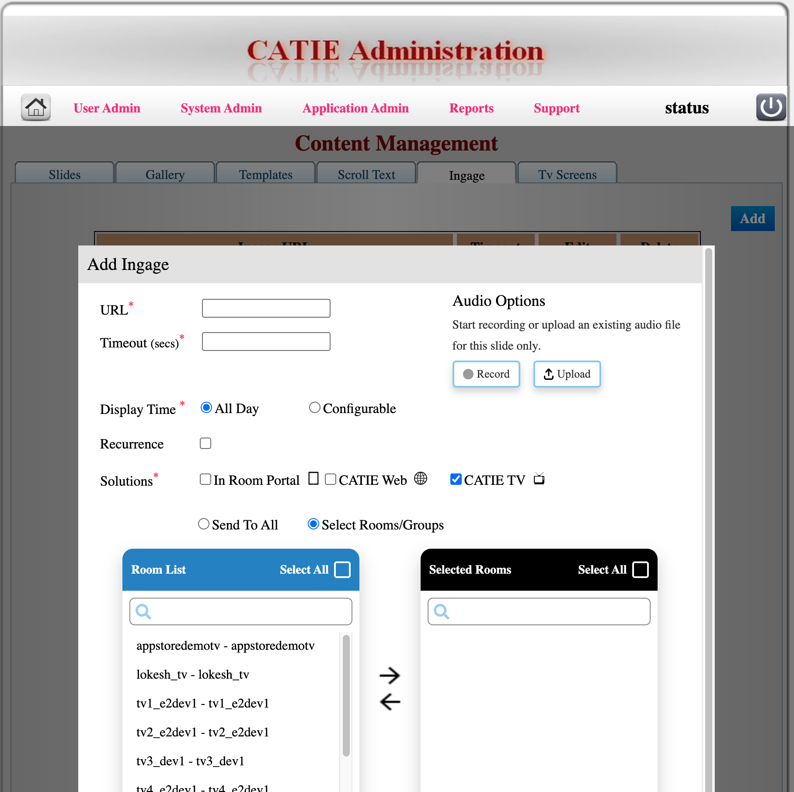

Click the **Add** button to open the Add Ingage dialog with the following fields:

**Basic Configuration:**

- **URL*** (required): Enter the Ingage webview URL (e.g., `https://web.ingage.io/p/...`)
- **Timeout (secs)*** (required): Specify how long the Ingage content should display in seconds

**Audio Options:**

- **Record**: Start recording audio narration for this Ingage slide
- **Upload**: Upload an existing audio file for this slide
- Audio can be added to provide narration specific to this Ingage content

**Display Time*** (required):**

- **All Day**: Display the Ingage content throughout the entire day
- **Configurable**: Set specific time ranges for when the content should appear

**Recurrence:**

- Check this option to make the Ingage content repeat on a schedule

**Solutions*** (required):**

Select which CATIE platforms should display this Ingage content:

- **In Room Portal**: Display on in-room portal devices
- **CATIE Web**: Display on web-based interfaces
- **CATIE TV**: Display on CATIE TV devices (check this for TV display)

**Room/Group Selection:**

- **Send To All**: Send to all registered devices
- **Select Rooms/Groups**: Choose specific rooms or groups
  - **Room List**: Available rooms with search functionality (e.g., `appstoredemotv`, `lokesh_tv`, `tv1_e2dev1`, etc.)
  - **Selected Rooms**: Rooms that will receive this Ingage content
  - Use arrow buttons (→ ←) to move rooms between lists
  - **Select All**: Checkbox to select all rooms at once

**Important Note:**

Since Apple TV doesn't support webview, the CATIE server converts Ingage webview URLs into images and sends them to the TV for display. The Timeout value determines how long each converted Ingage image will display in the carousel.

#### User Access Control for TV Screens

Control which admin users can manage content for specific CATIE TV devices via **Content Management** > **Tv Screens**.

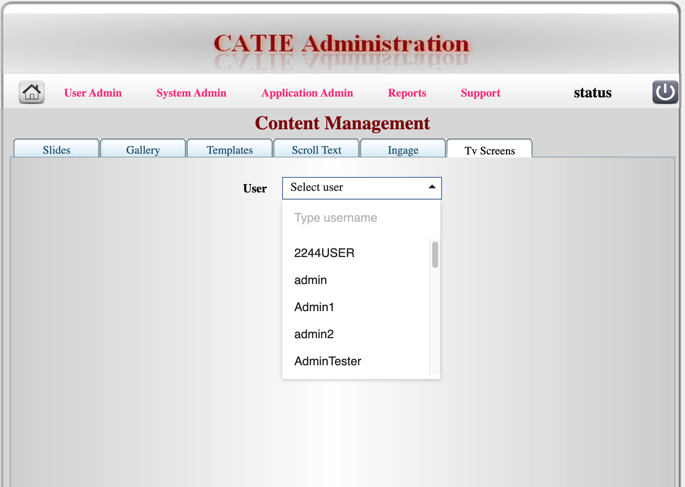

**To allocate TV access permissions to users:**

1. Navigate to **Application Admin** > **Content Management**
2. Click the **Tv Screens** tab
3. Click the **User** dropdown to select an admin user
4. Search for a user by typing in the "Type username" field, or select from the list:
   - Available users include system administrators (e.g., `2244USER`, `admin`, `Admin1`, `admin2`, `AdminTester`)

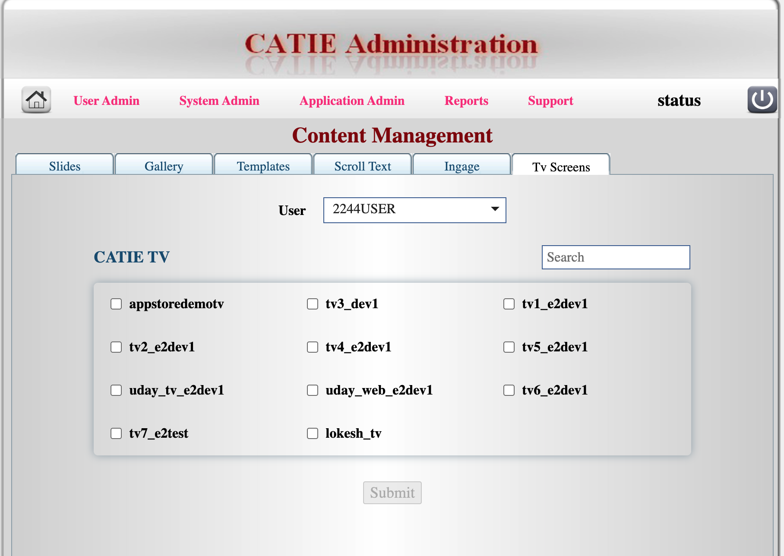

1. After selecting a user (e.g., `2244USER`), the **CATIE TV** section displays all available TV devices
2. Use the **Search** field to filter TV devices by name
3. Select which TVs the user can manage by checking the corresponding checkboxes:
   - `appstoredemotv`
   - `tv3_dev1`
   - `tv1_e2dev1`, `tv2_e2dev1`, `tv4_e2dev1`, `tv5_e2dev1`, `tv6_e2dev1`
   - `uday_tv_e2dev1`
   - `tv7_e2test`
   - `lokesh_tv`
   - And other registered CATIE TV devices
4. Click **Submit** to save the permissions

**Use Cases:**

- **Multi-location Management**: Allow different administrators to manage content only for their specific locations
- **Role-based Access**: Restrict content management permissions based on user roles
- **Security**: Prevent unauthorized users from modifying content on specific TV displays
- **Delegated Administration**: Enable department-specific administrators to manage their own TV displays

Once configured, users will only see and be able to modify carousel content for the TVs they have been granted access to.

### Event Calendar

Events are managed via **Application Admin** > **Content Management** > **Event Calendar**.

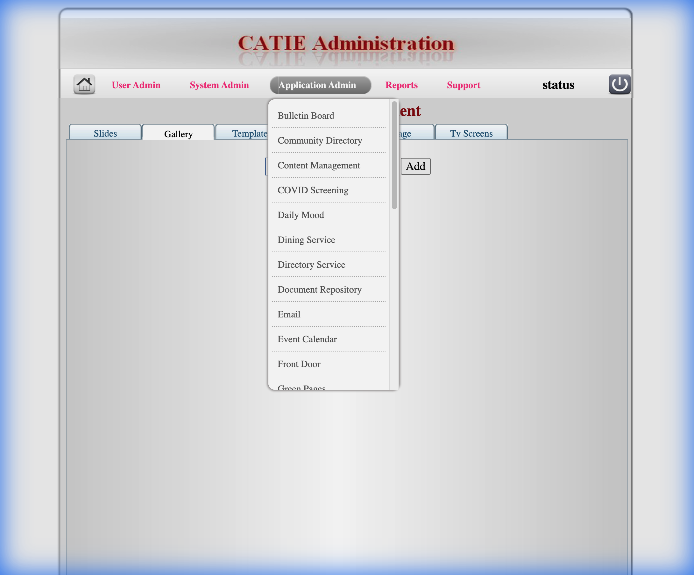

#### Creating Events

1. Navigate to **Content Management** > **Event Calendar**
2. Click **Add New Event**
3. Fill in event details:
   - **Event Title**
   - **Start Date/Time**
   - **End Date/Time**
   - **Description**
   - **Location** (optional)
4. Click **Save**

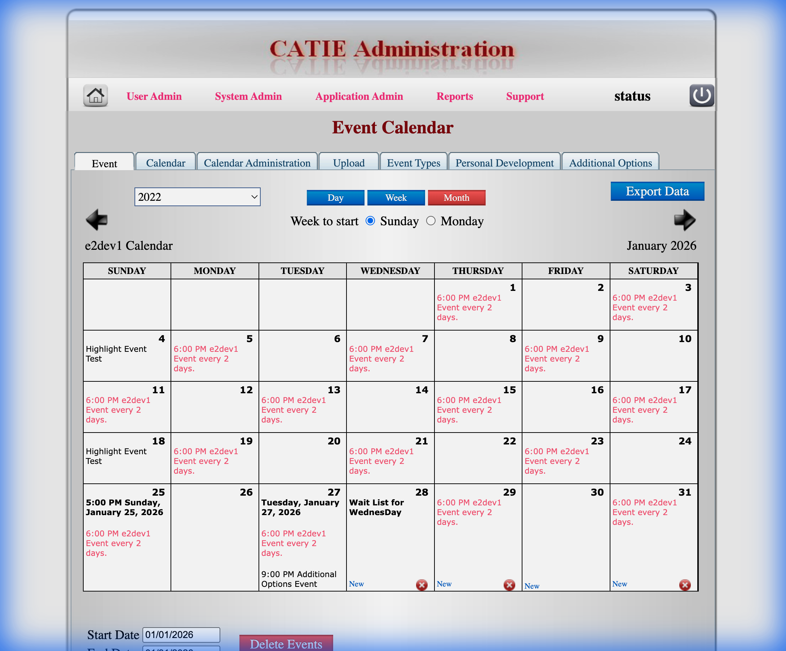

**Adding a New Event:**

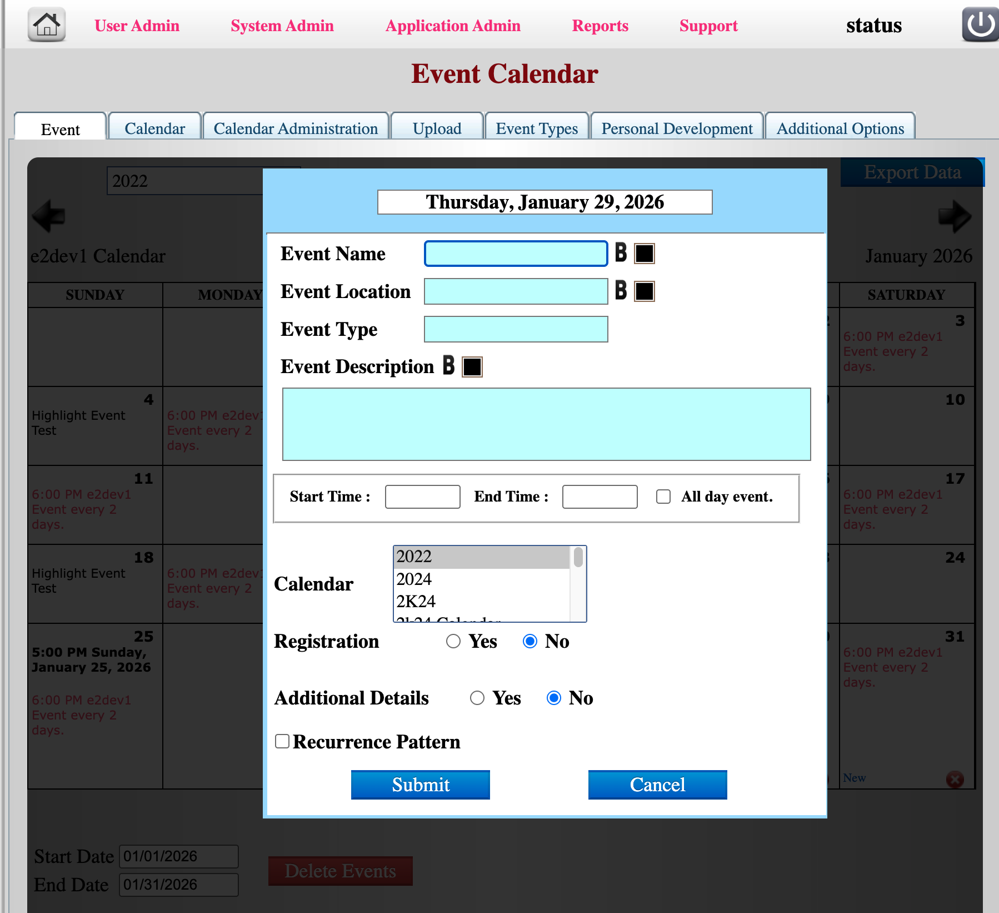

When creating a new event, you can configure:

- **Event Name**: Title of the event
- **Event Location**: Where the event takes place
- **Event Type**: Category or type of event
- **Event Description**: Detailed description of the event
- **Start Time** and **End Time**: Schedule for the event, or check "All day event" for full-day events
- **Calendar**: Select which calendar this event belongs to (dropdown shows available calendars like 2022, 2024, 2K24, e2k24 Calendar, etc.)
- **Registration**: Enable if the event requires registration (Yes/No)
- **Additional Details**: Add extra information if needed (Yes/No)
- **Recurrence Pattern**: Check to make the event repeat on a schedule
- Click **Submit** to save the event or **Cancel** to discard changes

#### Event Calendar Configuration

Event Calendar behavior can be customized via **System Admin** > **Application Configurations** > **Event Settings**.

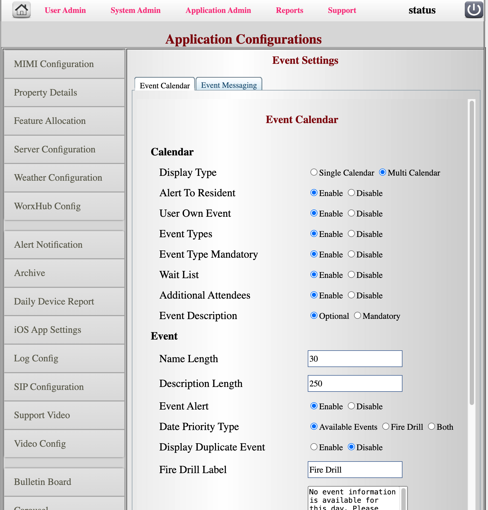

**To configure Event Calendar settings:**

1. Navigate to **System Admin** > **Application Configurations**
2. Select **Event Settings** from the left sidebar
3. Click the **Event Calendar** tab

**Event Settings (Applicable to CATIE TV):**

The "Event" section contains settings that control how events are created and displayed:

- **Name Length**: Maximum character limit for event names (default: 30 characters)
- **Description Length**: Maximum character limit for event descriptions (default: 250 characters)
- **Event Alert**: Enable/Disable event alerts
  - **Enable**: Activates event alert functionality
  - **Disable**: Turns off event alerts
- **Date Priority Type**: Controls which events are prioritized for display
  - **Available Events**: Show only regular scheduled events
  - **Fire Drill**: Show only fire drill/emergency events
  - **Both**: Display both regular events and fire drill events
- **Display Duplicate Event**: Control whether duplicate events are shown
  - **Enable**: Allow duplicate events to be displayed
  - **Disable**: Hide duplicate events
- **Fire Drill Label**: Custom text label for fire drill events (e.g., "Fire Drill")

**Note:** The "Calendar" section in Event Settings primarily affects other CATIE solutions and is not applicable to CATIE TV.

#### Event Display

**Event Display by UI Type:**

- **UI Type 1**: Events displayed in dedicated right panel with rotation
- **UI Type 3**: Events displayed in portrait-optimized format
- **UI Types 2, 4, 5, 6**: Events not displayed

**Event Status Indicators on TV:**

Events appear on the CATIE TV with different visual styles based on their current status:

**Scheduled Events (Grey Background):**

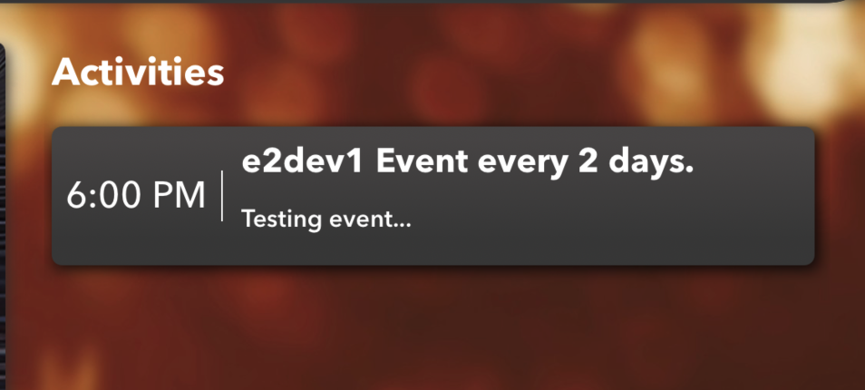

Events that are scheduled for the day but not currently active are displayed with a grey/dark background. The event shows:

- Time on the left (e.g., "6:00 PM")
- Event title and description
- Indicates upcoming events that will start later

**Active Events (Red Background):**

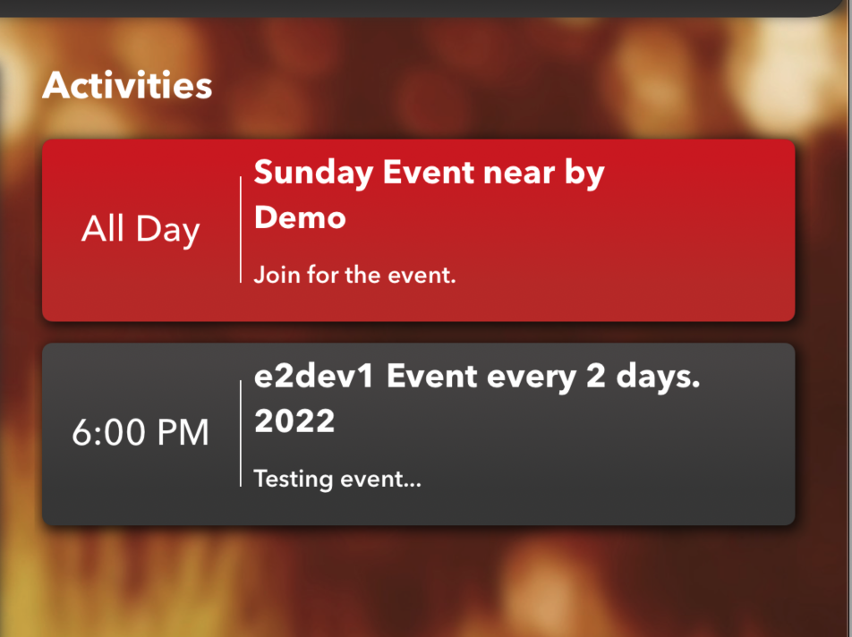

Events that are currently active (happening now) are displayed with a red background to draw attention. The display shows:

- Time or "All Day" indicator on the left
- Event title in large white text
- Event description below the title
- Red background makes active events immediately visible

The visual distinction between active (red) and scheduled (grey) events helps users quickly identify which activities are happening now versus upcoming events for the day.

**Calendar Display Details (Single vs Multiple Calendars):**

The activities list UI changes according to how many calendars are allocated to the TV:

- **Single Calendar Allocated:** When only one calendar is allocated, the calendar name is *not* shown in the middle of the list tile to save space.
- **Multiple Calendars Allocated:** When more than one calendar is allocated to the TV, the calendar name (e.g., "Keerthana") is displayed in the middle of the list tile to help identify which calendar the event belongs to.

*Single Calendar View (Calendar name hidden):*

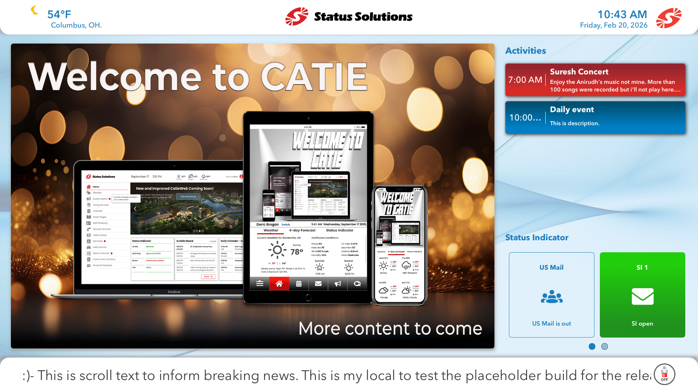

*Multiple Calendars View (Calendar names are visible in the middle of the tile):*

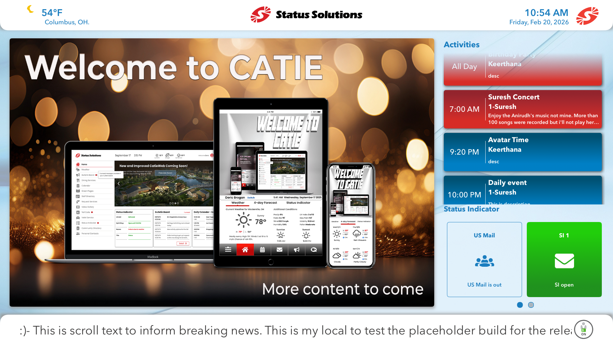

#### Allocating Calendars to TVs

Calendars can be assigned to specific TVs or groups of TVs using the **Calendar Administration** feature.

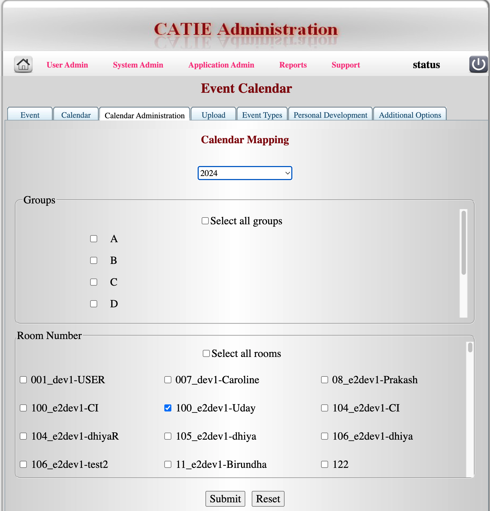

**To allocate a calendar to specific TVs:**

1. Navigate to **Application Admin** > **Content Management** > **Event Calendar**
2. Click the **Calendar Administration** tab
3. The **Calendar Mapping** interface will display
4. Select the calendar year from the dropdown (e.g., 2024, 2025, 2026)

**Allocate by Groups:**

1. In the **Groups** section, select groups to assign the calendar:
   - Check **Select all groups** to apply to all groups
   - Or select specific groups (A, B, C, D, etc.) individually

**Allocate by Room Number:**

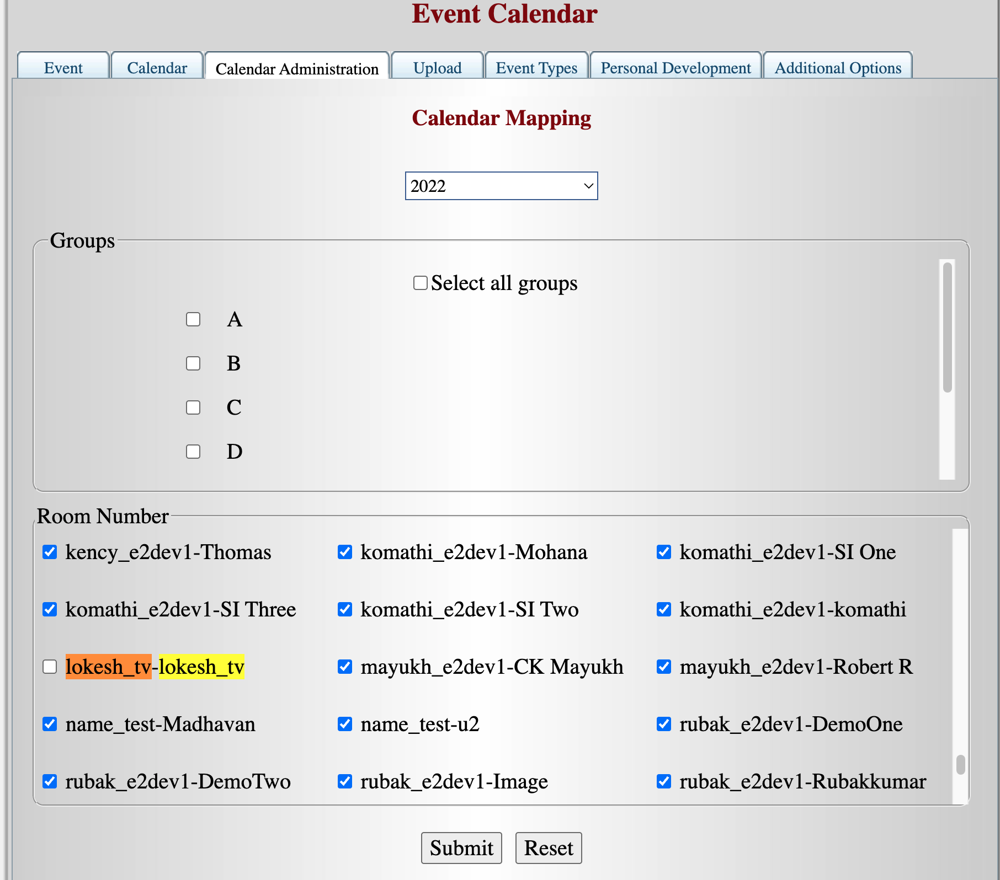

1. In the **Room Number** section, select specific rooms/TVs:
   - Check **Select all rooms** to apply to all registered TVs
   - Or select individual rooms by checking specific checkboxes
   - Room names typically follow format: `RoomNumber_Device-Name` (e.g., `kency_e2dev1-Thomas`, `komathi_e2dev1-Mohana`)
   - CATIE TV devices are shown with their device names (e.g., `lokesh_tv-lokesh_tv` highlighted in the image)
2. Click **Submit** to apply the calendar allocation
3. Click **Reset** to clear selections

The image above shows the Calendar Mapping interface where you can allocate calendars to specific TVs. Selected rooms/TVs are indicated with checked checkboxes, making it easy to see which devices will receive the calendar events.

**Viewing Allocated Calendar:**

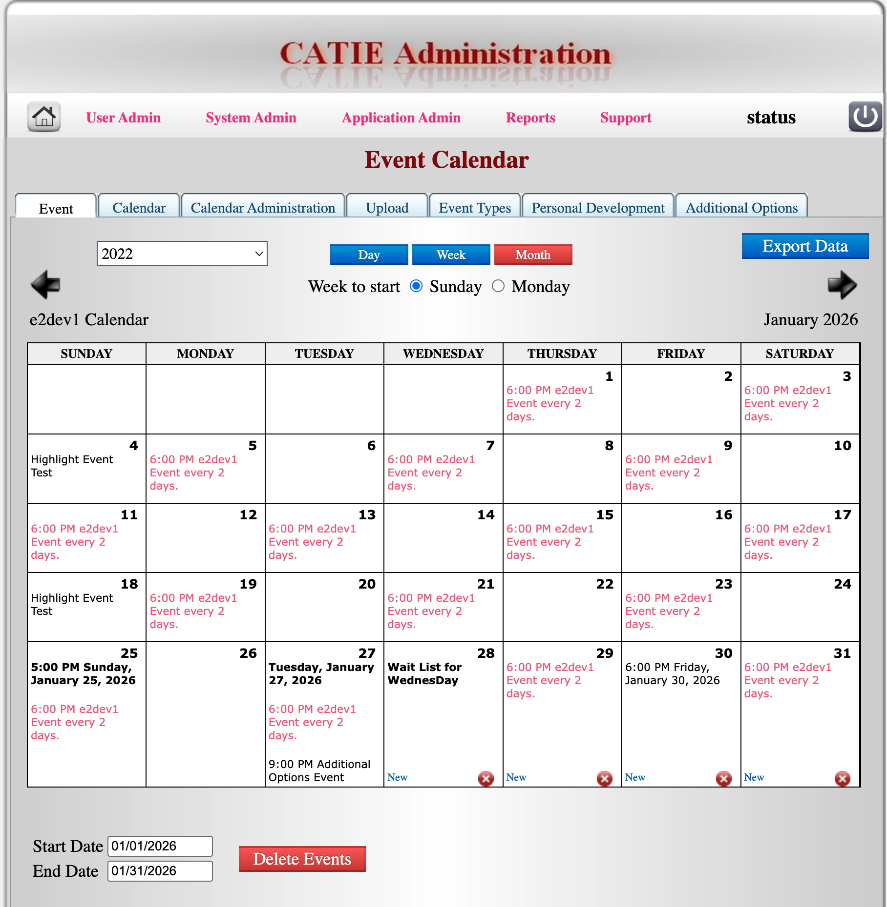

Once allocated, you can view the calendar by switching to the **Calendar** tab:

- Calendar header shows the assigned name (e.g., "e2dev1 Calendar")
- Events appear on their scheduled dates and times
- Different event types may be displayed with different colors or styles
- Use Day/Week/Month views to see events at different scales

### Status Indicators

Status indicators are managed via **Application Admin** > **Status Indicator**.

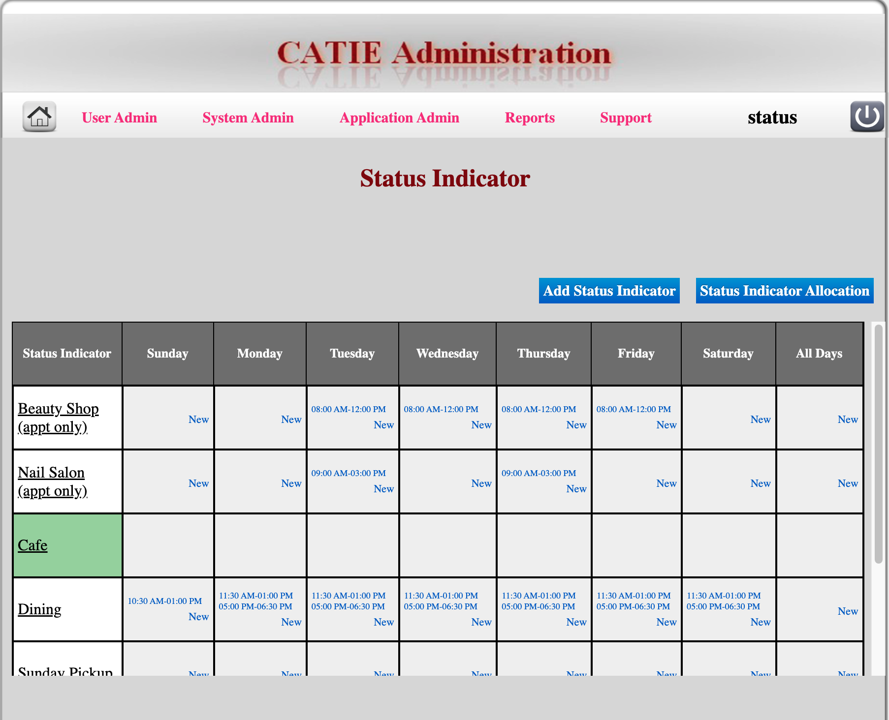

#### Adding Status Indicators

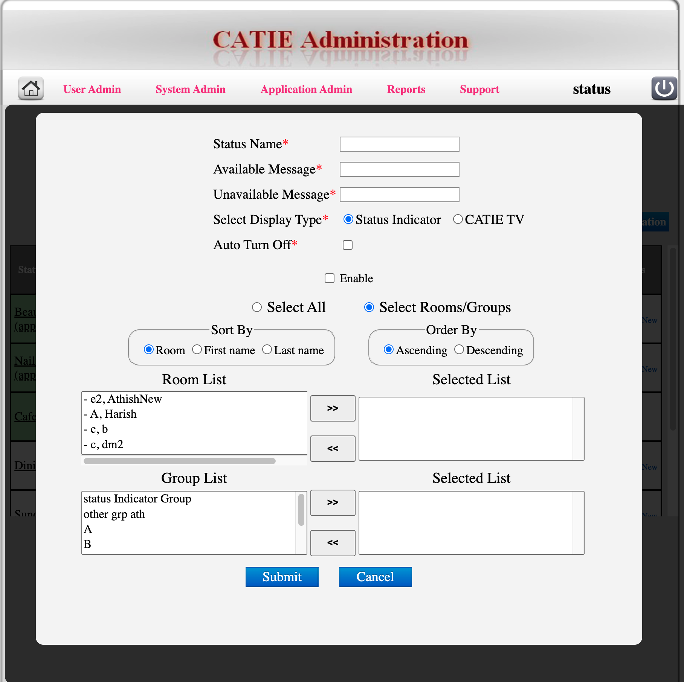

**To add a new status indicator:**

1. Navigate to **Application Admin** > **Status Indicator**
2. Click **Add Status Indicator**
3. Fill in the required fields:
   - **Status Name**: Name of the status indicator (e.g., "Beauty Shop", "Cafe", "Dining")
   - **Available Message**: Message to display when the service is available
   - **Unavailable Message**: Message to display when the service is unavailable
4. **Select Display Type**:
   - **Status Indicator**: Regular status message (default)
   - **CATIE TV**: Clock display functionality
5. Configure additional options:
   - **Auto Turn Off**: Automatically turn off the status indicator at midnight (checkbox)
     - When enabled, if a status indicator is active for the whole day, it will automatically turn OFF at midnight
     - Example: If "US Mail" is enabled for the entire day, the Auto Turn Off feature will deactivate it at midnight automatically
     - This prevents status indicators from remaining active indefinitely
6. **Enable options**:
   - Check the **Enable** checkbox to activate the status indicator
   - Choose activation mode:
     - **Enable Now**: Instantly activate the status indicator without scheduling
     - **Configurable**: Enable scheduling configuration on the main Status Indicator page

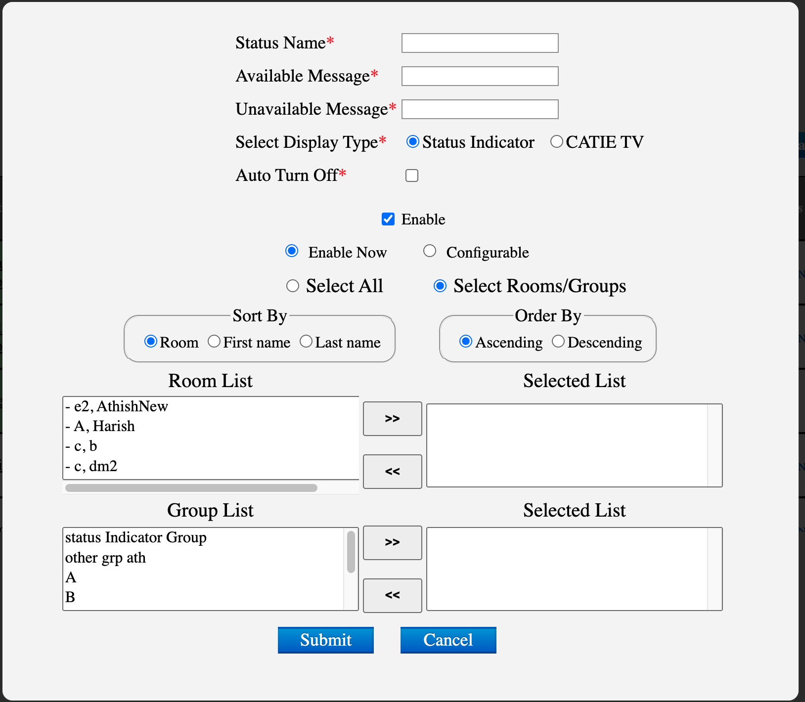

1. **Select target devices**:
   - **Select All**: Apply to all registered TVs
   - **Select Rooms/Groups**: Choose specific rooms or groups
2. If selecting specific rooms/groups:
   - Use **Sort By** (Room/First name/Last name) and **Order By** (Ascending/Descending) to organize lists
   - Move items from **Room List** to **Selected List** using >> button
   - Move items from **Group List** to **Selected List** using >> button
   - Remove items using << button
3. Click **Submit** to save

#### Scheduling Status Indicators

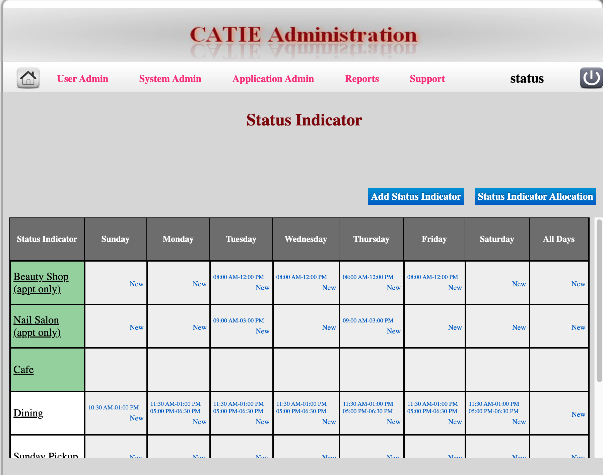

When you select **Configurable** mode while adding a status indicator, you can schedule it by day and time on the main Status Indicator page:

1. Navigate to **Application Admin** > **Status Indicator**
2. The scheduling grid displays all status indicators with columns for each day of the week
3. Click **New** in any day column (e.g., Monday, Tuesday) to add a time slot for that status indicator
4. A time slot dialog will appear:

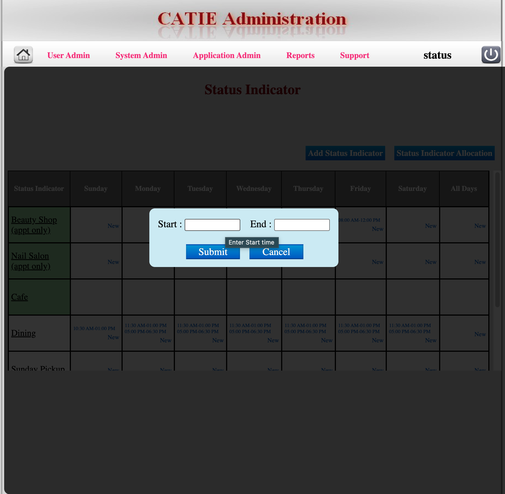

1. Enter the time range:
   - **Start**: Enter the start time (e.g., "08:00 AM")
   - **End**: Enter the end time (e.g., "12:00 PM")
2. Click **Submit** to save the time slot
3. Click **Cancel** to discard changes
4. The time slot will appear in the grid for that specific day
5. Multiple time slots can be added for the same day by clicking **New** again
6. Click **All Days** column to apply the same schedule to all days of the week

**Grid Features:**

- Each row represents a status indicator
- Each column represents a day (Sunday through Saturday, plus "All Days")
- Blue "New" links allow adding new time slots
- Time slots are displayed directly in the grid (e.g., "08:00 AM-12:00 PM")
- Multiple time slots per day are supported
- Each day can have different schedules

#### Status Indicator Display on TV

Status indicators appear differently on the TV based on their scheduled time:

**Active Status (Scheduled Time Reached):**

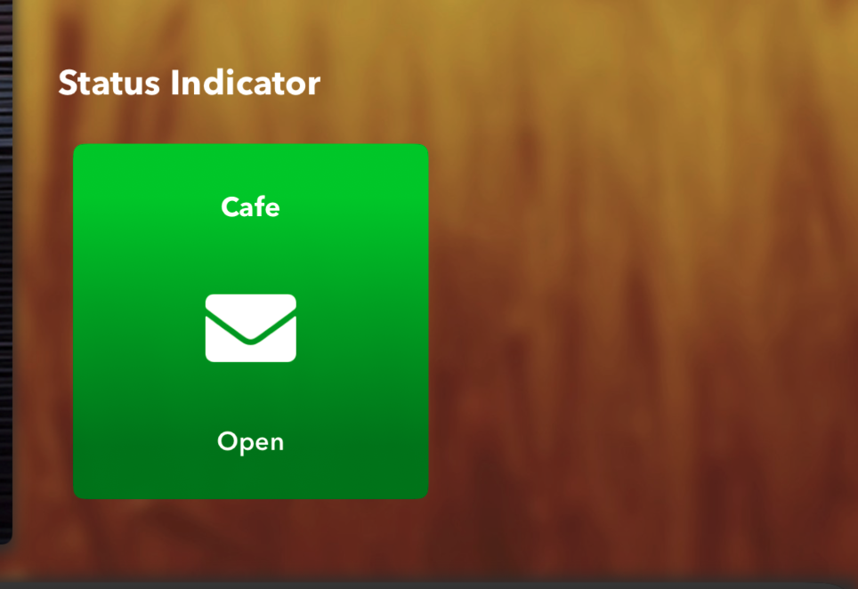

When the current time falls within the scheduled time slot, the status indicator displays with a solid green background showing the "Available Message" (e.g., "Open").

**Inactive Status (Outside Scheduled Time):**

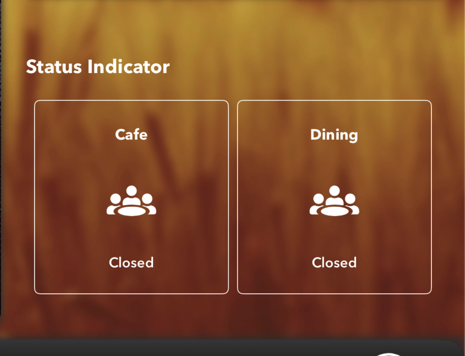

When the status indicator is allocated to the TV but the current time is outside the scheduled time slot, it displays with an outlined border showing the "Unavailable Message" (e.g., "Closed").

#### Display by UI Type

- **Types 1, 2, 3**: Status indicators displayed
- **Types 4, 5, 6**: Status indicators not displayed

### Radio Configuration

Radio configuration involves setting up base radio settings in **System Admin** > **Application Configurations** and enabling/disabling radio per TV in **Application Admin** > **Radio Administration**.

#### Base Radio Settings

Configure base radio settings via **System Admin** > **Application Configurations** > **Radio**.

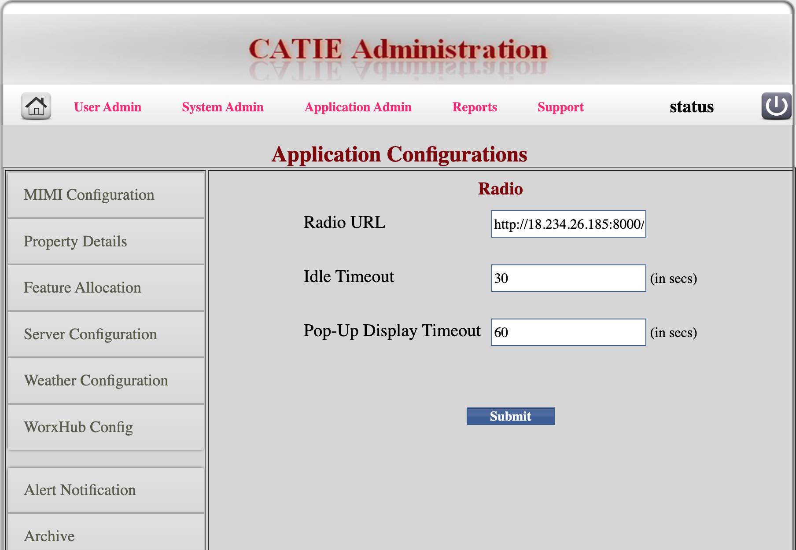

**To configure base radio settings:**

1. Navigate to **System Admin** > **Application Configurations**
2. Select **Radio** from the left sidebar menu
3. Configure the following settings:
   - **Radio URL**: Enter the HTTP/HTTPS URL for the audio stream (e.g., `http://18.234.26.185:8000/`)
   - ~~**Idle Timeout**: Time in seconds before radio pauses during inactivity (default: 30 seconds) - *Not applicable for CATIE TV*~~
   - ~~**Pop-Up Display Timeout**: Duration in seconds for radio player UI to remain visible (default: 60 seconds) - *Not applicable for CATIE TV*~~
4. Click **Submit** to save changes

**Configuration Details:**

- **Radio URL**: Must be a valid streaming URL (HTTP or HTTPS protocol)
- **Idle Timeout** and **Pop-Up Display Timeout** settings do not apply to CATIE TV

CATIE TV has two separate radio controls that serve different purposes:

#### 1. Radio Feature Visibility (UI Types 5 & 6 Only)

For **UI Types 5 and 6**, you can control whether the radio feature (icon) appears on the screen at all. This is configured in the **Room Administration** settings.

**To configure visibility:**

1. Go to **Room Administration**.
2. Edit the Room Details.
3. Use the **Radio** radio buttons:
   - **Enabled**: The radio icon is visible on the UI.
   - **Disabled**: The radio icon is completely removed from the UI.

**Visibility States:**

| State | Result |
|-------|--------|
| **Enabled** | Radio icon is present. User can interact with it. |
| **Disabled** | Radio icon is hidden. Feature is inaccessible. |

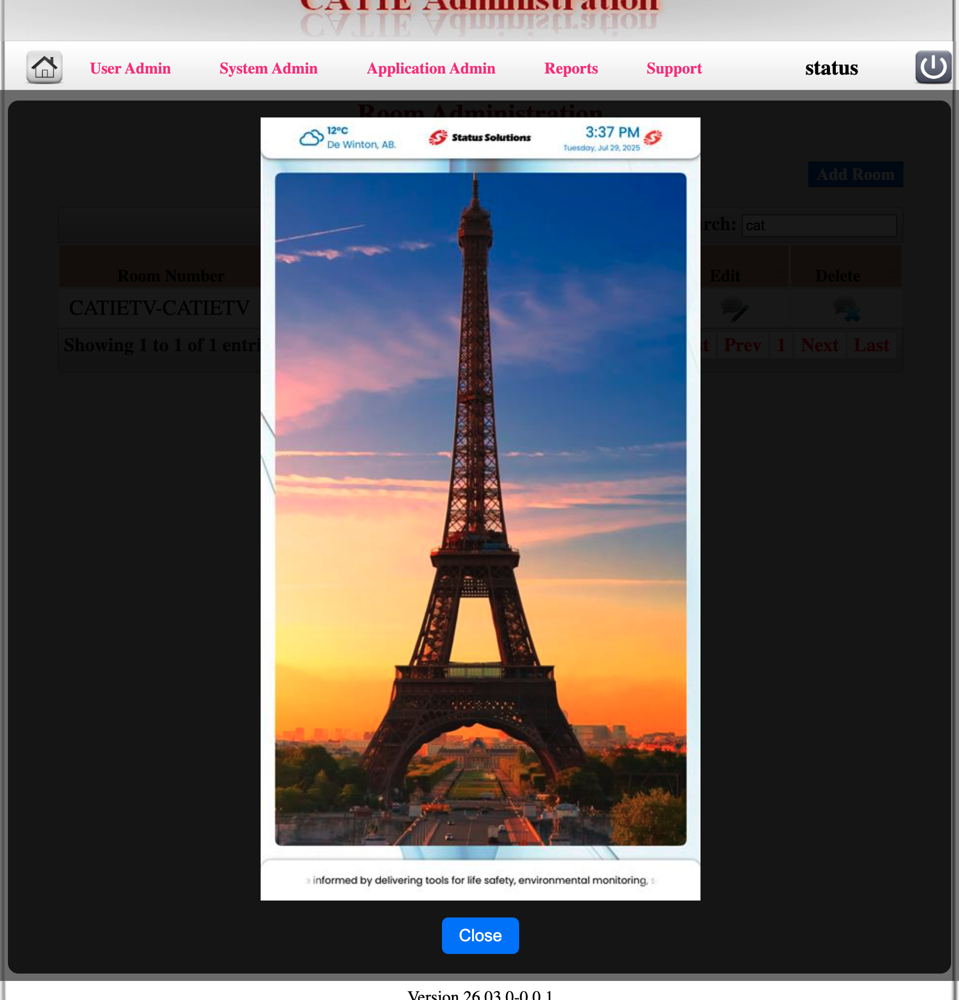
*Above: Radio feature enabled in Room Admin (icon visible)*

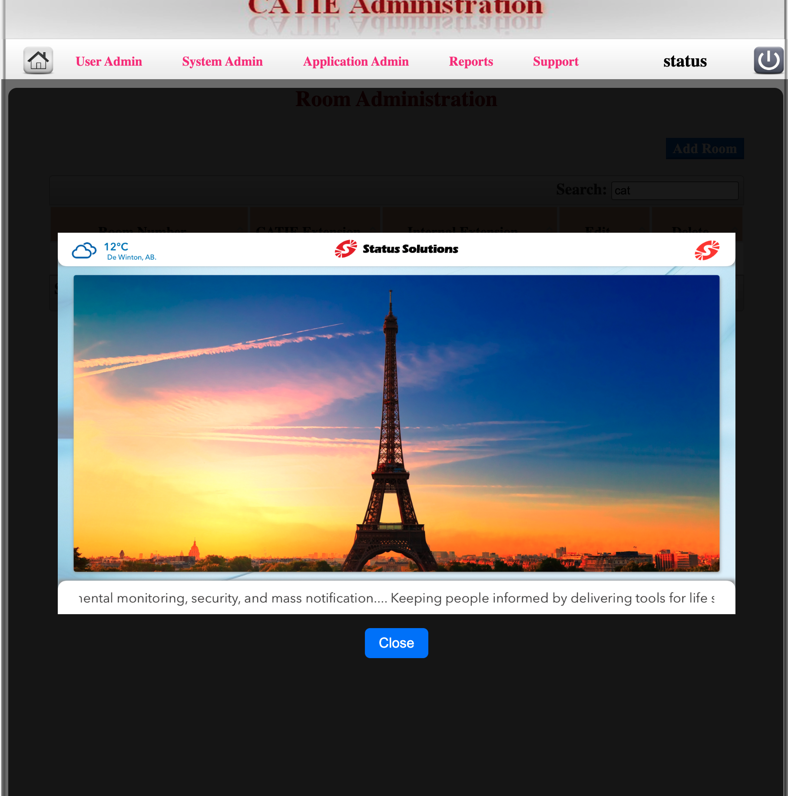
*Above: Radio feature disabled in Room Admin (icon removed)*

#### 2. Radio Functional Control (All UI Types)

The **Radio Administration** page controls the *operational state* of the radio. This determines whether the radio is valid/playable or disabled/stopped.

**To configure functionality:**

1. Go to **Application Admin** > **Radio Administration**.
2. Toggle the switch **On** or **Off** for a specific TV.

**Functional States (When Icon is Visible):**

- **Enabled (Green Icon)**: Radio is active and ready to play.
- **Disabled (Red Icon)**: Radio is disabled. The icon remains visible (for Types 1-4, or Types 5/6 if visibility is Enabled), but typically indicates a disabled state (Red).

**Note:** For UI Types 5 & 6, if you have disabled the feature visibility in Room Admin (Section 1), this Functional Control setting will have no visible effect because the icon is hidden.

#### Important Notes

**Speaker Requirement:**

- In some tvOS versions, radio functionality requires a speaker to be connected to the Apple TV to work properly
- If radio audio is not playing, verify that:
  - A speaker or audio output device is connected to the Apple TV
  - The Apple TV audio output settings are configured correctly
  - The volume is not muted

### Clock Configuration

Full-screen clock overlay is configured via **Application Admin** > **Status Indicator**.

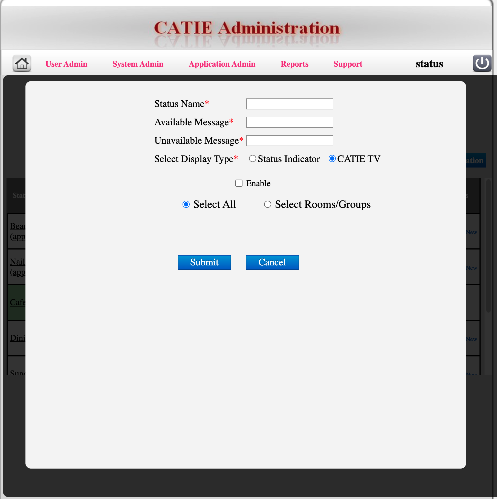

#### Clock Settings

**IMPORTANT:** To configure clock display for CATIE TV, you must select **"CATIE TV"** as the Display Type (not "Status Indicator").

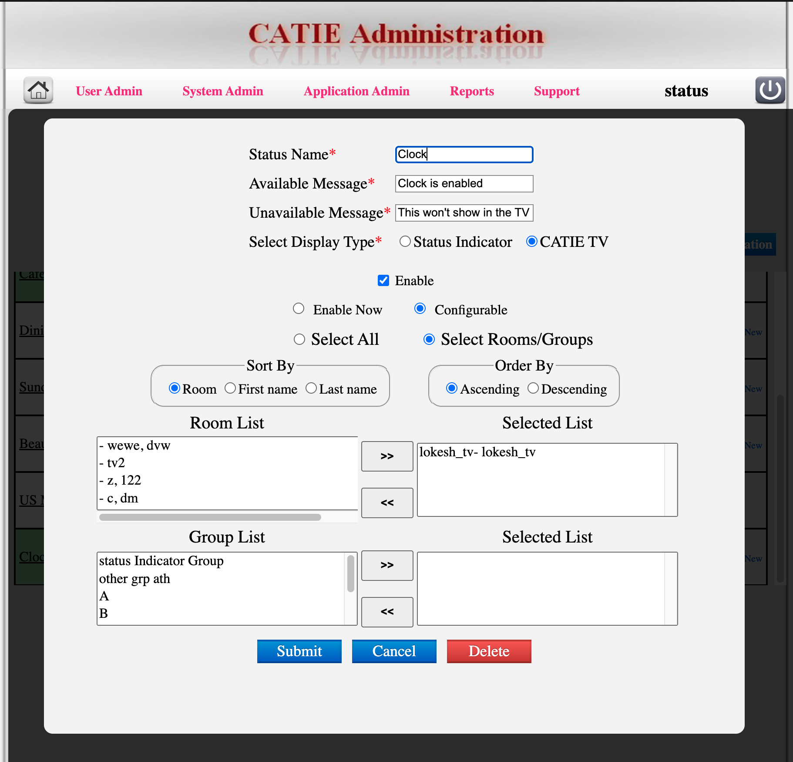

**To configure the clock:**

1. Navigate to **Application Admin** > **Status Indicator**
2. Click **Add Status Indicator** or edit an existing entry
3. Fill in the configuration fields:
   - **Status Name**: Enter a descriptive name for the clock configuration (e.g., "Clock")
   - **Available Message**: Message to display when clock is enabled (e.g., "Clock is enabled")
   - ~~**Unavailable Message**: This field is ignored for CATIE TV and won't be displayed~~
4. **Select Display Type**: Choose **"CATIE TV"** radio button (required for clock functionality)
5. Check **Enable** to activate the clock display
6. Choose **Enable Now** or **Configurable** (for scheduling)
7. Select target TVs:
   - **Select All**: Apply to all registered TVs
   - **Select Rooms/Groups**: Apply to specific rooms or groups
8. Click **Submit** to save

**Clock Display on TV:**

When the clock is enabled, the TV displays a full-screen analog clock with the Available Message shown alongside:

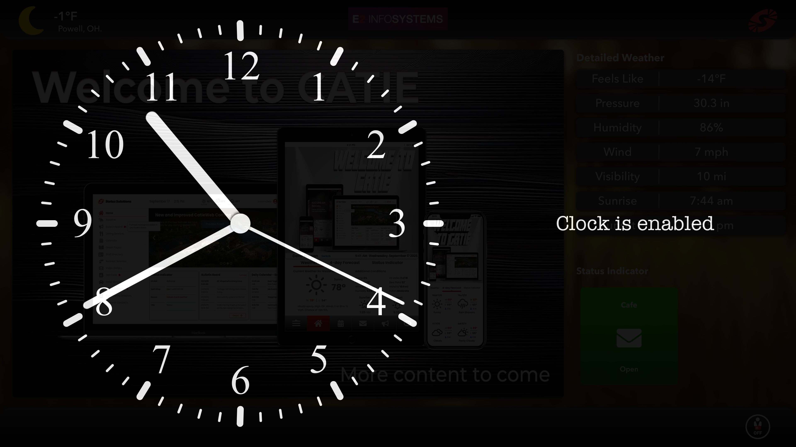

**Important Notes:**

- Only the **Available Message** is displayed on the TV
- The **Unavailable Message** field is ignored and will not be shown

### Scroll Text

Scrolling text banner at the bottom of the screen is managed via **Application Admin** > **Content Management** > **Scroll Text**.

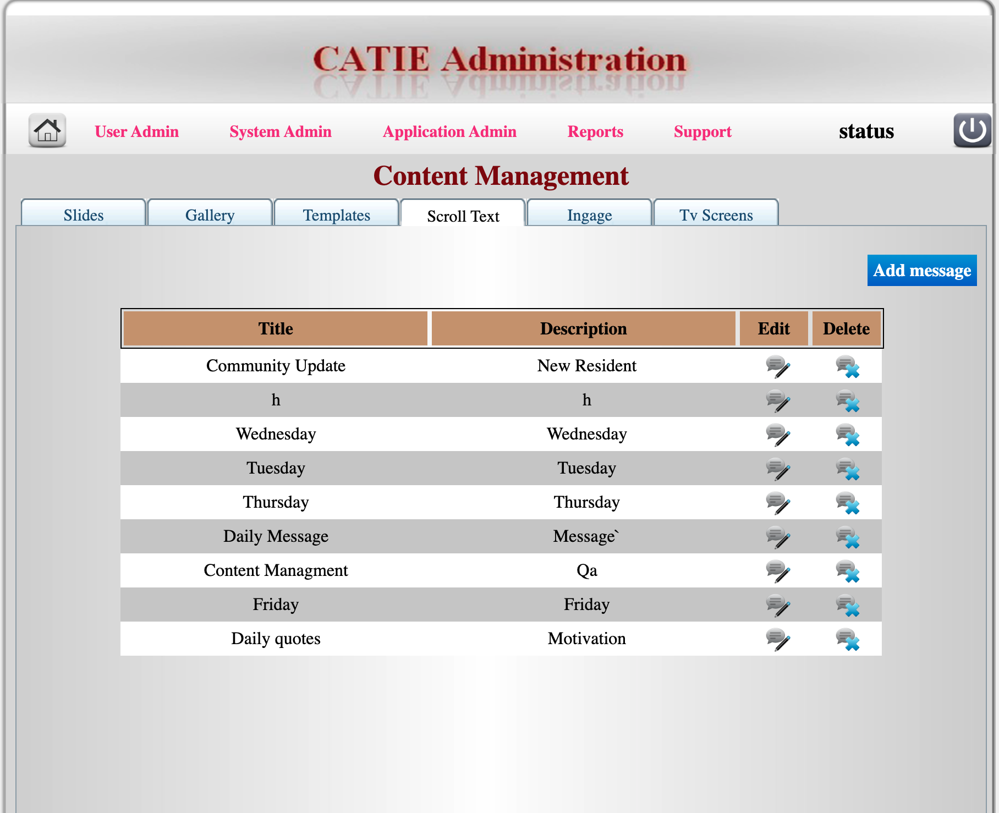

#### Managing Scroll Text Messages

Scroll text messages are available directly under **Content Management** in the **Scroll Text** tab.

**Viewing Scroll Text Messages:**

The scroll text list shows all configured messages with:

- **Title**: Message identifier
- **Description**: Brief description of the message
- **Edit** button (pencil icon): Modify existing messages
- **Delete** button (trash icon): Remove messages

#### Adding New Scroll Text

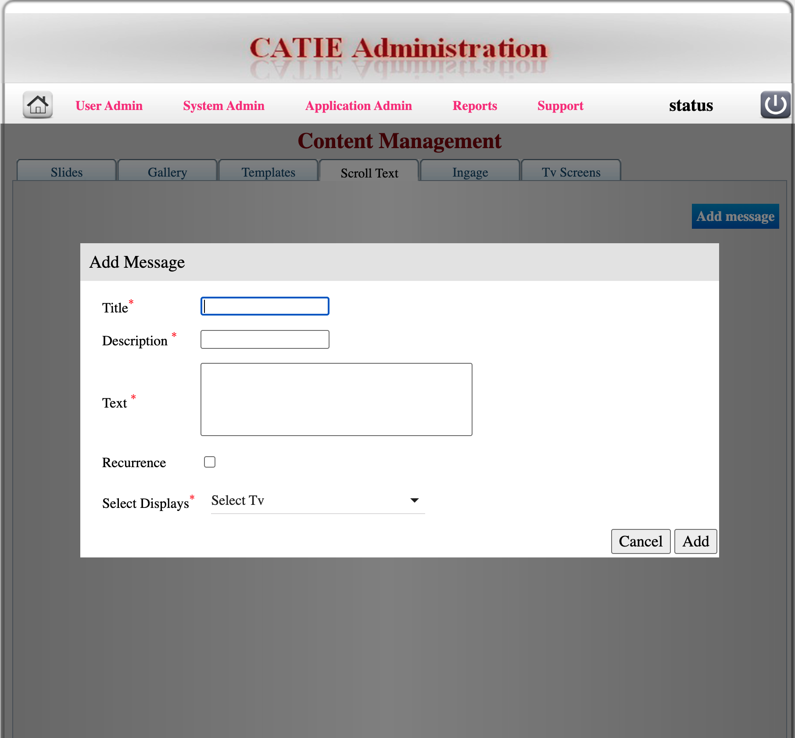

**To add a new scroll text message:**

1. Navigate to **Application Admin** > **Content Management** > **Scroll Text**
2. Click **Add message** button (top right)
3. Fill in the message details:
   - **Title**: Message identifier/name
   - **Description**: Brief description of what this message is for
   - **Text**: The actual text content to scroll on the TV screen
4. **Recurrence**: Check this option if the message should repeat on a schedule
5. **Select Displays**: Click the dropdown to allocate the message to specific TVs

#### Selecting TVs for Scroll Text Allocation

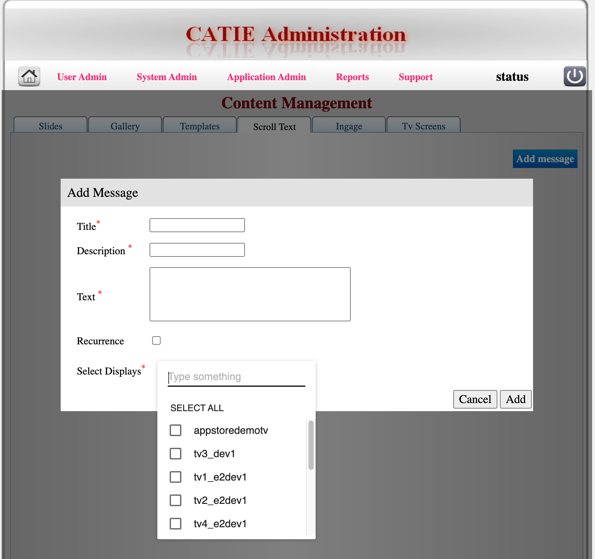

**To allocate scroll text to specific TVs:**

1. Click the **Select Displays** dropdown
2. Use the search field to filter TV names (optional)
3. Select TVs using checkboxes:
   - **SELECT ALL**: Apply message to all TVs
   - Individual TVs: Check specific devices (e.g., `appstoredemotv`, `tv3_dev1`, `tv1_e2dev1`, `tv2_e2dev1`, `tv4_e2dev1`)
4. Click **Add** to save the new scroll text message

#### Editing Existing Scroll Text

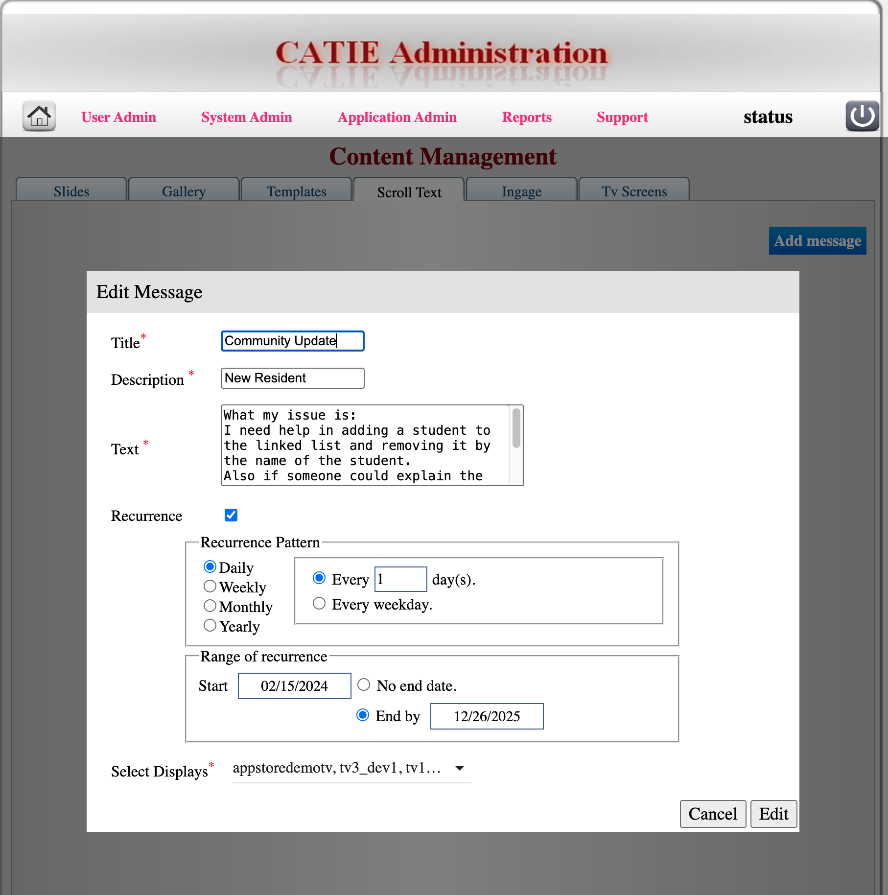

**To edit an existing scroll text message:**

1. Click the **Edit** button (pencil icon) next to the message in the list
2. Update any of the fields:
   - **Title**: Message identifier
   - **Description**: Description text
   - **Text**: Scrolling message content
3. Configure **Recurrence** if needed:
   - Check the **Recurrence** checkbox
   - Select **Recurrence Pattern**:
     - **Daily**: Every day
     - **Every [n] day(s)**: Custom interval
     - **Every weekday**: Monday through Friday only
     - **Weekly**, **Monthly**, **Yearly**: Other patterns
   - Set **Range of recurrence**:
     - **Start**: Start date for the message
     - **No end date**: Continues indefinitely
     - **End by**: Specify end date
4. Update **Select Displays**: Modify which TVs receive this message (shows current selection like "appstoredemotv, tv3_dev1, tv1...")
5. Click **Edit** to save changes

#### Scroll Text Display on TV

The scroll text appears as a banner at the bottom of the TV screen:

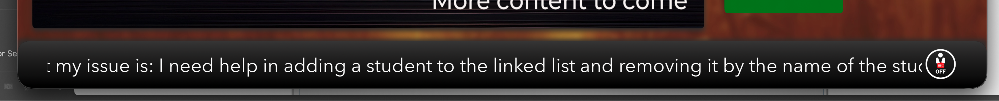

The text scrolls continuously from right to left, displaying the message content configured in the admin panel.

### Weather Configuration

Weather is configured via **System Admin** > **Application Configurations** > **Weather Configuration**.

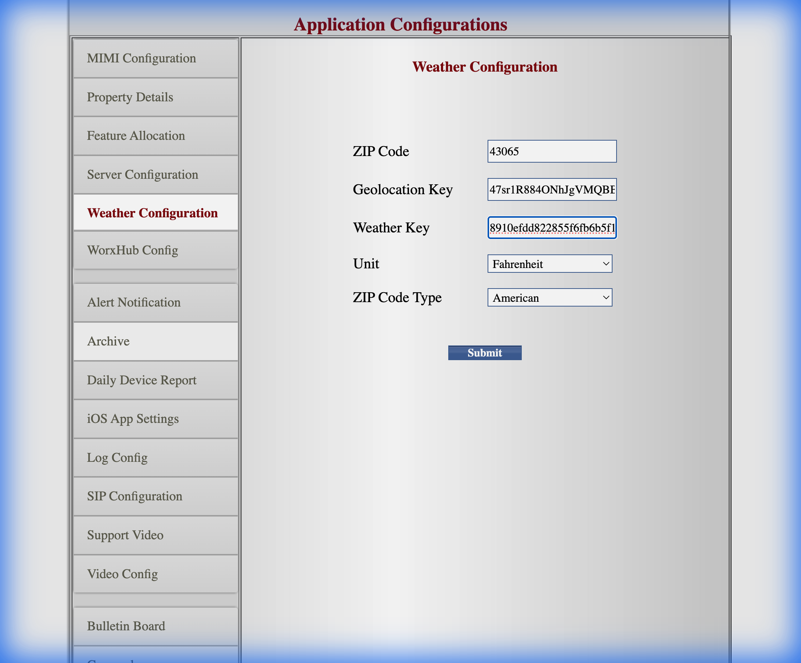

#### Settings

1. Navigate to **System Admin** > **Application Configurations** > **Weather Configuration**
2. Configure:
   - **Location**: City or ZIP code
   - **Temperature Units**: Celsius or Fahrenheit
   - **Update Interval**: Frequency of weather data refresh
   - **API Provider**: Weather data source
3. Click **Save**

#### Weather Display on TV

Weather information is displayed in different formats across the TV interface:

**Basic Weather Header:**

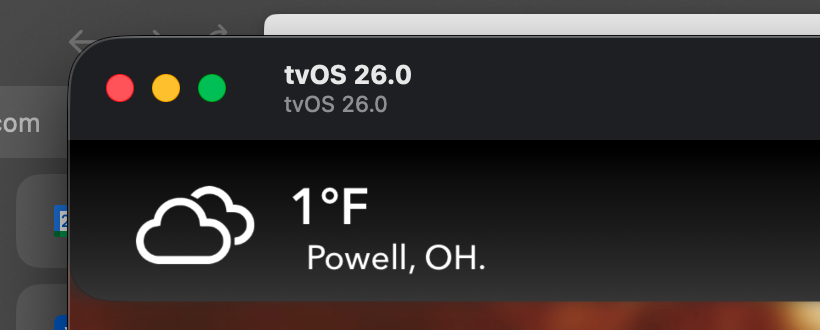

Shows temperature, weather icon, and location (e.g., "1°F Powell, OH.")

**Detailed Weather View:**

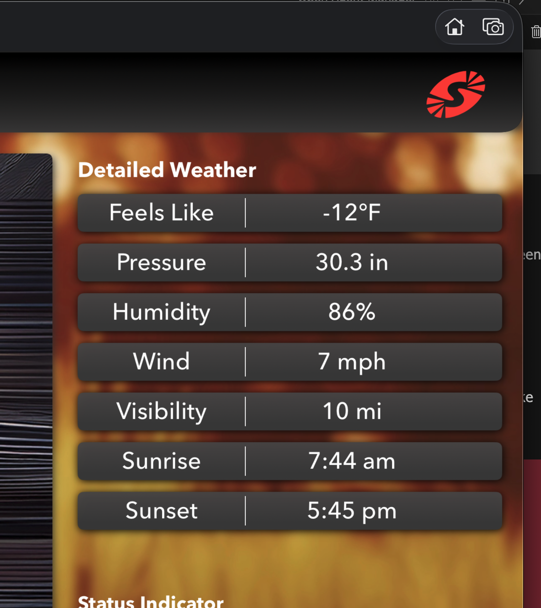

Displays comprehensive weather information:

- Feels Like temperature
- Pressure
- Humidity
- Wind speed
- Visibility
- Sunrise time
- Sunset time

**Forecast Weather View:**

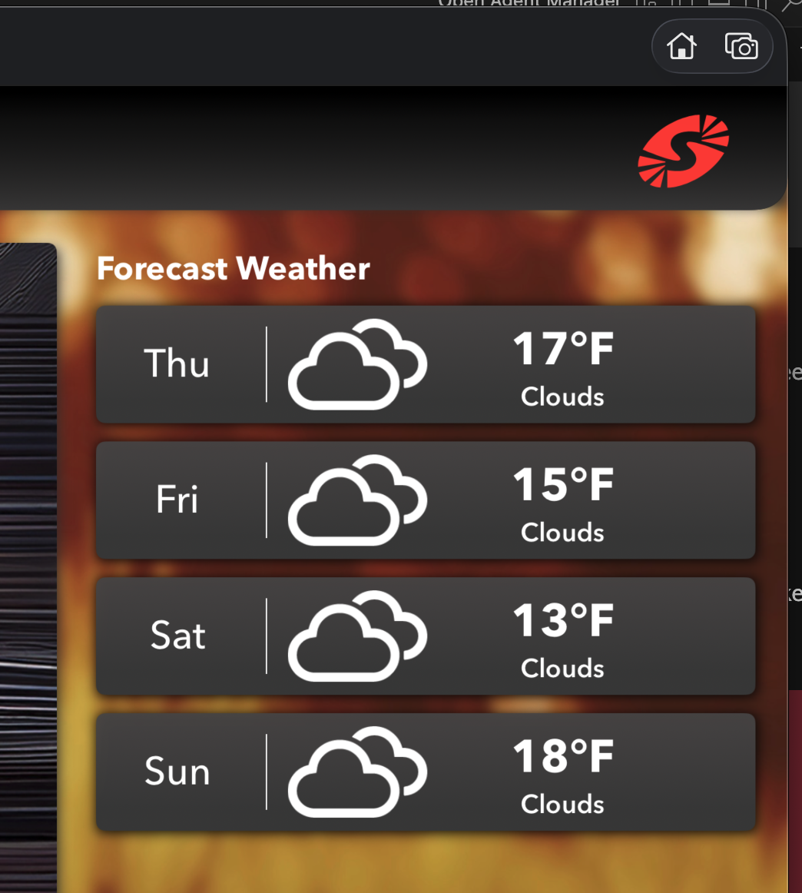

Shows 4-day weather forecast with:

- Day of week
- Weather icon
- Temperature
- Weather condition (e.g., "Clouds")

#### Weather Display by UI Type

| UI Type | Weather Display |
|---------|-----------------|
| Type 1 | Full detailed weather + 4-day forecast (when no events) |
| Type 2 | Basic weather in header only |
| Type 3 | Portrait-optimized weather display |
| Type 4, 5, 6 | Basic weather in header only |

### Logo Configuration

Site logos are configured via **System Admin** > **Application Configurations** > **Logo Configuration**.

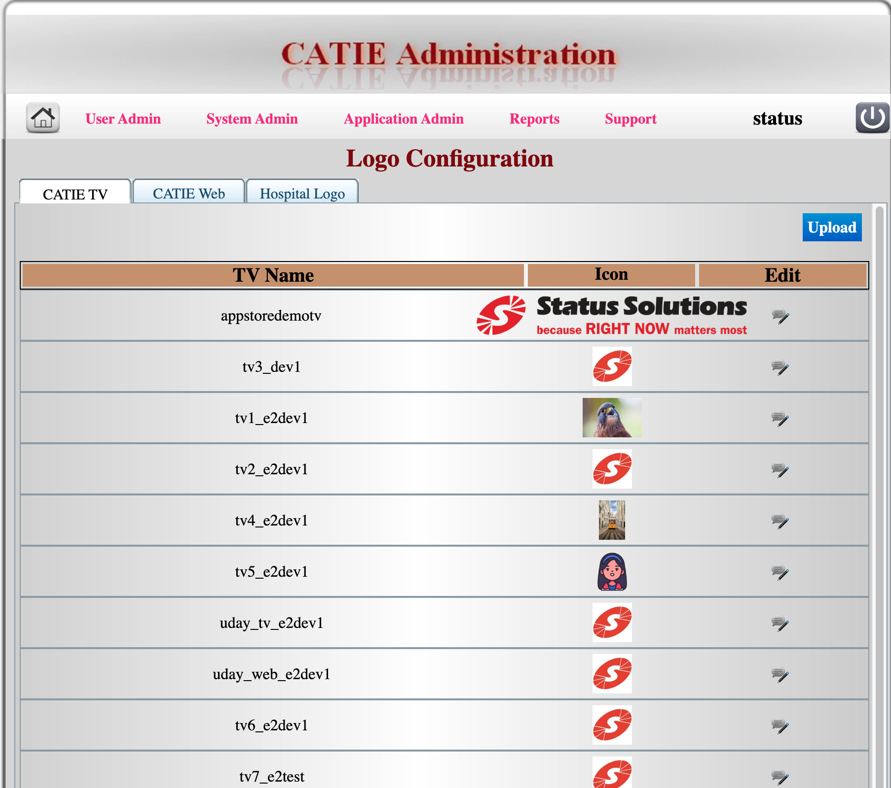

#### Configuring TV Logos

Each TV can display a custom logo/branding image in the header area. Logos can be configured individually for each registered TV.

#### Uploading Logos for Specific TVs

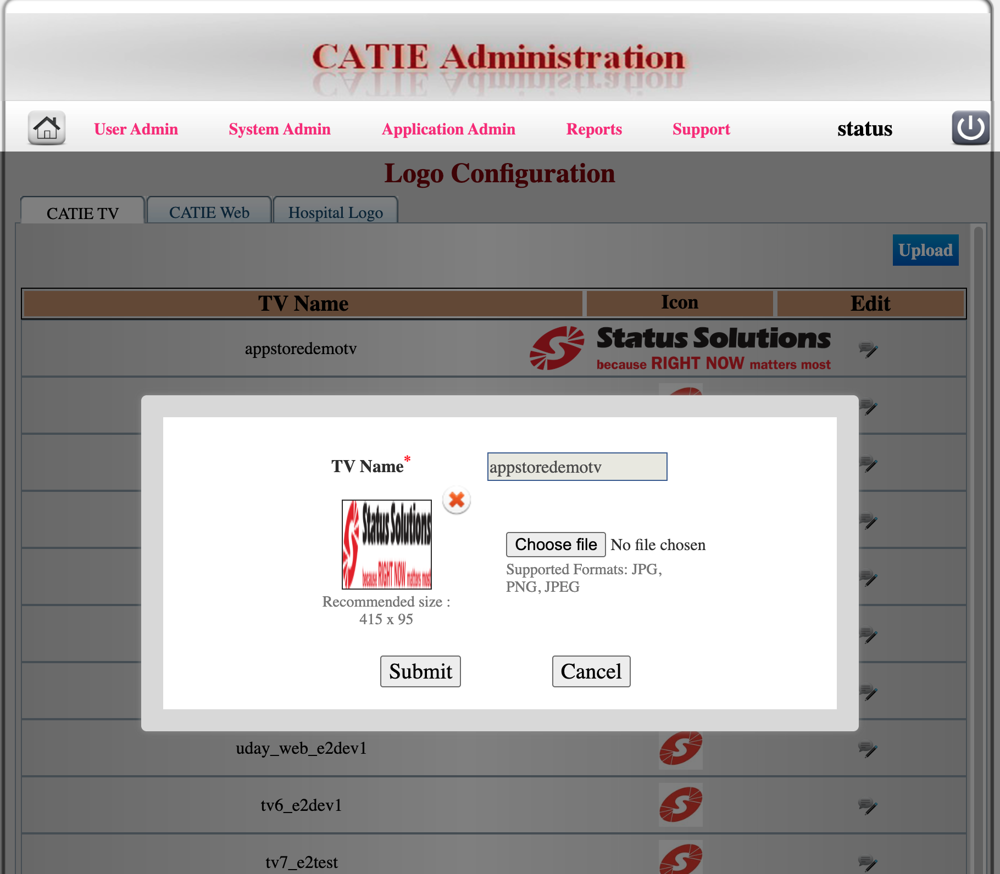

**To configure a logo for a specific TV:**

1. Navigate to **System Admin** > **Application Configurations** > **Logo Configuration**
2. Ensure the **CATIE TV** tab is selected
3. Locate the TV in the list by TV Name (e.g., `appstoredemotv`, `tv1_e2dev1`, `tv2_e2dev1`)
4. Click the **Edit** button (pencil icon) for the desired TV
5. In the edit dialog:
   - **TV Name**: Shows the device name (read-only)
   - Current logo preview is displayed (if already configured)
   - Click **Choose file** button
   - Select your logo image file
6. Click **Submit** to upload and apply the logo
7. Click **Cancel** to discard changes

#### Logo Requirements

- **Supported Formats**: JPG, PNG, JPEG
- **Recommended Size**: 415 x 95 pixels
- **Aspect Ratio**: Maintain logo aspect ratio for best display
- **File Size**: Keep files under 2MB for optimal performance

#### Logo Display

Once configured, logos appear:

- **Landscape Layouts (Types 1, 2, 5)**: In the header area of the TV interface
- **Portrait Layouts (Types 3, 4, 6)**: At the top of the portrait display
- Logos update in real-time after upload
- If no custom logo is configured, default branding (Status Solutions) is displayed

**Logo Display on TV:**

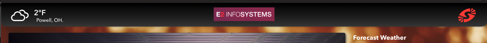

The site logo is displayed prominently in the center-top area of the TV screen (shown here: "E2 INFOSYSTEMS" logo). The logo appears alongside weather information and other header elements.

### SARA Emergency Alerts

SARA (Safety Alert and Response Application) alerts are configured via **Support** > **SARA Registration**.

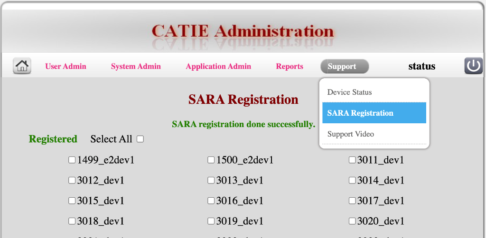

#### Setup

1. Navigate to **Support** > **SARA Registration**.
2. The registration screen will display a list of available devices.
3. Select the devices you wish to register:
   - Check individual device boxes.
   - Or check **Select All** to register all devices.
4. The system will automatically register the selected devices and display the message **"SARA registration done successfully."**

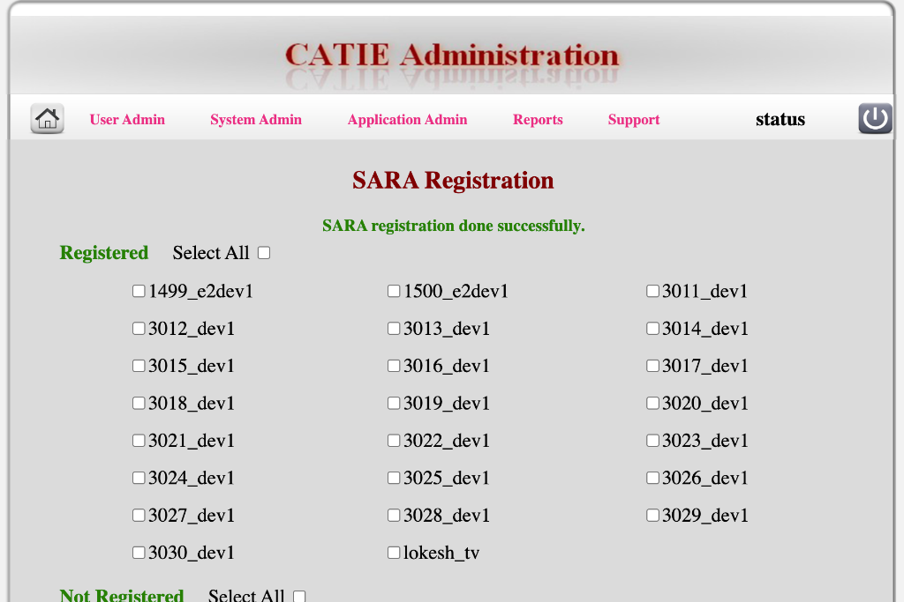

#### 2. Customize Alert

You can customize the specific details of the alert (urgency, visual flash, audio) and the content (header, body, footer) in the CATIE TV Alerts administration.

1. Navigate to **Dashboard** > **Administration** > **CATIE TV Alerts**.
2. Click **Create a new Template** or select an existing template to edit.
3. **Template Name**: Enter a descriptive name for the alert template.
4. **Pop-up Settings (CATIE only)**:
   - **Urgent**: Check to mark the alert as urgent.
   - **Flash**: Check to enable visual flashing on the TV screen.
   - **Audio**: Check to enable audio alerts.
   - **Border color of alert**: Select a color for the alert border.
5. **Content Configuration**:
   - **Header**: Enter the alert title/header text. You can use the rich text editor to format it.
   - **Body**: Enter the main message of the alert. This is where detailed instructions can be provided.
   - **Footer**: Enter any footer text or additional information.
6. Click **Save** to apply the configuration.

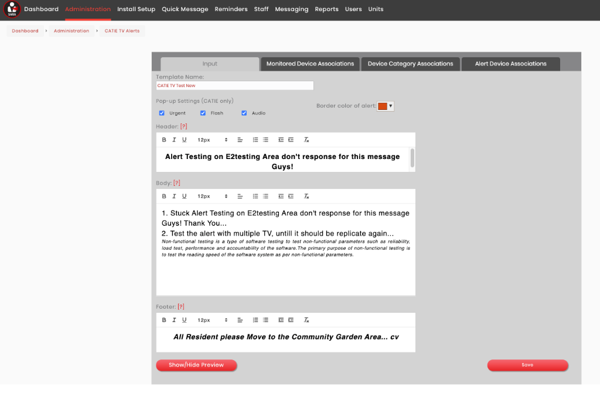

#### 3. Configure Alert Groups

Adding the device to a CATIE TV alert group ensures it is included in the test button functionality on the home page.

1. Navigate to **Dashboard** > **Administration** > **Alert Groups**.
2. Click **Create a New Alert Group** to define a new group, or select an existing one to edit.

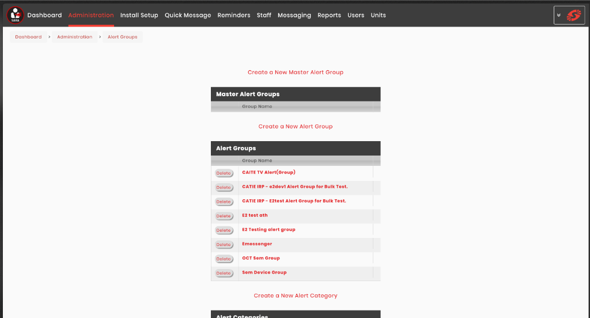

1. In the **Available devices** list, select your device (e.g., `lokesh_tv(CATIE TV)`).
2. Click **Add Device** to move it to the **Devices in group** list.
3. Click **Save**.

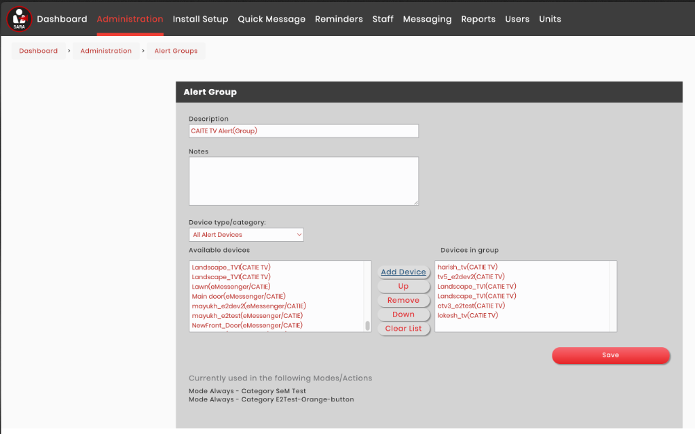

#### 4. Create Device Categories

Device Categories allow you to organize and group your CATIE TV devices for targeted alert delivery.

1. Navigate to **Dashboard** > **Administration** > **Device Categories**.
2. Click **Create a New Category** at the top of the page.
3. Enter a name for the category (e.g., `CATIE TV Alert Category`, `Front Door SIP`).
4. In the **CATIE TV Template** dropdown, select the CATIE TV alert template created in Step 2 (e.g., `CATIE TV Test New`).
5. Assign the relevant devices to the category.
6. Click **Save**.

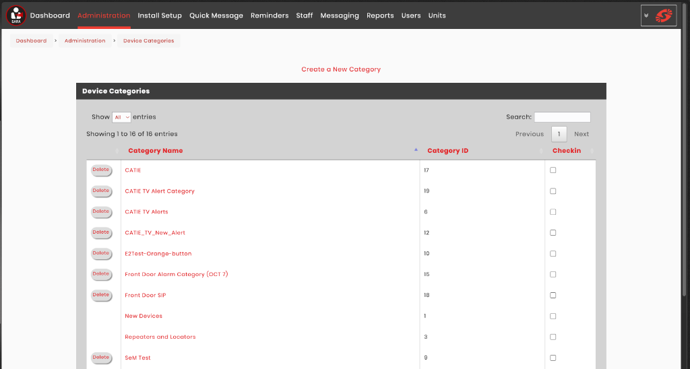

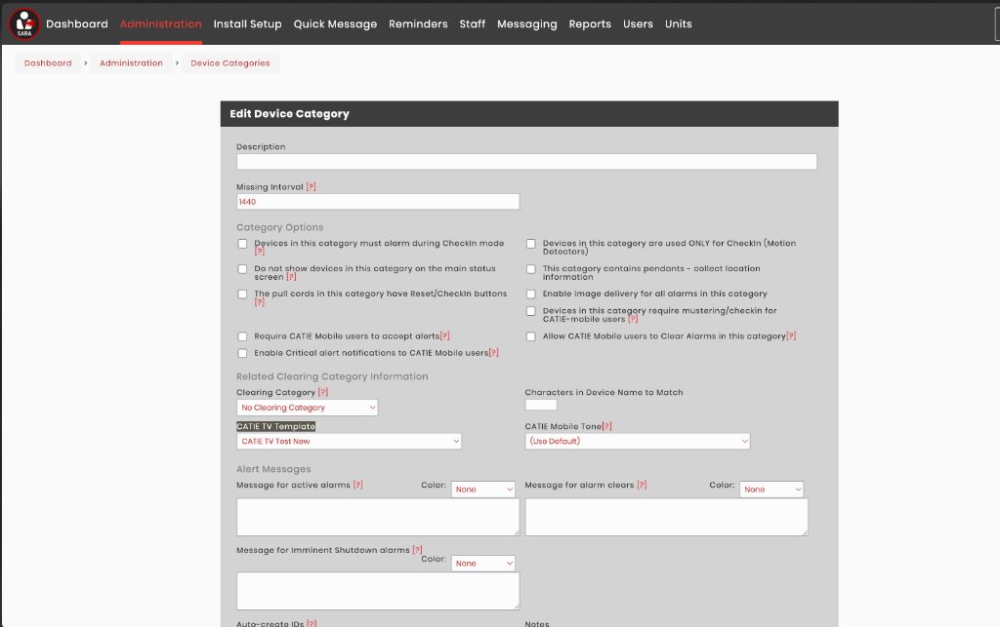

#### 5. Configure Modes and Actions

Modes and Actions determine when and how alerts are triggered. You need to select an existing mode or create a new one.

1. Navigate to **Dashboard** > **Administration**.
2. In the **Modes and Actions** section on the right, click **Modes and Actions**.

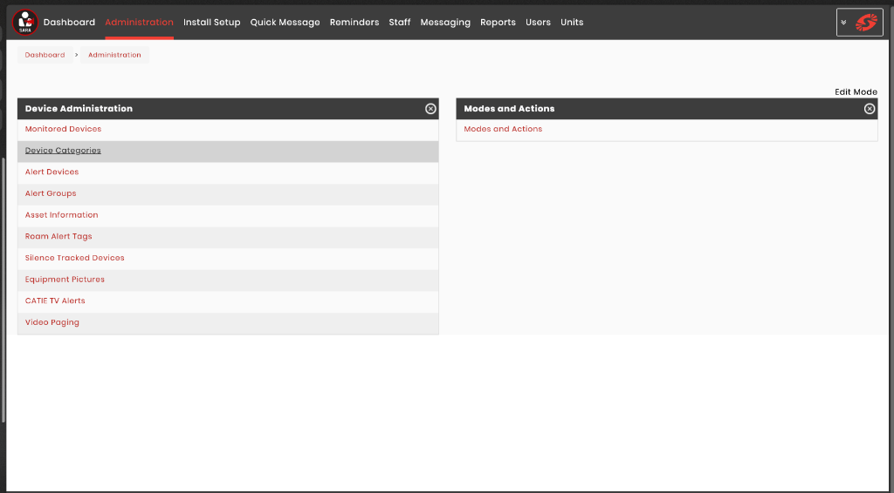

1. The **Modes and Actions** page displays all configured modes in a table with columns for **Active Checkin**, **Action**, **Mode**, **Start Time**, **End Time**, and day-of-week checkboxes (Mon–Sun).
2. Select the **Always** mode (already created by default), which runs at **Any Time** on all days.

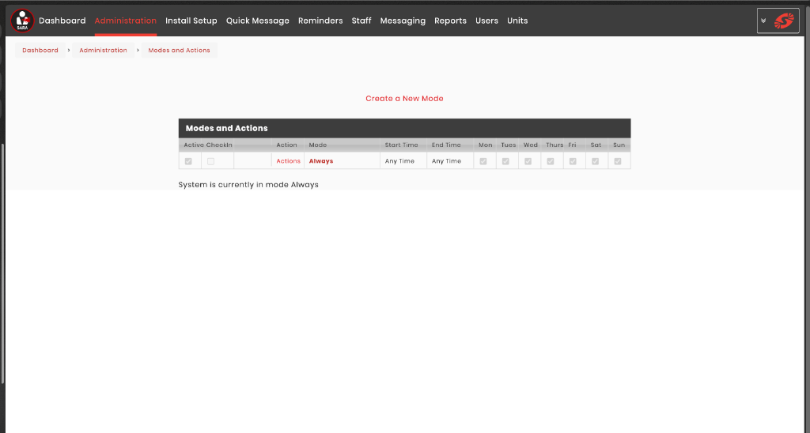

1. The **Actions for mode Always** page lists all device categories. Find and select the device category you created in Step 4 (e.g., `TV alerts documentation`).

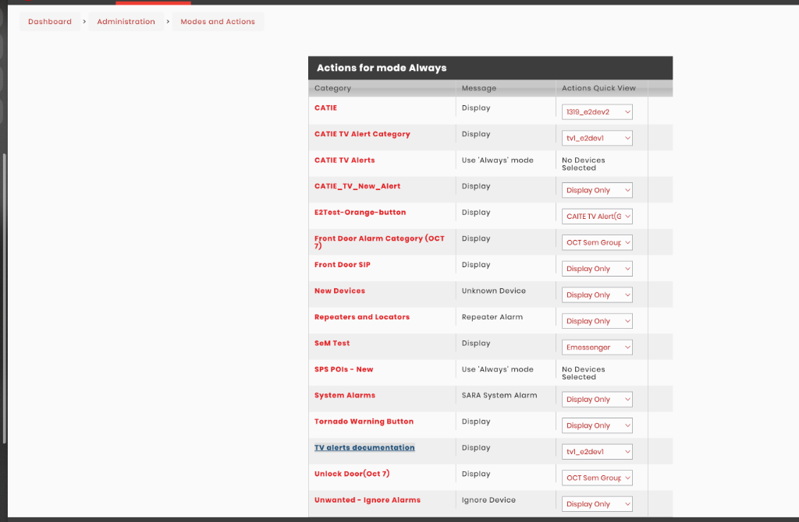

**Note:** The system status at the bottom confirms which mode is currently active (e.g., "System is currently in mode Always"). You can also click **Create a New Mode** to define a custom schedule if needed.

1. The **Action List** page opens for the selected category. Configure which devices or groups should receive the alert:
   - **Action Message**: Set the action type (e.g., `Display`)
   - **Device Type/Category**: Select the device type (e.g., `All Alert Devices`)
   - **Available contacts/alert devices**: Select the device or alert group from the left list (e.g., `CATIE TV Alert(Group)`, `tv1_e2dev1 (CATIE TV)`)
   - Click **Add** to move it to the **When an alarm occurs (escalation)** list on the right
   - Use **Up**/**Down** to reorder, **Remove** to unassign, or **Clear List** to reset
2. Click **Save** to apply the configuration.

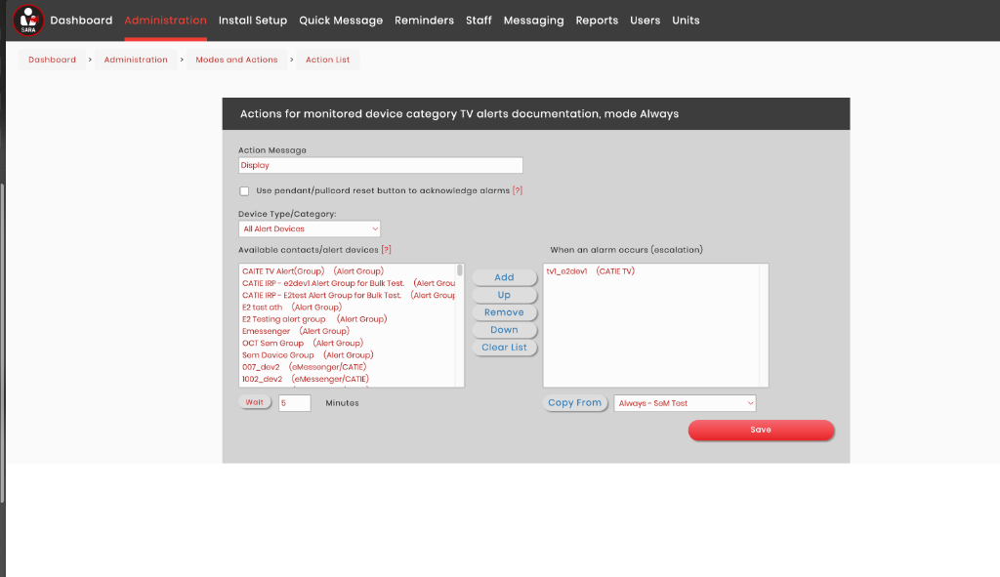

#### 7. Test Alert Configuration

Once the association is complete, you can trigger a test alert from the dashboard.

1. Navigate to the **Dashboard** home page.
2. Locate the test button (e.g., "test") which now includes your device.
3. Click the test button. A confirmation popup will appear.

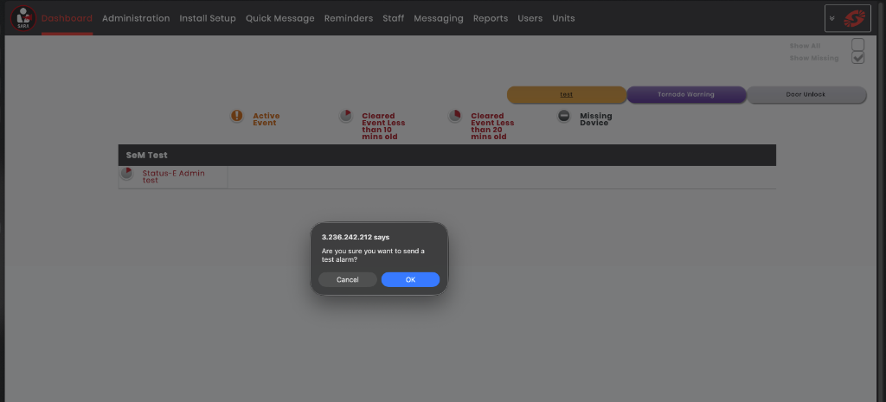

1. Click **OK** to send the test alarm.
2. The dashboard will show the active event status.

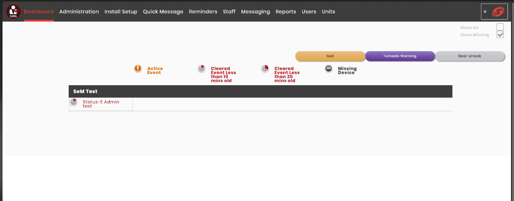

1. Clicking on the **Status-E Admin test** event will open the details of the alert delivery.

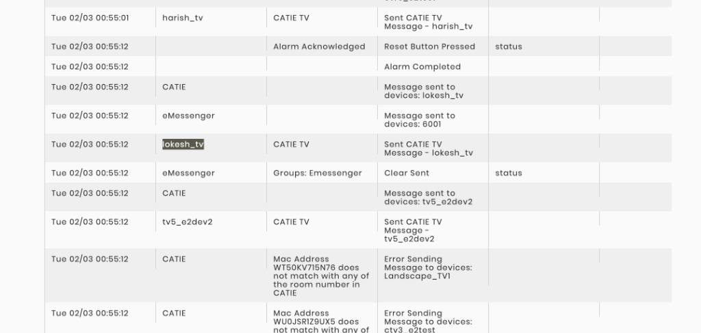

1. To close or cancel the alert, click the **Confirm This Event** button at the bottom of the details page.

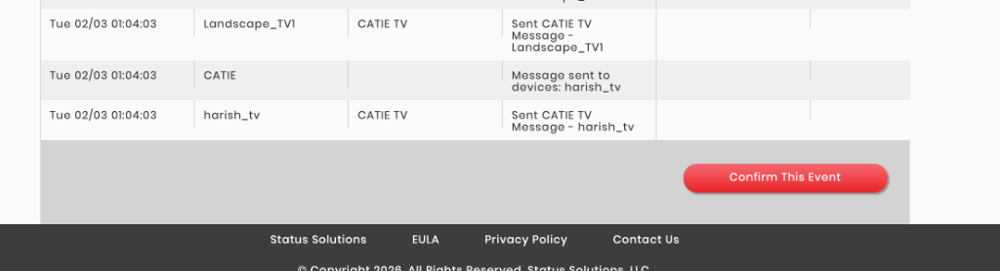

---

## Monitoring & Troubleshooting

### TV Status Monitoring

Monitor connected TVs via **Support** > **Device Status** > **TV Status**.

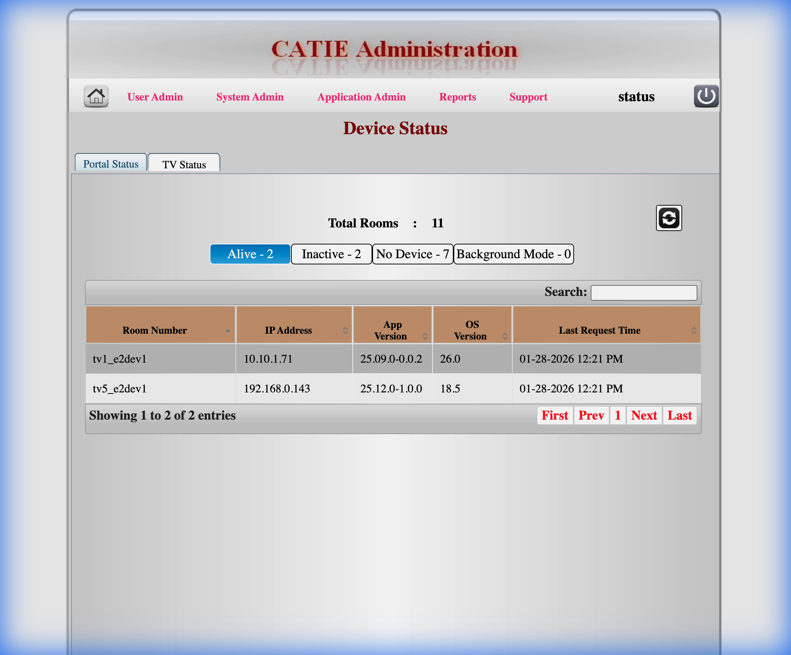

#### Status Information

View for each TV:

- **Connection Status**: Online/Offline
- **Last Seen**: Timestamp of last server communication
- **Room Number**: Assigned room
- **UI Type**: Current layout type
- **App Version**: Installed CATIE TV version
- **Device Model**: Apple TV hardware model

#### Device Status Filtering

The TV Status page provides tabs to filter devices by their current status:

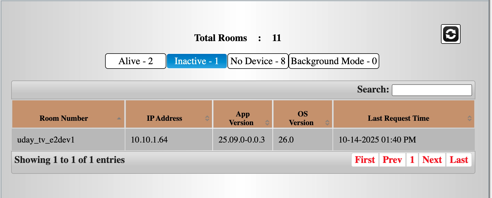

**Status Tabs:**

- **Total Rooms**: Shows the total number of rooms configured for CATIE TV
- **Alive**: Displays currently online and active devices
- **Inactive**: Shows devices that are registered but currently offline or not responding
- **No Device**: Lists rooms that are configured for CATIE TV but have no device registered
- **Background Mode**: Shows devices running in background mode

**Inactive Devices View:**

When viewing inactive devices (shown in the screenshot above), the table displays:

- **Room Number**: Device identifier (e.g., `uday_tv_e2dev1`)
- **IP Address**: Last known IP address of the device (e.g., `10.10.1.64`)
- **App Version**: Last reported CATIE TV version (e.g., `25.09.0-0.0.3`)
- **OS Version**: Last reported tvOS version (e.g., `26.0`)
- **Last Request Time**: Timestamp of the last communication from the device (e.g., `10-14-2025 01:40 PM`)

Use the status tabs to quickly identify and troubleshoot devices that are offline or not functioning properly.

#### Viewing Room Details

Click on any device in the TV Status list to view detailed information about that device.

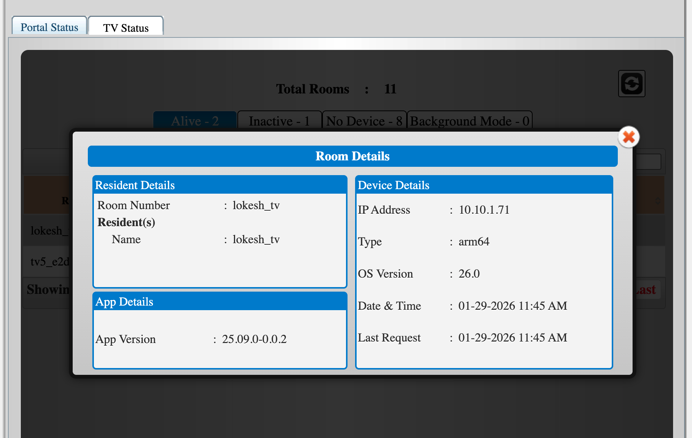

The **Room Details** dialog displays comprehensive information organized into three sections:

**Resident Details:**

- **Room Number**: The room identifier (e.g., `lokesh_tv`)
- **Resident(s) Name**: Name associated with the room (e.g., `lokesh_tv`)

**App Details:**

- **App Version**: Current CATIE TV application version installed (e.g., `25.09.0-0.0.2`)

**Device Details:**

- **IP Address**: Current IP address of the device (e.g., `10.10.1.71`)
- **Type**: Device architecture type (e.g., `arm64`)
- **OS Version**: tvOS version running on the device (e.g., `26.0`)
- **Date & Time**: Current timestamp from the device (e.g., `01-29-2026 11:45 AM`)
- **Last Request**: Last time the device communicated with the server (e.g., `01-29-2026 11:45 AM`)

Click the **X** button in the top-right corner to close the details dialog.

### Log Collection

Collect diagnostic logs from TVs via **System Admin** > **Application Config** > **Log Config**.

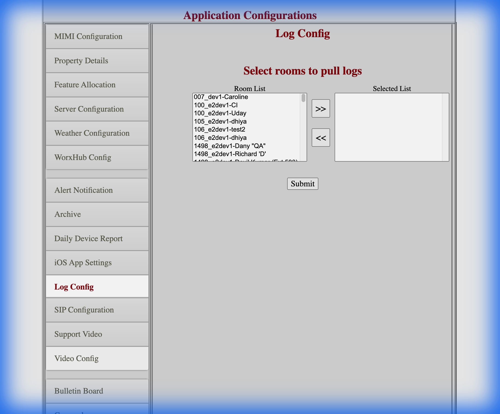

#### Log Retrieval

1. Navigate to **System Admin** > **Application Config** > **Log Config**
2. Select target TV device
3. Click **Request Logs**
4. Logs are uploaded to server
5. Access logs via BeyondTrust (Bomgar) remote support tool

#### Log Files Location

Logs are stored on the server and can be accessed via:

- **BeyondTrust/Bomgar**: Remote support session (refer to Bomgar documentation)

---

## MDM Configuration

### 1. Prerequisites

Before starting the MDM enrollment process, ensure the following requirements are met:

- **Supervised Mode**: The device must be in supervised mode to enroll in MDM.
  - You can verify this by checking the **Supervised** section in the **Apple Configurator** app.
- **Network Connection**: The device must be connected to the same network as the Mac running Apple Configurator for detection and setup.

### 2. Device Preparation

1. **Initial State**: During the initial setup screen on the Apple TV, **do not touch the remote** or interact with the menu.
2. **Connect**: Ensure the device is detected by Apple Configurator.
3. **Start Preparation**:
   - In Apple Configurator, select the device.
   - Right-click and select **Prepare...**.
4. **Configuration Settings**:
   - **Prepare with**: Select **Manual Configuration**.
   - **Check**: Add to Apple School Manager or Apple Business Manager (optional).
   - **Supervision**: Check the box for **Supervise devices**.
   - **Pairing**: Check the box for **Allow devices to pair with other computers**.
   - Click **Next** to proceed.
